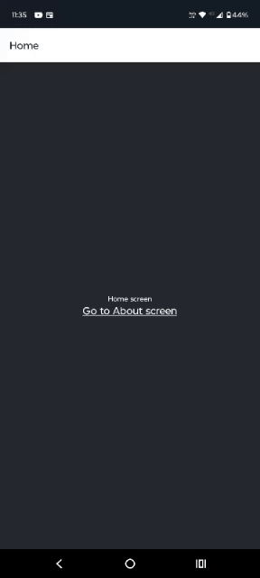
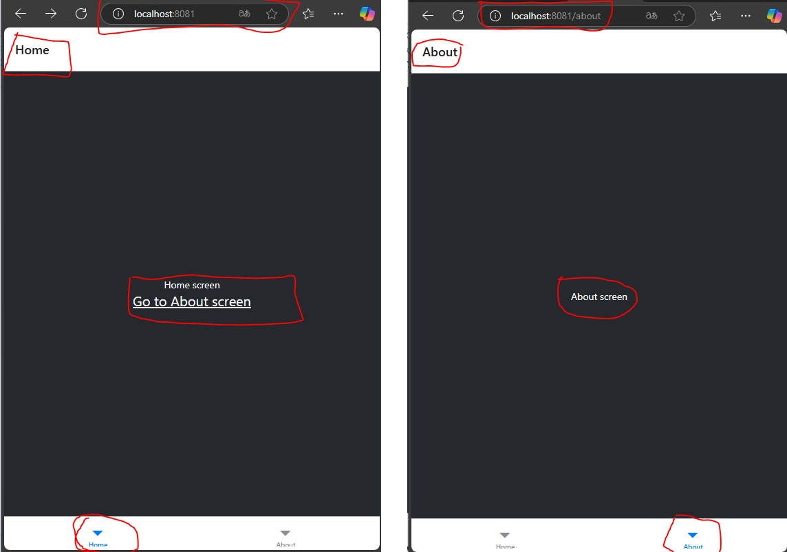
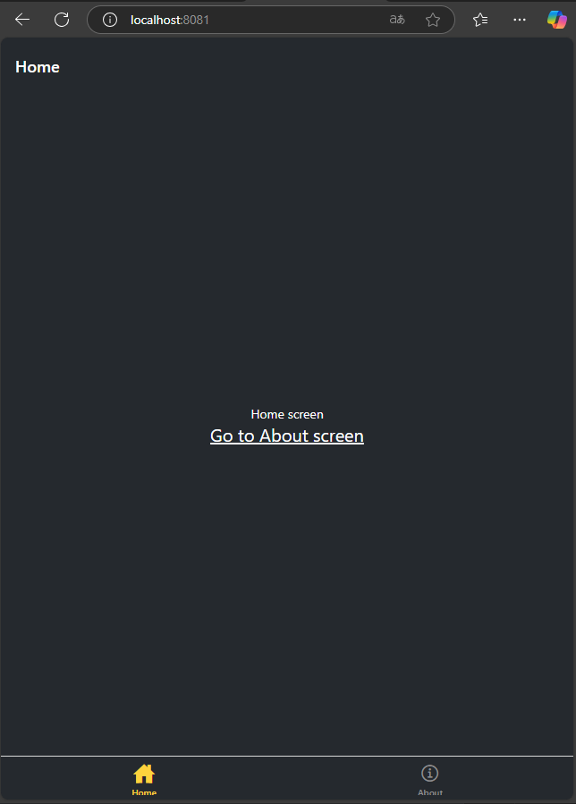
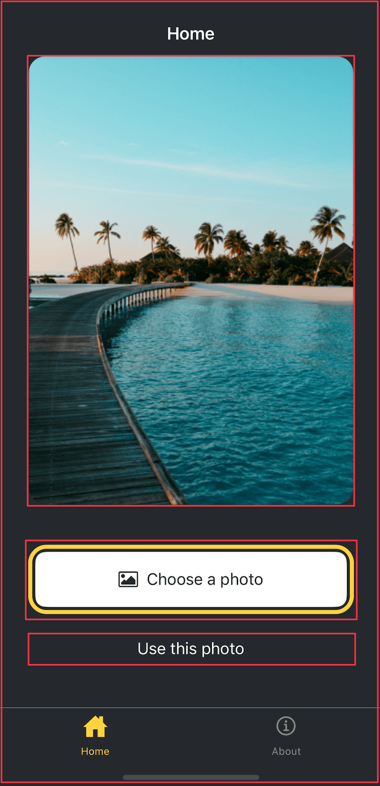
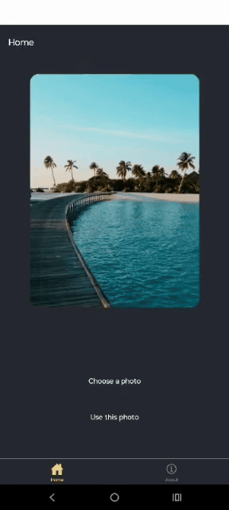
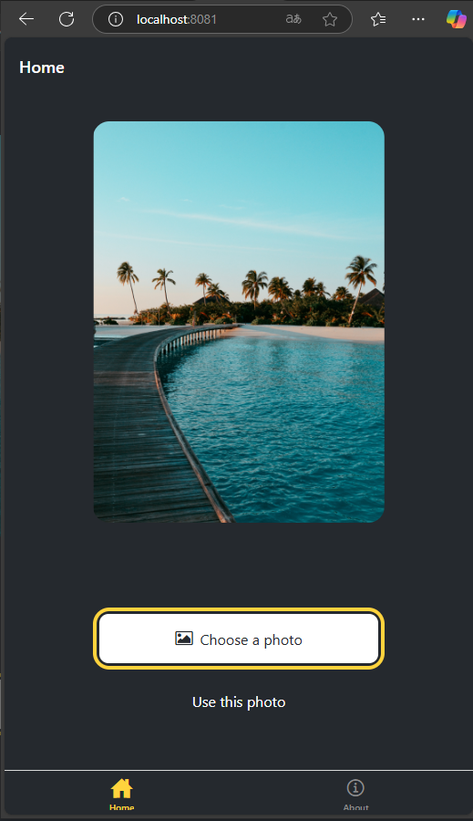
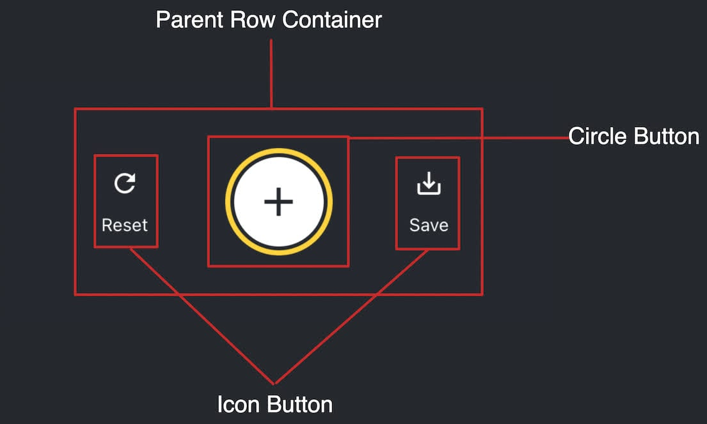
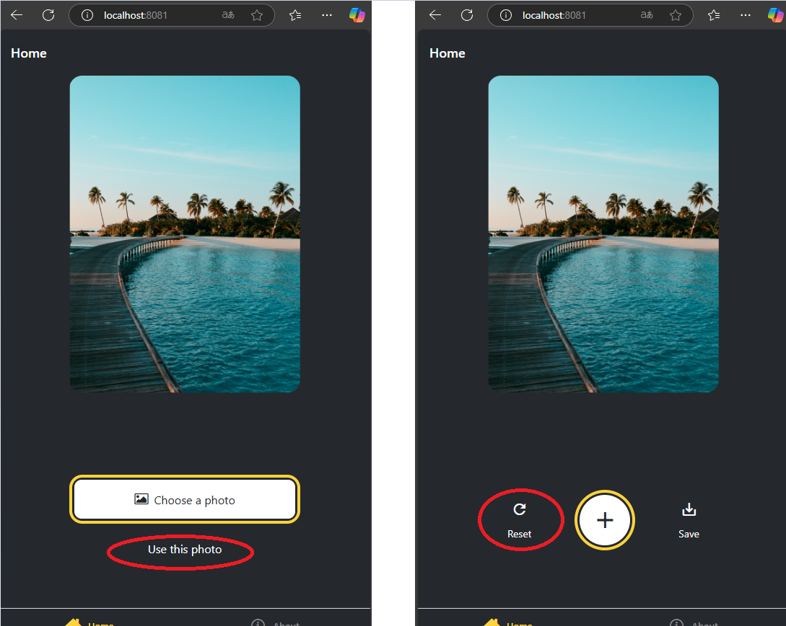
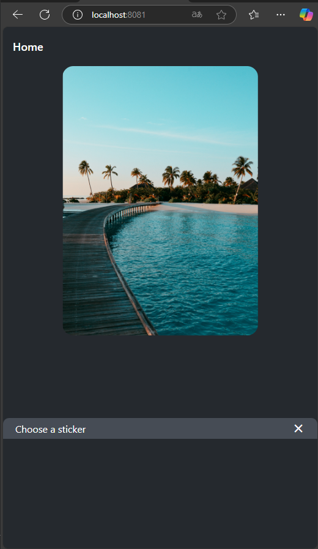
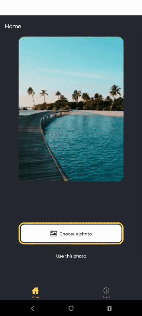

# Mobile-Introduction

# Objetivo: 
Este repositório tem como objetivo dar uma introdução rápida ao desenvolvimento de um app para dispositivos android com o foco em aplicações mobile. 

A ideia é de forma rápida e objetiva conseguir instalar e utilizar um app no celular.

Todo o guia vai ser baseado em react native em função de sua pratividade e facilidade na analise e aprendizado, além de ser um frameork bem aceito no mercado. 

Abaixo o tutorial que foi base para a construção desta introdução

[React Native aprendizado com Expo](https://docs.expo.dev/tutorial/overview/)


## Pré Requisitos

Esta seção aborda os pré requisistos necessários para podermos proseguir com o aprendizado.

### Pré Requisitos

- [Expo - instalção no dispositivo mobile](https://expo.dev/go/)
- [Node.JS ](https://nodejs.org/en)
- [VS Code](https://code.visualstudio.com/)

Ajuste de politica de execução do PowerShell. Por padrão, o PowerShell não permite a execução de scripts não assinados, como o **npx**. Abaixo o comando para o determinado ajuste.

- Abrir o PowerShell como Administrador
- Pressione **Win + X** e selecione **"Windows PowerShell (Admin)"**.
- Ou procure por **"PowerShell"** no menu iniciar, clique com o botão direito e escolha **"Executar como Administrador"**.
- Digite o seguinte comando no PowerShell para permitir a execução de scripts locais:

```powershell
Set-ExecutionPolicy RemoteSigned -Scope CurrentUser
```

### Familizarização

Links de conhecimento relacionado ao TypeScript e ao React.

- [Introdução ao TS](https://www.typescriptlang.org/docs/handbook/2/everyday-types.html)
- [Introdução ao React](https://react.dev/learn) 

## 1 - Criando su primeiro APP

### 1 Inicializar um novo aplicativo EXPO

Dentro do nosso terminal do VS Code, criaremos o nosso app através de uma linha de comando. Lembrando que aqui, temos que executar o comando extamente onde queremos que o projeto seja inicializado. 

obs: Recomendo que criem uma pasta na raiz do computador conforme modelo abaixo:

c:\desenvolvimento\mobile\

```sh
npx create-expo-app@latest StickerSmash && cd StickerSmash
```
O comando vai criar um diretório usando um modelo padrão de app, com biblioteca essenciais. 

Algumas Vantagens de usar um modelo padrão para desenvolvimento:
- Cria um novo projeto React Native com expoo pacote instalado
- Inclui ferramentas recomendadas, como Expo CLI
- Inclui um navegador de abas do Expo Router para fornecer um sistema de navegação básico
- Configurado automaticamente para executar um projeto em várias plataformas: Android, iOS e web
TypeScript configurado por padrão

### 2 Ativos

Baixar os arquivos abaixo e substituir os mesmos na pasta do projeto your-project-name/assets/images

- [Ativos Projeto](https://docs.expo.dev/static/images/tutorial/sticker-smash-assets.zip)

### 3 Script Reset

Como vamos criar o nosso aplicativo do zero, vamos resetar ele e com isto retirar alguns arquivos desnecessários. 

```sh
npm run reset-project
```

Com isto nossa pasta de APP fica com dois arquivos ( index.tsx e _layout.tsx ) os demais foram movidos para a pasta app-example. 

### 4 executando o aplicativo no Celular

Primeiramente executamos o comando abaixo para instalar as dependencias caso falte alguma relacionado ao ferramental do expo. 

```sh
npm install expo
```

Posterior iniciamos o nosso projeto com o comando abaixo.

```sh
npx expo start
```
Se no momento da instalação, aparecer uma mensagem solicitando a liberação do node.js no firewall do windoes, libere tanto para redes publicas como privadas. Este passo é bem iportante pois caso não configuremos estas permissoes, podemos ter impacto para emular o projeto. 

O comando acima iniciara o nosso servidor de desenvolvimento. Caso solicite para instalar alguma dependencia a mesma deve ser instalada. 

### 5 Editar a tela de indice

Vamos adaptar o nosso index.tsx para modificar um pouco o nosso fluxo de tela, onde colocamos um descritivo simples na nossa tela e modificamos a cor geral do app. 

```tsx
import { Text, View, StyleSheet } from 'react-native';

export default function Index() {
  return (
    <View style={styles.container}>
      <Text style={styles.text}>Home screen</Text>
    </View>
  );
}

const styles = StyleSheet.create({
  container: {
    flex: 1,
    backgroundColor: '#25292e',
    alignItems: 'center',
    justifyContent: 'center',
  },
  text: {
    color: '#fff',
  },
});
```

Explicando o código acima: 

Um componente React Native chamado Index que mostra um texto centralizado na tela com fundo escuro.

🔍 O que ele faz:
Cria uma tela com fundo escuro (#25292e)

No centro da tela, exibe o texto "Home screen" na cor branca

🧱 Partes principais:
View: é como uma "div" no React — a estrutura da tela

Text: mostra o texto

StyleSheet: define os estilos (cores, alinhamento, etc)

## 2 Adicionar Navegação

### Noções básicas de roteamento

O Expo Router é um frameork de roteamento. Ele gerencia a navegação entre telas.
- Diretório do Aplicativo: Diretírio contendo rotas e seus layouts.
- Layout Raiz: app/_layout.tsx. Define elementos de interfaçe do usuário compartilhado. 
- Convenção de nome de arquivo: Nome de arquivo indice, como index.tsx correspndem ao diretório pai e nao adicionam segmento de arquivo. 
- Um arquivo de rota exporta um componente React com seu valor padrão.
- Android, IOS e WEB compartilha extrutura de navegação. 
- [Mais sobre Expo Router](https://docs.expo.dev/router/introduction/)

### 1 Adicionar uma nova tela

Vamos criar um novo arquivo about.tsx dentro do nosso diretório app. Este arquivo segue o padrão do index, porém com outro descritivo 

```tsx 
import { Text, View, StyleSheet } from 'react-native';

export default function AboutScreen() {
  return (
    <View style={styles.container}>
      <Text style={styles.text}>About screen</Text>
    </View>
  );
}

const styles = StyleSheet.create({
  container: {
    flex: 1,
    backgroundColor: '#25292e',
    justifyContent: 'center',
    alignItems: 'center',
  },
  text: {
    color: '#fff',
  },
});
```
Dentro da nossa rota, vamos configurar o mesmo para entender as movimentações de tela e definindo titulo das rotas através de um stack.

```tsx 
import { Stack } from 'expo-router';

export default function RootLayout() {
  return (
    <Stack>
      <Stack.Screen name="index" options={{ title: 'Home' }} />
      <Stack.Screen name="about" options={{ title: 'About' }} />
    </Stack>
  );
}
```

<details>
  <summary>📱 Explicação simples do Stack e das rotas</summary>
🔁 O que é Stack?

É um navegador de telas empilhadas, tipo um histórico: quando você vai para uma nova tela, ela "empilha" por cima da anterior. Quando volta, a de baixo aparece de novo.

➡️ Isso simula o comportamento de navegação comum em apps (como abrir uma nova página e depois voltar).

🧭 O que são as rotas nesse exemplo?

```tsx
<Stack.Screen name="index" options={{ title: 'Home' }} />
<Stack.Screen name="about" options={{ title: 'About' }} />
```

Cada Stack.Screen representa uma tela (rota) do app:


- "index" → será o componente index.tsx → com título "Home"
- "about" → será o componente about.tsx → com título "About"

Esses nomes correspondem aos arquivos na pasta app/. Ou seja:

- app/index.tsx
- app/about.tsx

</details>

### 2 Navegando entre Telas

Utilizaremos o link do expo para navegar entre telas. 

Dentro do index, vamos realizar a importação do componente link do expo

```tsx 
import { Link } from 'expo-router';
```
vamos também adicionar alguns estilos ao link que vamos criar, dexiando nosso fonte completo conforme abaixo: 


```tsx 
import { Text, View, StyleSheet } from 'react-native';
 import { Link } from 'expo-router'; 

export default function Index() {
  return (
    <View style={styles.container}>
      <Text style={styles.text}>Home screen</Text>
      <Link href="/about" style={styles.button}>
        Go to About screen
      </Link>
    </View>
  );
}

const styles = StyleSheet.create({
  container: {
    flex: 1,
    backgroundColor: '#25292e',
    alignItems: 'center',
    justifyContent: 'center',
  },
  text: {
    color: '#fff',
  },
  button: {
    fontSize: 20,
    textDecorationLine: 'underline',
    color: '#fff',
  },
});
```
Neste ponto vamos testar a nossa aplicação ver como está a evolução. 

<!---->



### 3 Adicionar uma rota não encontrada ao projeto

Quando uma rota não existe, podemos usar uma página para exibir uma tela de feedback. Isso se torna util quando queremos exibir uma tela personalizada ao navegar para uma rota que não existe ao invés de exibir um erro de 404. 

Vamos criar um novo arquivo chamado +not-found.tsx dentro da nossa APP, também adicionar um Stack para exibir um titulo de rota personalizado e um ink para retornar a rota padrão "/"

```tsx
import { View, StyleSheet } from 'react-native';
import { Link, Stack } from 'expo-router';

export default function NotFoundScreen() {
  return (
    <>
      <Stack.Screen options={{ title: 'Oops! Not Found' }} />
      <View style={styles.container}>
        <Link href="/" style={styles.button}>
          Go back to Home screen!
        </Link>
      </View>
    </>
  );
}

const styles = StyleSheet.create({
  container: {
    flex: 1,
    backgroundColor: '#25292e',
    justifyContent: 'center',
    alignItems: 'center',
  },

  button: {
    fontSize: 20,
    textDecorationLine: 'underline',
    color: '#fff',
  },
});
```

Com isto ao colocarmos uma rota incorreta no nosso app, temos o seguinte resultado: 

<!---->


### 4 Adicionando um navegador de guias inferior

Até o mmomento a nossa estrutura de pastas segue o seguinte padrão:

```sh
app/
├── _layout.tsx        # Root layout com <Stack />
├── index.tsx          # Tela inicial ('/')
├── about.tsx          # Tela sobre ('/about')
└── +not-found.tsx     # Página 404
```

Vamos adicionar um navegador de abas inferrio ao nossoapp, reutilizando as telas que criamos. vamos utilizar este estilo em função de ser muito comum em aplicativos.

- Dentro do diretório app, vamos criar um subdiretório chamado (tabs)
- Dentro de (tabs), vamos criar um arquivo chamado (tabs)/_layout.tsx, nele vamos definir o layout das abas.
- Posterior vamos mover os arquivos index.tsx e about.tsx para dentro do diretório (tabs), deixando a nossa extrutura como mostrado abaixo:

```sh
app/
├── _layout.tsx           # Root layout com <Tabs /> ou navegação principal
├── +not-found.tsx        # Página 404
└── (tabs)/               # Diretório com layout em abas
    ├── _layout.tsx       # Layout de abas
    ├── index.tsx         # Aba inicial ('/')
    └── about.tsx         # Aba 'Sobre' ('/about')
```

Vamos atualizar os arquivos de rootas conforme as extruturas abaixo:

- app/_layout.tsx
```tsx
import { Stack } from 'expo-router';

export default function RootLayout() {
  return (
    <Stack>
      <Stack.Screen name="(tabs)" options={{ headerShown: false }} />
      <Stack.Screen name="+not-found" />
    </Stack>
  );
}
```

Dentro de (tabs)/_layout.tsx, adicionamos o componente "tabs" para criar o layout inferior

```tsx
import { Tabs } from 'expo-router'; //Esta linha adiciona os elementos para navegação inferior

export default function TabLayout() {
  return (
    <Tabs>
      <Tabs.Screen name="index" options={{ title: 'Home' }} />
      <Tabs.Screen name="about" options={{ title: 'About' }} />
    </Tabs>
  );
}
```

<!---->


### 5 Atualizar a aparência do navegador da guia inferior

Vamos personalizar a nossa aba de navegação inferior com icones personalizados.
Vamos modificar o nosso arquivo de layout (tabs)/_layout.tsx, adicionando icones a nossa barra de navegação.

- Importar Ionicons, uma biblioteca que inclui icones populares. Você pode ver mais detalhes sobre o uso de ícones na [documentação oficial do Expo](https://docs.expo.dev/guides/icons/#expovector-icons).

- Vamos adicionar o tabBarIconàs rotas index e about. Esta função recebe focusede colorcomo parâmetros e renderiza o componente de ícone. A partir do conjunto de ícones, podemos fornecer nomes de ícones personalizados.

- vamos adicionar screenOptions.tabBarActiveTintColorao Tabscomponente e definir seu valor como #ffd33d. Isso mudará a cor do ícone e do rótulo da barra de guias quando ativo.

```tsx
import { Tabs } from 'expo-router';
import Ionicons from '@expo/vector-icons/Ionicons'; //importação dos icones

export default function TabLayout() {
  return (
    <Tabs
      screenOptions={{
        tabBarActiveTintColor: '#ffd33d',
        headerStyle: {
          backgroundColor: '#25292e',
        },
        headerShadowVisible: false,
        headerTintColor: '#fff',
        tabBarStyle: {
          backgroundColor: '#25292e',
        },
      }}
    >
      <Tabs.Screen
        name="index"
        options={{
          title: 'Home',
          tabBarIcon: ({ color, focused }) => (
            <Ionicons
              name={focused ? 'home-sharp' : 'home-outline'}
              color={color}
              size={24}
            />
          ),
        }}
      />
      <Tabs.Screen
        name="about"
        options={{
          title: 'About',
          tabBarIcon: ({ color, focused }) => (
            <Ionicons
              name={focused ? 'information-circle' : 'information-circle-outline'}
              color={color}
              size={24}
            />
          ),
        }}
      />
    </Tabs>
  );
}
```

<details>
  <summary>⚙️ EO que o (tabs)/_layout.tsx faz?</summary>

- ✅ Importa o '<Tabs />' do expo-router, que cria a navegação por abas (tabs) na parte inferior do app.

- ✅ Define estilos globais de navegação, dentro da prop screenOptions:
  - tabBarActiveTintColor: cor do ícone/texto quando a aba está ativa
  - tabBarStyle.backgroundColor: cor de fundo da barra inferior
  - headerStyle.backgroundColor: cor de fundo do topo da tela (header)
  - headerTintColor: cor do texto no topo da tela
  - headerShadowVisible: false: remove sombra da barra superior

- ✅ Define cada tela (aba) com <Tabs.Screen />:
  - name: nome do arquivo da tela (ex: 'index' mapeia para index.tsx)
  - options.title: título mostrado no topo da tela
  - options.tabBarIcon: função que mostra o ícone, dependendo se a aba está ativa (focused) e da cor passada

🎨 Resultado final no app:
- A barra inferior agora:
  - Tem cor escura (#25292e)
  - Ícones que mudam ao serem selecionados
  - Cor amarela no ícone ativo (#ffd33d)
- O topo (header) também fica escuro e sem sombra
- Navegação intuitiva com nome das rotas (Home, About) e ícones contextuais

</details>

Como está ficando até o momento: 

<!---->




## 3 Construindo uma tela

Nos próximos passos vamos construir uma tela. A construção vai seguir o exemplo da tela abaixo exibe uma imagem e dois botões. O usuário do aplicativo pode selecionar uma imagem usando um dos dois botões. O primeiro botão permite que o usuário selecione uma imagem do seu dispositivo. O segundo botão permite que o usuário continue com uma imagem padrão fornecida pelo aplicativo.

Depois que o usuário seleciona uma imagem, ele pode adicionar um adesivo a ela. Então, vamos começar. [Criando uma tela no seu aplicativo Expo](https://www.youtube.com/watch?v=3rcOP8xDwTQ)

<!---->


### 1 Quebrar a tela

Antes de criarmos a tela escrevendo o código, vamos dividir para conquistar

<!-- <p align="center">
  
</p> -->


Existem duas extruturas principais:

- Uma grande imagem exibida no centro da tela
- Existem dois botões na metade inferior da tela
  - O primeiro botão contém vários componentes. O elemento pai fornece uma borda amarela e contém um ícone e componentes de texto dentro de uma linha.

### 2 Exibindo a imagem

Vamos utilizar uma biblitoeca expo-image para exibr a imagem  no aplicativo que trabalhe com multiplataform para carregar e renderizar uma determinada imagem. 

```sh
npx expo install expo-image
```
O comando npx expo install instalará a biblioteca e a adicionará às dependências do projeto em package.json .

Vamos utilizar o componente image no arquivo app/(tabs)/index.tsx:
- Importar Imageda expo-imagebiblioteca.
- Crie uma PlaceholderImagevariável para usar o arquivo assets/images/background-image.png como sourceprop no Imagecomponente.

Ajustando o arquivo app/(guias)/index.tsx com a estrutura abaixo: 

```tsx
import { View, StyleSheet } from 'react-native';
import { Image } from 'expo-image'; 


const PlaceholderImage = require('@/assets/images/background-image.png');


export default function Index() {
  return (
    <View style={styles.container}>
      <View style={styles.imageContainer}>
        <Image source={PlaceholderImage} style={styles.image} />
      </View>
    </View>
  );
}

const styles = StyleSheet.create({
  container: {
    flex: 1,
    backgroundColor: '#25292e',
    alignItems: 'center',
  },
  imageContainer: {
    flex: 1,
  },
  image: {
    width: 320,
    height: 440,
    borderRadius: 18,
  },
});

```

<details>
  <summary>📘 Explicação do código (clique para expandir)</summary>

Este código cria uma tela simples que exibe uma **imagem centralizada** usando o componente `Image` da biblioteca `expo-image`, que é otimizado para performance.

---

🔧 Imports

- `View`: componente de contêiner para layout.
- `StyleSheet`: para definir estilos no React Native.
- `Image` do `expo-image`: exibe a imagem com melhor desempenho que o `Image` padrão do React Native.

---

🧱 Layout da Tela
- O componente principal Index retorna duas View:
  - A View externa usa o estilo container, com fundo escuro e centraliza os itens.
  - A View interna (imageContainer) usa flex: 1 para ocupar o espaço e conter a imagem.

🎨 Estilos
- container: tela inteira com fundo escuro e itens centralizados na horizontal.
- imageContainer: ocupa o espaço da tela (com flex: 1).
- image: define largura, altura e borderRadius para bordas arredondadas.

✅ Resultado esperado
A imagem background-image.png será exibida no centro da tela com:

- 320px de largura
- 440px de altura
- Cantos arredondados com raio de 18

</details>

### 3 Dividir componentes em arquivos

Vamos dividir o código em diversos arquivos a medida que adicionamos mais componentes. A medida que avançamos vamos criar componentes personalizados para usarmos nas nossas rotas. 

- Vamos criar um diretório componentes/ImageViewe.tsx, dentro da pasta raiz do nosso projeto projeto.
- Vamos criar o componente imageViewer.tsx

```bh
.
├── app/               # Contém as rotas (com expo-router)
│   ├── index.tsx
│   └── about.tsx
├── components/        # Componentes reutilizáveis do app
│   └── ImageViewer.tsx
├── assets/            # Imagens, fontes, etc.
├── tsconfig.json
└── ...
```

```tsx
import { StyleSheet } from 'react-native';
import { Image, type ImageSource } from 'expo-image';

type Props = {
  imgSource: ImageSource;
};

export default function ImageViewer({ imgSource }: Props) {
  return <Image source={imgSource} style={styles.image} />;
}

const styles = StyleSheet.create({
  image: {
    width: 320,
    height: 440,
    borderRadius: 18,
  },
});
```

Posterior vamos importar o nosso componente ao nosso app/(tabs)/index.tsx.

```tsx
import { StyleSheet, View } from 'react-native';

import ImageViewer from '@/components/ImageViewer'; //importação do nosso componente

const PlaceholderImage = require('@/assets/images/background-image.png');

export default function Index() {
  return (
    <View style={styles.container}>
      <View style={styles.imageContainer}>
        <ImageViewer imgSource={PlaceholderImage} />
      </View>
    </View>
  );
}

const styles = StyleSheet.create({
  container: {
    flex: 1,
    backgroundColor: '#25292e',
    alignItems: 'center',
  },
  imageContainer: {
    flex: 1,
  },
});
```
### 4 Botoes usando pressable

O React Native inclui alguns componentes para trabalhar com eventos de toques, <Pressable>.

Vamos criar dois botoes. Primeiramente vamos criar um componente no qual desenhamos o botao e podemos reutilizar ele no futuro. 

Vamos criar o Button.tsx dentro do nosso component. 

```tsx
import { StyleSheet, View, Pressable, Text } from 'react-native';

type Props = {
  label: string;
};

export default function Button({ label }: Props) {
  return (
    <View style={styles.buttonContainer}>
      <Pressable style={styles.button} onPress={() => alert('You pressed a button.')}>
        <Text style={styles.buttonLabel}>{label}</Text>
      </Pressable>
    </View>
  );
}

const styles = StyleSheet.create({
  buttonContainer: {
    width: 320,
    height: 68,
    marginHorizontal: 20,
    alignItems: 'center',
    justifyContent: 'center',
    padding: 3,
  },
  button: {
    borderRadius: 10,
    width: '100%',
    height: '100%',
    alignItems: 'center',
    justifyContent: 'center',
    flexDirection: 'row',
  },
  buttonLabel: {
    color: '#fff',
    fontSize: 16,
  },
});

```
Em resumo o codigo acima cria uma configuração de botao para utilizarmos. 

Vamos adaptar o nosso index com a importação dos nossos botões.

```tsx
import { View, StyleSheet } from 'react-native';

import Button from '@/components/Button'; 
import ImageViewer from '@/components/ImageViewer';

const PlaceholderImage = require("@/assets/images/background-image.png");

export default function Index() {
  return (
    <View style={styles.container}>
      <View style={styles.imageContainer}>
        <ImageViewer imgSource={PlaceholderImage} />
      </View>
      <View style={styles.footerContainer}>
        <Button label="Choose a photo" />
        <Button label="Use this photo" />
      </View>
    </View>
  );
}

const styles = StyleSheet.create({
  container: {
    flex: 1,
    backgroundColor: '#25292e',
    alignItems: 'center',
  },
  imageContainer: {
    flex: 1,
    paddingTop: 28,
  },
  footerContainer: {
    flex: 1 / 3,
    alignItems: 'center',
  },
});

```

Vamos testar o nosso aplicativo e ver o resultado



### 5 Melhorando o nosso botao

Os botões vão possuir estilos diferentes. Para isto vamos subir um estilo a um dos botões com a importação @expo/vector-icons

Vamos modificar o nosso componente botao, no seguinte formato:

```tsx
import { StyleSheet, View, Pressable, Text } from 'react-native';
import FontAwesome from '@expo/vector-icons/FontAwesome';

type Props = {
  label: string;
  theme?: 'primary';
};

export default function Button({ label, theme }: Props) {
  if (theme === 'primary') {
    return (
      <View
        style={[
          styles.buttonContainer,
          { borderWidth: 4, borderColor: '#ffd33d', borderRadius: 18 },
        ]}>
        <Pressable
          style={[styles.button, { backgroundColor: '#fff' }]}
          onPress={() => alert('You pressed a button.')}>
          <FontAwesome name="picture-o" size={18} color="#25292e" style={styles.buttonIcon} />
          <Text style={[styles.buttonLabel, { color: '#25292e' }]}>{label}</Text>
        </Pressable>
      </View>
    );
  }

  return (
    <View style={styles.buttonContainer}>
      <Pressable style={styles.button} onPress={() => alert('You pressed a button.')}>
        <Text style={styles.buttonLabel}>{label}</Text>
      </Pressable>
    </View>
  );
}

const styles = StyleSheet.create({
  buttonContainer: {
    width: 320,
    height: 68,
    marginHorizontal: 20,
    alignItems: 'center',
    justifyContent: 'center',
    padding: 3,
  },
  button: {
    borderRadius: 10,
    width: '100%',
    height: '100%',
    alignItems: 'center',
    justifyContent: 'center',
    flexDirection: 'row',
  },
  buttonIcon: {
    paddingRight: 8,
  },
  buttonLabel: {
    color: '#fff',
    fontSize: 16,
  },
});
```

<details>
  <summary>📘 Explicação do código (clique para expandir)</summary>

- O botão do tema principal usa estilos embutidos , que substituem os estilos definidos em StyleSheet.create()um objeto passado diretamente na styleprop.
- O <Pressable>componente no tema principal usa uma backgroundColorpropriedade com um valor #fffpara definir o fundo do botão como branco. Se adicionarmos essa propriedade ao styles.button, o valor da cor de fundo será definido tanto para o tema principal quanto para o sem estilo.
- Os estilos embutidos usam JavaScript e substituem os estilos padrão para um valor específico.

</details>

Agora vamos modificar o nosso index para usar o theme primary no nosso primeiro botao. 

```tsx
import { View, StyleSheet } from 'react-native';

import Button from '@/components/Button';
import ImageViewer from '@/components/ImageViewer';

const PlaceholderImage = require('@/assets/images/background-image.png');

export default function Index() {
  return (
    <View style={styles.container}>
      <View style={styles.imageContainer}>
        <ImageViewer imgSource={PlaceholderImage} />
      </View>
      <View style={styles.footerContainer}>
        <Button theme="primary" label="Choose a photo" />
        <Button label="Use this photo" />
      </View>
    </View>
  );
}

const styles = StyleSheet.create({
  container: {
    flex: 1,
    backgroundColor: '#25292e',
    alignItems: 'center',
  },
  imageContainer: {
    flex: 1,
  },
  footerContainer: {
    flex: 1 / 3,
    alignItems: 'center',
  },
});

```
Se reaprarem bem, realizamos poucas modificações (Somente o button primary).

Vamos verificar como ficou nossa aplicação, reparando na diferença entre botoes:



## 4 Usando um seletor de imagens

Para podermos continuar com o nosso projeto, vamos precisar de uma biblioteca pronta para podermos selecionar imagens da nossa galeria, visto que o que o react nos entrega de componentes não facilita essa abordagem. 

Vamos usar o [expo-image-picker ](https://docs.expo.dev/versions/latest/sdk/imagepicker/)

### 1 

Para instalarmos a biblioteca, utilizamos o seguinte comando:

```sh
npx expo install expo-image-picker
```

### 2 Selecionando uma imagem do dispositivo

A biblioteca que importamos nos fonece um metodo para que o usuário escolha um video ou imagem da midia do dispositivo. 

Vamos utilizar o botao tematico criado no passo anterior para iniciarmos a biblioteca do dispositivo. 

Vamos fazer as seguintes adaptações no nosso index app/(guias)/index.tsx

```tsx
// ...rest of the import statements remain unchanged
 import * as ImagePicker from 'expo-image-picker';

export default function Index() {
  const pickImageAsync = async () => {
    let result = await ImagePicker.launchImageLibraryAsync({
      mediaTypes: ['images'],
      allowsEditing: true,
      quality: 1,
    });

    if (!result.canceled) {
      console.log(result);
    } else {
      alert('You did not select any image.');
    }
  };

  // ...rest of the code remains same
}

```
Observação: Caso tenha dificuldade em entender esse passo, nos passos a frente vamos ter disponivel o código completo. 


<details>
  <summary>📘 Vamos aprender o que o código acima faz:</summary>

- O launchImageLibraryAsync()recebe um objeto para especificar diferentes opções. Este objeto é o ImagePickerOptionsobjeto que estamos passando ao invocar o método.
- Quando allowsEditingdefinido como true, o usuário pode cortar a imagem durante o processo de seleção no Android e iOS.
</details>

### 3 Atualizando o componente do botão

Ao pressionar o botao principal, chamaremos a função pickImageAsync():

```tsx
import { StyleSheet, View, Pressable, Text } from 'react-native';
import FontAwesome from '@expo/vector-icons/FontAwesome';

type Props = {
  label: string;
  theme?: 'primary';
  onPress?: () => void;
};

export default function Button({ label, theme, onPress }: Props) {
  if (theme === 'primary') {
    return (
      <View
        style={[
          styles.buttonContainer,
          { borderWidth: 4, borderColor: '#ffd33d', borderRadius: 18 },
        ]}>
        <Pressable style={[styles.button, { backgroundColor: '#fff' }]} onPress={onPress}>
          <FontAwesome name="picture-o" size={18} color="#25292e" style={styles.buttonIcon} />
          <Text style={[styles.buttonLabel, { color: '#25292e' }]}>{label}</Text>
        </Pressable>
      </View>
    );
  }

  return (
    <View style={styles.buttonContainer}>
      <Pressable style={styles.button} onPress={() => alert('You pressed a button.')}>
        <Text style={styles.buttonLabel}>{label}</Text>
      </Pressable>
    </View>
  );
}

const styles = StyleSheet.create({
  buttonContainer: {
    width: 320,
    height: 68,
    marginHorizontal: 20,
    alignItems: 'center',
    justifyContent: 'center',
    padding: 3,
  },
  button: {
    borderRadius: 10,
    width: '100%',
    height: '100%',
    alignItems: 'center',
    justifyContent: 'center',
    flexDirection: 'row',
  },
  buttonIcon: {
    paddingRight: 8,
  },
  buttonLabel: {
    color: '#fff',
    fontSize: 16,
  },
});
```

No nosso app/(guias)/index.tsx adicionamos a função pickImageAsync() ao onPress do nosso primeiro botao

```tsx
import { View, StyleSheet } from 'react-native';
import * as ImagePicker from 'expo-image-picker';

import Button from '@/components/Button';
import ImageViewer from '@/components/ImageViewer';

const PlaceholderImage = require('@/assets/images/background-image.png');

export default function Index() {
  const pickImageAsync = async () => {
    let result = await ImagePicker.launchImageLibraryAsync({
      mediaTypes: ['images'],
      allowsEditing: true,
      quality: 1,
    });

    if (!result.canceled) {
      console.log(result);
    } else {
      alert('You did not select any image.');
    }
  };

  return (
    <View style={styles.container}>
      <View style={styles.imageContainer}>
        <ImageViewer imgSource={PlaceholderImage} />
      </View>
      <View style={styles.footerContainer}>
        <Button theme="primary" label="Choose a photo" onPress={pickImageAsync} />
        <Button label="Use this photo" />
      </View>
    </View>
  );
}

const styles = StyleSheet.create({
  container: {
    flex: 1,
    backgroundColor: '#25292e',
    alignItems: 'center',
  },
  imageContainer: {
    flex: 1,
  },
  footerContainer: {
    flex: 1 / 3,
    alignItems: 'center',
  },
});

```

A função adicionada invoca a biblioteca que retorna um objeto contendo informações sobre uma possível imagem selecionada, falando em termos tecnicos e conceituais. 

### 4 Usando uma imagem selecionada

Vamos pegar uma imagem selecionada e mostrar na nossa tela. 

Vamos modificar primeiramente o arquivo app/(tabs)/index.tsx 

- Declare uma variável de estado chamada selectedImageusando o useStatehook do React. Usaremos essa variável de estado para armazenar o URI da imagem selecionada.
- Atualize a pickImageAsync()função para salvar o URI da imagem na selectedImagevariável de estado.
- Passe o selectedImagecomo um suporte para o ImageViewercomponente.

```tsx
import { View, StyleSheet } from 'react-native';
import * as ImagePicker from 'expo-image-picker';

import { useState } from 'react';


import Button from '@/components/Button';
import ImageViewer from '@/components/ImageViewer';

const PlaceholderImage = require('@/assets/images/background-image.png');

export default function Index() {
  const [selectedImage, setSelectedImage] = useState<string | undefined>(undefined);

  const pickImageAsync = async () => {
    let result = await ImagePicker.launchImageLibraryAsync({
      mediaTypes: ['images'],
      allowsEditing: true,
      quality: 1,
    });

    if (!result.canceled) {
      setSelectedImage(result.assets[0].uri);
    } else {
      alert('You did not select any image.');
    }
  };

  return (
    <View style={styles.container}>
      <View style={styles.imageContainer}>
        <ImageViewer imgSource={PlaceholderImage} selectedImage={selectedImage} />
      </View>
      <View style={styles.footerContainer}>
        <Button theme="primary" label="Choose a photo" onPress={pickImageAsync} />
        <Button label="Use this photo" />
      </View>
    </View>
  );
}

const styles = StyleSheet.create({
  container: {
    flex: 1,
    backgroundColor: '#25292e',
    alignItems: 'center',
  },
  imageContainer: {
    flex: 1,
  },
  footerContainer: {
    flex: 1 / 3,
    alignItems: 'center',
  },
});
```

Posterior vamos ajustar o nosso componente ImageViewer

- Modifique o arquivo components/ImageViewer.tsx para aceitar a selectedImagepropriedade.
- A fonte da imagem está ficando longa, então vamos movê-la também para uma variável separada chamada imageSource.
- Passar imageSourcecomo valor do sourceprop no Imagecomponente.

```tsx
import { StyleSheet } from 'react-native';
import { Image, type ImageSource } from 'expo-image';

type Props = {
  imgSource: ImageSource;
  selectedImage?: string;
};

export default function ImageViewer({ imgSource, selectedImage }: Props) {
  const imageSource = selectedImage ? { uri: selectedImage } : imgSource;

  return <Image source={imageSource} style={styles.image} />;
}

const styles = StyleSheet.create({
  image: {
    width: 320,
    height: 440,
    borderRadius: 18,
  },
});
```

O componente Image usa um operador condicional para carregar a fonte da imagem. A imagem selecionada é uma uristring , não um recurso local como a imagem do espaço reservado.

Vamos ver o resultado da cosntrução da nossa aplicação até o momento:


## 5 Criando uma modal

O React Native possui um componente chamado <Modal> ao qual é possível apresentar um conteudo acima do restante do seu aplicativo. De forma geral o objetivo da Modal é chamar a atenção do usuário. 

### 1 Declare uma variável de estado para mostrar botões

Antes de adaptarmos uma modal, vamos criar três novos botões. Esses botões vao ficar disponiveis após selecionarmos uma imagem da bibliteca ou de espaço reservado.

Os três botões iram ficar disponíveis em app/(tabs)/index.tsx 

- Declare uma variável de estado booleana, showAppOptions, para mostrar ou ocultar os botões que abrem o modal, além de algumas outras opções. Quando a tela do aplicativo carregar, definiremos a variável false para que as opções não sejam exibidas antes de selecionar uma imagem. Quando o usuário selecionar uma imagem ou usar a imagem de espaço reservado, definiremos a variável para true.
- Atualize a pickImageAsync()função para definir o valor de showAppOptionsdepois trueque o usuário escolher uma imagem.
- Atualize o botão sem tema adicionando um onPressprop com o seguinte valor.

Atualizamos o nosso index da seguinte maneira:

```tsx
import { View, StyleSheet } from 'react-native';
import * as ImagePicker from 'expo-image-picker';
import { useState } from 'react';

import Button from '@/components/Button';
import ImageViewer from '@/components/ImageViewer';

const PlaceholderImage = require('@/assets/images/background-image.png');

export default function Index() {
  const [selectedImage, setSelectedImage] = useState<string | undefined>(undefined);
  const [showAppOptions, setShowAppOptions] = useState<boolean>(false);

  const pickImageAsync = async () => {
    let result = await ImagePicker.launchImageLibraryAsync({
      mediaTypes: ['images'],
      allowsEditing: true,
      quality: 1,
    });

    if (!result.canceled) {
      setSelectedImage(result.assets[0].uri);
      setShowAppOptions(true);
    } else {
      alert('You did not select any image.');
    }
  };

  return (
    <View style={styles.container}>
      <View style={styles.imageContainer}>
        <ImageViewer imgSource={PlaceholderImage} selectedImage={selectedImage} />
      </View>
      {showAppOptions ? (
        <View />
      ) : (
        <View style={styles.footerContainer}>
          <Button theme="primary" label="Choose a photo" onPress={pickImageAsync} />
          <Button label="Use this photo" onPress={() => setShowAppOptions(true)} />
        </View>
      )}
    </View>
  );
}

const styles = StyleSheet.create({
  container: {
    flex: 1,
    backgroundColor: '#25292e',
    alignItems: 'center',
  },
  imageContainer: {
    flex: 1,
  },
  footerContainer: {
    flex: 1 / 3,
    alignItems: 'center',
  },
});

```

Agora podemos realizar a retirada do alert do nosso componente Button, lembrando que o ajuste deve ser realizado no segundo botão. 

```tsx
<Pressable style={styles.button}  onPress={onPress} >
```

### 2 Adicionar botões

Vamos avaliar como ficara o layout dos nossos botões neste capitulo.



O fluxo vai seguir 3 botões alinhados em uma fileira. O botão do meio (+), abrira o modal e tem estilo diferente dos outros dois botões. 

Vamos criar um novo componente chamado CircleButton.tsx

```tsx
import { View, Pressable, StyleSheet } from 'react-native';
import MaterialIcons from '@expo/vector-icons/MaterialIcons';

type Props = {
  onPress: () => void;
};

export default function CircleButton({ onPress }: Props) {
  return (
    <View style={styles.circleButtonContainer}>
      <Pressable style={styles.circleButton} onPress={onPress}>
        <MaterialIcons name="add" size={38} color="#25292e" />
      </Pressable>
    </View>
  );
}

const styles = StyleSheet.create({
  circleButtonContainer: {
    width: 84,
    height: 84,
    marginHorizontal: 60,
    borderWidth: 4,
    borderColor: '#ffd33d',
    borderRadius: 42,
    padding: 3,
  },
  circleButton: {
    flex: 1,
    justifyContent: 'center',
    alignItems: 'center',
    borderRadius: 42,
    backgroundColor: '#fff',
  },
});

```

Os botões vao ser renderizados todos pelo <MaterialIcons> relacionado a biblioteca @expo/vector-icons.

Para os demais botões, vamos criar um componente chamado IconButton.tsx com as propriedades abaixo: 

- icon: o nome correspondente ao MaterialIconsícone da biblioteca.
- label: o rótulo de texto exibido no botão.
- onPress: esta função é invocada quando o usuário pressiona o botão.

```tsx
import { Pressable, StyleSheet, Text } from 'react-native';
import MaterialIcons from '@expo/vector-icons/MaterialIcons';

type Props = {
  icon: keyof typeof MaterialIcons.glyphMap;
  label: string;
  onPress: () => void;
};

export default function IconButton({ icon, label, onPress }: Props) {
  return (
    <Pressable style={styles.iconButton} onPress={onPress}>
      <MaterialIcons name={icon} size={24} color="#fff" />
      <Text style={styles.iconButtonLabel}>{label}</Text>
    </Pressable>
  );
}

const styles = StyleSheet.create({
  iconButton: {
    justifyContent: 'center',
    alignItems: 'center',
  },
  iconButtonLabel: {
    color: '#fff',
    marginTop: 12,
  },
});
```

Dentro do app/(tabs)/index.tsx realizaremos duas ações: 

- Importar os componentes CircleButtone IconButtonpara exibi-los.
- Adicionar três funções de espaço reservado para esses botões. A função onReset() é invocada quando o usuário pressiona o botão de reinicialização, fazendo com que o botão seletor de imagens reapareça. Adicionaremos a funcionalidade para as outras duas funções mais a frente.

```tsx
import { View, StyleSheet } from 'react-native';
import * as ImagePicker from 'expo-image-picker';
import { useState } from 'react';

import Button from '@/components/Button';
import ImageViewer from '@/components/ImageViewer';

import IconButton from '@/components/IconButton';
import CircleButton from '@/components/CircleButton';


const PlaceholderImage = require('@/assets/images/background-image.png');

export default function Index() {
  const [selectedImage, setSelectedImage] = useState<string | undefined>(undefined);
  const [showAppOptions, setShowAppOptions] = useState<boolean>(false);

  const pickImageAsync = async () => {
    let result = await ImagePicker.launchImageLibraryAsync({
      mediaTypes: ['images'],
      allowsEditing: true,
      quality: 1,
    });

    if (!result.canceled) {
      setSelectedImage(result.assets[0].uri);
      setShowAppOptions(true);
    } else {
      alert('You did not select any image.');
    }
  };

  const onReset = () => {
    setShowAppOptions(false);
  };

  const onAddSticker = () => {
    // we will implement this later
  };

  const onSaveImageAsync = async () => {
    // we will implement this later
  };

  return (
    <View style={styles.container}>
      <View style={styles.imageContainer}>
        <ImageViewer imgSource={PlaceholderImage} selectedImage={selectedImage} />
      </View>
      {showAppOptions ? (
        <View style={styles.optionsContainer}>
          <View style={styles.optionsRow}>
            <IconButton icon="refresh" label="Reset" onPress={onReset} />
            <CircleButton onPress={onAddSticker} />
            <IconButton icon="save-alt" label="Save" onPress={onSaveImageAsync} />
          </View>
        </View>
      ) : (
        <View style={styles.footerContainer}>
          <Button theme="primary" label="Choose a photo" onPress={pickImageAsync} />
          <Button label="Use this photo" onPress={() => setShowAppOptions(true)} />
        </View>
      )}
    </View>
  );
}

const styles = StyleSheet.create({
  container: {
    flex: 1,
    backgroundColor: '#25292e',
    alignItems: 'center',
  },
  imageContainer: {
    flex: 1,
  },
  footerContainer: {
    flex: 1 / 3,
    alignItems: 'center',
  },
  optionsContainer: {
    position: 'absolute',
    bottom: 80,
  },
  optionsRow: {
    alignItems: 'center',
    flexDirection: 'row',
  },
});

```

Vamos verificar como está o nosso pojeto até o momento: 



### 3 Criando um seletor modal de emojois

A ideia aqui é que a nossa modal permita que o usuário escolha um emojoi de uma lista de emojois disponíveis. Vamos criar o componente EmojoiPicker.tsx onde o mesmo vai aceitar três propreidades: 

- isVisible: um booleano para determinar o estado de visibilidade do modal.
- onClose: uma função para fechar o modal.
- children: usado posteriormente para exibir uma lista de emojis.

```tsx
import { Modal, View, Text, Pressable, StyleSheet } from 'react-native';
import { PropsWithChildren } from 'react';
import MaterialIcons from '@expo/vector-icons/MaterialIcons';

type Props = PropsWithChildren<{
  isVisible: boolean;
  onClose: () => void;
}>;

export default function EmojiPicker({ isVisible, children, onClose }: Props) {
  return (
    <View>
    <Modal animationType="slide" transparent={true} visible={isVisible}>
      <View style={styles.modalContent}>
        <View style={styles.titleContainer}>
          <Text style={styles.title}>Choose a sticker</Text>
          <Pressable onPress={onClose}>
            <MaterialIcons name="close" color="#fff" size={22} />
          </Pressable>
        </View>
        {children}
      </View>
    </Modal>
    </View>
  );
}

const styles = StyleSheet.create({
  modalContent: {
    height: '25%',
    width: '100%',
    backgroundColor: '#25292e',
    borderTopRightRadius: 18,
    borderTopLeftRadius: 18,
    position: 'absolute',
    bottom: 0,
  },
  titleContainer: {
    height: '16%',
    backgroundColor: '#464C55',
    borderTopRightRadius: 10,
    borderTopLeftRadius: 10,
    paddingHorizontal: 20,
    flexDirection: 'row',
    alignItems: 'center',
    justifyContent: 'space-between',
  },
  title: {
    color: '#fff',
    fontSize: 16,
  },
});

```

<details>
  <summary>📘 Vamos aprender o que o código acima faz:</summary>

- O <Modal>componente exibe um título e um botão Fechar.
- Sua visiblepropriedade assume o valor de isVisiblee controla se o modal está aberto ou fechado.
- Seu transparentprop é um valor booleano, que determina se o modal preenche a visualização inteira.
- Seu animationTypesuporte determina como ele entra e sai da tela. Neste caso, ele desliza da parte inferior da tela.
- Por fim, <EmojiPicker>o prop é invocado onClosequando o usuário pressiona close <Pressable>.
</details>

Agora vamos realizar os seguintes ajustes ao nosso index: 

- Vamos importar o  <EmojiPicker>componente.
- Criar uma isModalVisiblevariável de estado com o useStatehook. Seu valor padrão é false, que oculta o modal até que o usuário pressione o botão para abri-lo.
- Subistituir  o comentário na onAddSticker()função para atualizar a isModalVisiblevariável para truequando o usuário pressionar o botão. Isso abrirá o seletor de emojis.
- Criar a onModalClose()função para atualizar a isModalVisiblevariável de estado.
- Colocar o <EmojiPicker>componente na parte inferior do Indexcomponente.

```tsx
import { View, StyleSheet } from 'react-native';
import * as ImagePicker from 'expo-image-picker';
import { useState } from 'react';

import Button from '@/components/Button';
import ImageViewer from '@/components/ImageViewer';
import IconButton from '@/components/IconButton';
import CircleButton from '@/components/CircleButton';

import EmojiPicker from '@/components/EmojiPicker';


const PlaceholderImage = require('@/assets/images/background-image.png');

export default function Index() {
  const [selectedImage, setSelectedImage] = useState<string | undefined>(undefined);
  const [showAppOptions, setShowAppOptions] = useState<boolean>(false);
  const [isModalVisible, setIsModalVisible] = useState<boolean>(false);

  const pickImageAsync = async () => {
    let result = await ImagePicker.launchImageLibraryAsync({
      mediaTypes: ['images'],
      allowsEditing: true,
      quality: 1,
    });

    if (!result.canceled) {
      setSelectedImage(result.assets[0].uri);
      setShowAppOptions(true);
    } else {
      alert('You did not select any image.');
    }
  };

  const onReset = () => {
    setShowAppOptions(false);
  };

  const onAddSticker = () => {
    setIsModalVisible(true);
  };

  const onModalClose = () => {
    setIsModalVisible(false);
  };

  const onSaveImageAsync = async () => {
    // we will implement this later
  };

  return (
    <View style={styles.container}>
      <View style={styles.imageContainer}>
        <ImageViewer imgSource={PlaceholderImage} selectedImage={selectedImage} />
      </View>
      {showAppOptions ? (
        <View style={styles.optionsContainer}>
          <View style={styles.optionsRow}>
            <IconButton icon="refresh" label="Reset" onPress={onReset} />
            <CircleButton onPress={onAddSticker} />
            <IconButton icon="save-alt" label="Save" onPress={onSaveImageAsync} />
          </View>
        </View>
      ) : (
        <View style={styles.footerContainer}>
          <Button theme="primary" label="Choose a photo" onPress={pickImageAsync} />
          <Button label="Use this photo" onPress={() => setShowAppOptions(true)} />
        </View>
      )}
      <EmojiPicker isVisible={isModalVisible} onClose={onModalClose}>
        {/* A list of emoji component will go here */}
      </EmojiPicker>
    </View>
  );
}

const styles = StyleSheet.create({
  container: {
    flex: 1,
    backgroundColor: '#25292e',
    alignItems: 'center',
  },
  imageContainer: {
    flex: 1,
  },
  footerContainer: {
    flex: 1 / 3,
    alignItems: 'center',
  },
  optionsContainer: {
    position: 'absolute',
    bottom: 80,
  },
  optionsRow: {
    alignItems: 'center',
    flexDirection: 'row',
  },
});

```

Resultado após esta etapa, mostrando a modal após clicarmos no botão de +:



### 4 Exibindo uma lista de emojis

vamos adicionar uma lista no formato horizontlal de emojis a modal construida. Vamos criar o componente EmojiList.tsx

```tsx
import { useState } from 'react';
import { StyleSheet, FlatList, Platform, Pressable } from 'react-native';
import { Image, type ImageSource } from 'expo-image';

type Props = {
  onSelect: (image: ImageSource) => void;
  onCloseModal: () => void;
};

export default function EmojiList({ onSelect, onCloseModal }: Props) {
  const [emoji] = useState<ImageSource[]>([
    require("../assets/images/emoji1.png"),
    require("../assets/images/emoji2.png"),
    require("../assets/images/emoji3.png"),
    require("../assets/images/emoji4.png"),
    require("../assets/images/emoji5.png"),
    require("../assets/images/emoji6.png"),
  ]);

  return (
    <FlatList
      horizontal
      showsHorizontalScrollIndicator={Platform.OS === 'web'}
      data={emoji}
      contentContainerStyle={styles.listContainer}
      renderItem={({ item, index }) => (
        <Pressable
          onPress={() => {
            onSelect(item);
            onCloseModal();
          }}>
          <Image source={item} key={index} style={styles.image} />
        </Pressable>
      )}
    />
  );
}

const styles = StyleSheet.create({
  listContainer: {
    borderTopRightRadius: 10,
    borderTopLeftRadius: 10,
    paddingHorizontal: 20,
    flexDirection: 'row',
    alignItems: 'center',
    justifyContent: 'space-between',
  },
  image: {
    width: 100,
    height: 100,
    marginRight: 20,
  },
});

```

<details>
  <summary>📘 Vamos aprender o que o código acima faz:</summary>

- O componente <FlatList> renderiza todas as imagens de emoji usando o Imagecomponente, envolto por um <Pressable>. Posteriormente, iremos aprimorá-lo para que o usuário possa tocar em um emoji na tela para que ele apareça como um adesivo na imagem.
- Ele também recebe um array de itens fornecido pela emojivariável array como valor da datapropriedade. A renderItempropriedade recebe o item da lista datae retorna o item da lista. Por fim, adicionamos Imageos <Pressable>componentes e para exibir este item.
- A propriedade horizontal renderiza a lista horizontalmente em vez de verticalmente. Ela showsHorizontalScrollIndicatorusa o módulo do React Native Platformpara verificar o valor e exibir a barra de rolagem horizontal na web.

</details>

Agora vamos atualizar o nosso index para importar o componente EmojiList e substituir o comentario EmojiPicker conforme código abaixo: 

```tsx
import { View, StyleSheet } from 'react-native';
import * as ImagePicker from 'expo-image-picker';
import { useState } from 'react';

import { type ImageSource } from 'expo-image';


import Button from '@/components/Button';
import ImageViewer from '@/components/ImageViewer';
import IconButton from '@/components/IconButton';
import CircleButton from '@/components/CircleButton';
import EmojiPicker from '@/components/EmojiPicker';

import EmojiList from '@/components/EmojiList';


const PlaceholderImage = require('@/assets/images/background-image.png');

export default function Index() {
  const [selectedImage, setSelectedImage] = useState<string | undefined>(undefined);
  const [showAppOptions, setShowAppOptions] = useState<boolean>(false);
  const [isModalVisible, setIsModalVisible] = useState<boolean>(false);
  const [pickedEmoji, setPickedEmoji] = useState<ImageSource | undefined>(undefined);

  const pickImageAsync = async () => {
    let result = await ImagePicker.launchImageLibraryAsync({
      mediaTypes: ['images'],
      allowsEditing: true,
      quality: 1,
    });

    if (!result.canceled) {
      setSelectedImage(result.assets[0].uri);
      setShowAppOptions(true);
    } else {
      alert('You did not select any image.');
    }
  };

  const onReset = () => {
    setShowAppOptions(false);
  };

  const onAddSticker = () => {
    setIsModalVisible(true);
  };

  const onModalClose = () => {
    setIsModalVisible(false);
  };

  const onSaveImageAsync = async () => {
    // we will implement this later
  };

  return (
    <View style={styles.container}>
      <View style={styles.imageContainer}>
        <ImageViewer imgSource={PlaceholderImage} selectedImage={selectedImage} />
      </View>
      {showAppOptions ? (
        <View style={styles.optionsContainer}>
          <View style={styles.optionsRow}>
            <IconButton icon="refresh" label="Reset" onPress={onReset} />
            <CircleButton onPress={onAddSticker} />
            <IconButton icon="save-alt" label="Save" onPress={onSaveImageAsync} />
          </View>
        </View>
      ) : (
        <View style={styles.footerContainer}>
          <Button theme="primary" label="Choose a photo" onPress={pickImageAsync} />
          <Button label="Use this photo" onPress={() => setShowAppOptions(true)} />
        </View>
      )}
      <EmojiPicker isVisible={isModalVisible} onClose={onModalClose}>
        <EmojiList onSelect={setPickedEmoji} onCloseModal={onModalClose} />
      </EmojiPicker>
    </View>
  );
}

const styles = StyleSheet.create({
  container: {
    flex: 1,
    backgroundColor: '#25292e',
    alignItems: 'center',
  },
  imageContainer: {
    flex: 1,
  },
  footerContainer: {
    flex: 1 / 3,
    alignItems: 'center',
  },
  optionsContainer: {
    position: 'absolute',
    bottom: 80,
  },
  optionsRow: {
    alignItems: 'center',
    flexDirection: 'row',
  },
});
```

Temos o comportamento que após selecionarmos o emoji, a modal se fecha.


### 5 Exibir o emoji selecionado

Agora vamos adicionar o emji que selecionamos na imagem. Vamos crair o componente EmojiSticker.tsx e adicionar o seguinte código: 

```tsx
import { View, StyleSheet } from 'react-native';
import * as ImagePicker from 'expo-image-picker';
import { useState } from 'react';
import { type ImageSource } from 'expo-image';


import Button from '@/components/Button';
import ImageViewer from '@/components/ImageViewer';
import IconButton from '@/components/IconButton';
import CircleButton from '@/components/CircleButton';
import EmojiPicker from '@/components/EmojiPicker';
import EmojiList from '@/components/EmojiList';

import EmojiSticker from '@/components/EmojiSticker';


const PlaceholderImage = require('@/assets/images/background-image.png');

export default function Index() {
  const [selectedImage, setSelectedImage] = useState<string | undefined>(undefined);
  const [showAppOptions, setShowAppOptions] = useState<boolean>(false);
  const [isModalVisible, setIsModalVisible] = useState<boolean>(false);
   const [pickedEmoji, setPickedEmoji] = useState<ImageSource | undefined>(undefined);


  const pickImageAsync = async () => {
    let result = await ImagePicker.launchImageLibraryAsync({
      mediaTypes: ['images'],
      allowsEditing: true,
      quality: 1,
    });

    if (!result.canceled) {
      setSelectedImage(result.assets[0].uri);
      setShowAppOptions(true);
    } else {
      alert('You did not select any image.');
    }
  };

  const onReset = () => {
    setShowAppOptions(false);
  };

  const onAddSticker = () => {
    setIsModalVisible(true);
  };

  const onModalClose = () => {
    setIsModalVisible(false);
  };

  const onSaveImageAsync = async () => {
    // we will implement this later
  };

  return (
    <View style={styles.container}>
      <View style={styles.imageContainer}>
        <ImageViewer imgSource={PlaceholderImage} selectedImage={selectedImage} />
        {pickedEmoji && <EmojiSticker imageSize={40} stickerSource={pickedEmoji} />}
      </View>
      {showAppOptions ? (
        <View style={styles.optionsContainer}>
          <View style={styles.optionsRow}>
            <IconButton icon="refresh" label="Reset" onPress={onReset} />
            <CircleButton onPress={onAddSticker} />
            <IconButton icon="save-alt" label="Save" onPress={onSaveImageAsync} />
          </View>
        </View>
      ) : (
        <View style={styles.footerContainer}>
          <Button theme="primary" label="Choose a photo" onPress={pickImageAsync} />
          <Button label="Use this photo" onPress={() => setShowAppOptions(true)} />
        </View>
      )}
      <EmojiPicker isVisible={isModalVisible} onClose={onModalClose}>
        <EmojiList onSelect={setPickedEmoji} onCloseModal={onModalClose} />
      </EmojiPicker>
    </View>
  );
}

const styles = StyleSheet.create({
  container: {
    flex: 1,
    backgroundColor: '#25292e',
    alignItems: 'center',
  },
  imageContainer: {
    flex: 1,
  },
  footerContainer: {
    flex: 1 / 3,
    alignItems: 'center',
  },
  optionsContainer: {
    position: 'absolute',
    bottom: 80,
  },
  optionsRow: {
    alignItems: 'center',
    flexDirection: 'row',
  },
});

```

O resultado até aqui. 



## 6 Adicionar gestos

Nesta etapa vamos adicionar gestos ao nosso aplicativo gerando uma experiencia intuitiva ao usuário. Para isto vamos utilizar a biblotioteca [React Native Gesture Handler](https://docs.swmansion.com/react-native-gesture-handler/docs/).

Os dois pontos abordados serão: 

- Toque duas vezes para aumentar o tamanho do adesivo emoji e reduza o tamanho ao tocar duas vezes novamente.
- Mova o adesivo emoji pela tela para que o usuário possa colocá-lo em qualquer lugar da imagem.

Também usaremos a biblioteca [Reanimated](https://docs.swmansion.com/react-native-reanimated/docs/fundamentals/handling-gestures/) para animar entre estados de gestos.

### 1 Adicionar GestureHandlerRootView

Vamos substituir o componente de nível raiz em app/(tabs)/index.tsx

app/(guias)/index.tsx

```tsx
// ... rest of the import statements remain same
import { GestureHandlerRootView } from 'react-native-gesture-handler';

export default function Index() {
  return (
    <GestureHandlerRootView style={styles.container}>
      {/* ...rest of the code remains */}
    </GestureHandlerRootView>
  )
}

```

Ajuste detalhado: 

```tsx
import { View, StyleSheet } from 'react-native';
import * as ImagePicker from 'expo-image-picker';
import { useState } from 'react';
import { type ImageSource } from 'expo-image';


import Button from '@/components/Button';
import ImageViewer from '@/components/ImageViewer';
import IconButton from '@/components/IconButton';
import CircleButton from '@/components/CircleButton';
import EmojiPicker from '@/components/EmojiPicker';
import EmojiList from '@/components/EmojiList';

import EmojiSticker from '@/components/EmojiSticker';
import { GestureHandlerRootView } from 'react-native-gesture-handler';


const PlaceholderImage = require('@/assets/images/background-image.png');

export default function Index() {
  const [selectedImage, setSelectedImage] = useState<string | undefined>(undefined);
  const [showAppOptions, setShowAppOptions] = useState<boolean>(false);
  const [isModalVisible, setIsModalVisible] = useState<boolean>(false);
   const [pickedEmoji, setPickedEmoji] = useState<ImageSource | undefined>(undefined);


  const pickImageAsync = async () => {
    let result = await ImagePicker.launchImageLibraryAsync({
      mediaTypes: ['images'],
      allowsEditing: true,
      quality: 1,
    });

    if (!result.canceled) {
      setSelectedImage(result.assets[0].uri);
      setShowAppOptions(true);
    } else {
      alert('You did not select any image.');
    }
  };

  const onReset = () => {
    setShowAppOptions(false);
  };

  const onAddSticker = () => {
    setIsModalVisible(true);
  };

  const onModalClose = () => {
    setIsModalVisible(false);
  };

  const onSaveImageAsync = async () => {
    // we will implement this later
  };

  return (
    <GestureHandlerRootView style={styles.container}>
      <View style={styles.container}>
        <View style={styles.imageContainer}>
          <ImageViewer imgSource={PlaceholderImage} selectedImage={selectedImage} />
          {pickedEmoji && <EmojiSticker imageSize={40} stickerSource={pickedEmoji} />}
        </View>
        {showAppOptions ? (
          <View style={styles.optionsContainer}>
            <View style={styles.optionsRow}>
              <IconButton icon="refresh" label="Reset" onPress={onReset} />
              <CircleButton onPress={onAddSticker} />
              <IconButton icon="save-alt" label="Save" onPress={onSaveImageAsync} />
            </View>
          </View>
        ) : (
          <View style={styles.footerContainer}>
            <Button theme="primary" label="Choose a photo" onPress={pickImageAsync} />
            <Button label="Use this photo" onPress={() => setShowAppOptions(true)} />
          </View>
        )}
        <EmojiPicker isVisible={isModalVisible} onClose={onModalClose}>
          <EmojiList onSelect={setPickedEmoji} onCloseModal={onModalClose} />
        </EmojiPicker>
      </View>
    </GestureHandlerRootView>
  );
}

const styles = StyleSheet.create({
  container: {
    flex: 1,
    backgroundColor: '#25292e',
    alignItems: 'center',
  },
  imageContainer: {
    flex: 1,
  },
  footerContainer: {
    flex: 1 / 3,
    alignItems: 'center',
  },
  optionsContainer: {
    position: 'absolute',
    bottom: 80,
  },
  optionsRow: {
    alignItems: 'center',
    flexDirection: 'row',
  },
});

```

### 2 Comandos animados

Vamos usar o componente 'Animated' para aplicar atualizações e criar animações.

Vamos realizar um ajuste no EmojiSticker.tsx, conforme o código abaixo:

```tsx
import { View } from 'react-native';
import Animated from 'react-native-reanimated';
import { type ImageSource } from 'expo-image';

type Props = {
  imageSize: number;
  stickerSource: ImageSource;
};

export default function EmojiSticker({ imageSize, stickerSource }: Props) {
  return (
    <View style={{ top: -350 }}>
      <Animated.Image
        source={stickerSource}
        resizeMode="contain"
        style={{ width: imageSize, height: imageSize }}
      />
    </View>
  );
}

```
Para um melhor entendimento do componente animado, segue a documentação do [React Native Reanimated](https://docs.swmansion.com/react-native-reanimated/docs/core/createAnimatedComponent/).

### 3 Adicionando um toque animado:

O React Native Gesture Handler nos permite adicionar comportamento com detecta entrada de toques. 

No arquivo EmojiSticker.tsx :

- Importar Gesturee GestureDetectorde react-native-gesture-handler.
- Para reconhecer o toque no adesivo, importe useAnimatedStyle, useSharedValue, e withSpringde react-native-reanimatedpara animar o estilo do <Animated.Image>.
- Dentro do componente EmojiSticker, criamos uma referência chamada scaleImage usando o gancho useSharedValue(). Ela receberá o valor de imageSize como valor inicial.

Nos passos abaixo, sinalizarmos as mudanças em partes. Para o nosso projeto podemos utilizar o ultimo código criado na seção 3

```tsx
// ...rest of the import statements remain same
import { Gesture, GestureDetector } from 'react-native-gesture-handler';
import Animated, { useAnimatedStyle, useSharedValue, withSpring } from 'react-native-reanimated';

export default function EmojiSticker({ imageSize, stickerSource }: Props) {
  const scaleImage = useSharedValue(imageSize);

  return (
    // ...rest of the code remains same
  )
}

```

Criar um valor compartilhado usando o useSharedValue() hook tem muitas vantagens. Ajuda a mutar dados e executa animações com base no valor atual. Criaremos um objeto doubleTap para dimensionar o valor inicial e usaremos Gesture.Tap() para animar a transição enquanto dimensionamos a imagem do adesivo. Para determinar o número de toques necessários, adicionaremos numberOfTaps().

```tsx
const doubleTap = Gesture.Tap()
  .numberOfTaps(2)
  .onStart(() => {
    if (scaleImage.value !== imageSize * 2) {
      scaleImage.value = scaleImage.value * 2;
    } else {
      scaleImage.value = Math.round(scaleImage.value / 2);
    }
  });

```

Agora vamos usar uma animação baseada em mola, para a transição
Na imagem do adesivo usaremos o gancho useAnimatedStyle() para criar um objeto de estilo.

```tsx
const imageStyle = useAnimatedStyle(() => {
  return {
    width: withSpring(scaleImage.value),
    height: withSpring(scaleImage.value),
  };
});

```

Em seguida terminamos os principais ajustes da sessão 3 ajustando o componente de gesto:

```tsx
import { View } from 'react-native';
import { Gesture, GestureDetector } from 'react-native-gesture-handler';
import Animated, { useAnimatedStyle, useSharedValue, withSpring } from 'react-native-reanimated';
import { type ImageSource } from 'expo-image';

type Props = {
  imageSize: number;
  stickerSource: ImageSource;
};

export default function EmojiSticker({ imageSize, stickerSource }: Props) {
  const scaleImage = useSharedValue(imageSize);

  const doubleTap = Gesture.Tap()
    .numberOfTaps(2)
    .onStart(() => {
      if (scaleImage.value !== imageSize * 2) {
        scaleImage.value = scaleImage.value * 2;
      } else {
        scaleImage.value = Math.round(scaleImage.value / 2);
      }
    });

  const imageStyle = useAnimatedStyle(() => {
    return {
      width: withSpring(scaleImage.value),
      height: withSpring(scaleImage.value),
    };
  });

  return (
    <View style={{ top: -350 }}>
       <GestureDetector gesture={doubleTap}>
        <Animated.Image
          source={stickerSource}
          resizeMode="contain"
          style={[imageStyle, { width: imageSize, height: imageSize }]}
        />
      </GestureDetector>
    </View>
  );
}
```

Observação: O código acima é o código que pode ser utilizado no nosso.

Até o momento estamos com a nossa aplicação no seguinte fluxo: 


### 4 Adicionar Gesto panoramico

Vamos criar um gesto de arrastar e rastrara o adesivo conforme fluxo previso abaixo. Observação o código completo do componente EmojiSticker.tsx vai estar ao final da seção.

Vamos criar  dois novos valores compartilhados: translateXe translateY e substituir o <View>pelo <Animated.View>componente.

```tsx
export default function EmojiSticker({ imageSize, stickerSource }: Props) {
  const scaleImage = useSharedValue(imageSize);
  const translateX = useSharedValue(0);
  const translateY = useSharedValue(0);
  // ...rest of the code remains same

  return (
    <Animated.View style={{ top: -350 }}>
      <GestureDetector gesture={doubleTap}>
        {/* ...rest of the code remains same */}
      </GestureDetector>
    </Animated.View>
  );
}

```

<details>
  <summary>📘 Vamos aprender o que o código acima faz:</summary>

- Os valores de translação definidos moverão o adesivo pela tela. Como o adesivo se move ao longo de ambos os eixos, precisamos rastrear os valores X e Y.
- Nos ganchos useSharedValue(), definimos ambas as variáveis ​​de tradução para uma posição inicial de 0. Esta é a posição inicial do adesivo e um ponto de partida. Este valor define a posição inicial do adesivo quando o gesto começa.

</details>

Para o gesto panoramico vamo especificar um onChange() que será executado quando o gesto estiver ativo e em movimento

- Vamos criar um objeto de drag para manipular o gesto de panorâmica. O onChange()retorno de chamada aceita eventcomo parâmetro as propriedades changeXe changeY, que armazenam a mudança de posição desde o último evento. e atualizam os valores armazenados em translateXe translateY.
- vamos defirnir um objeto containerStyle usando o gancho useAnimatedStyle(). Ele retornará um array de transformações. Para o componente <Animated.View>, precisamos definir a transformpropriedade com os valores translateXe translateY. Isso mudará a posição do adesivo quando o gesto estiver ativo.

```tsx
const drag = Gesture.Pan().onChange(event => {
  translateX.value += event.changeX;
  translateY.value += event.changeY;
});

const containerStyle = useAnimatedStyle(() => {
  return {
    transform: [
      {
        translateX: translateX.value,
      },
      {
        translateY: translateY.value,
      },
    ],
  };
});

```

Abaixo o nosso código atualizado para a versão final desta sessão, onde atualizamos o componente <EmojiSticker>para que o <GestureDetector>se torne um componente de nível superior. Também adicionamos o containerStyleno <Animated.View>, para aplicar estilos de transformação.

```tsx
import { Gesture, GestureDetector } from 'react-native-gesture-handler';
import Animated, { useAnimatedStyle, useSharedValue, withSpring } from 'react-native-reanimated';
import { type ImageSource } from 'expo-image';

type Props = {
  imageSize: number;
  stickerSource: ImageSource;
};

export default function EmojiSticker({ imageSize, stickerSource }: Props) {
  const scaleImage = useSharedValue(imageSize);
  const translateX = useSharedValue(0);
  const translateY = useSharedValue(0);

  const doubleTap = Gesture.Tap()
    .numberOfTaps(2)
    .onStart(() => {
      if (scaleImage.value !== imageSize * 2) {
        scaleImage.value = scaleImage.value * 2;
      } else {
        scaleImage.value = Math.round(scaleImage.value / 2);
      }
    });

  const imageStyle = useAnimatedStyle(() => {
    return {
      width: withSpring(scaleImage.value),
      height: withSpring(scaleImage.value),
    };
  });

  const drag = Gesture.Pan().onChange(event => {
    translateX.value += event.changeX;
    translateY.value += event.changeY;
  });

  const containerStyle = useAnimatedStyle(() => {
    return {
      transform: [
        {
          translateX: translateX.value,
        },
        {
          translateY: translateY.value,
        },
      ],
    };
  });

  return (
    <GestureDetector gesture={drag}>
      <Animated.View style={[containerStyle, { top: -350 }]}>
        <GestureDetector gesture={doubleTap}>
          <Animated.Image
            source={stickerSource}
            resizeMode="contain"
            style={[imageStyle, { width: imageSize, height: imageSize }]}
          />
        </GestureDetector>
      </Animated.View>
    </GestureDetector>
  );
}

```

O nosso projeto até aqui:


## 6 Realizando uma captura de Tela

