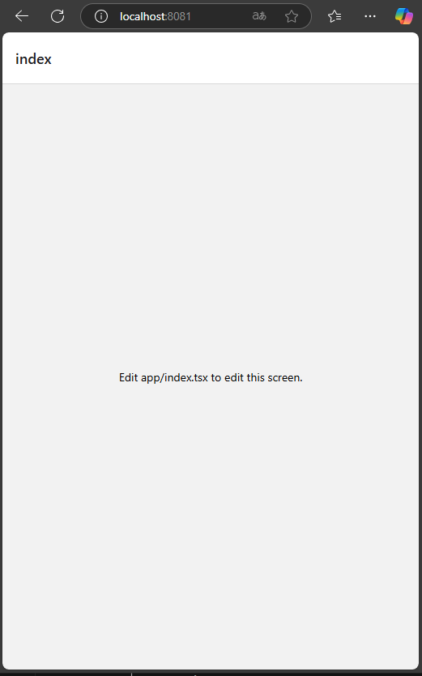
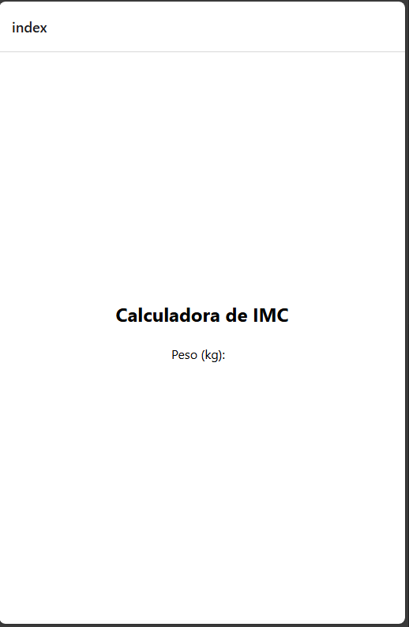
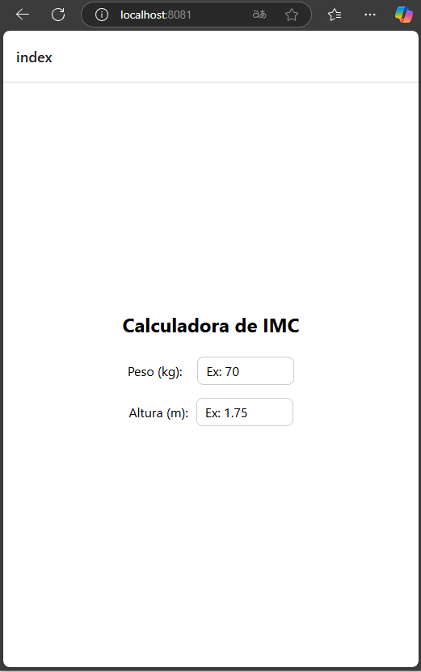
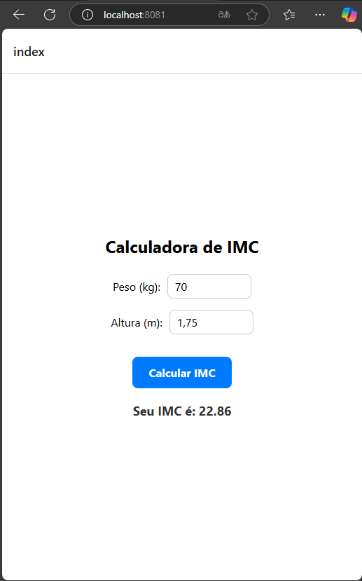
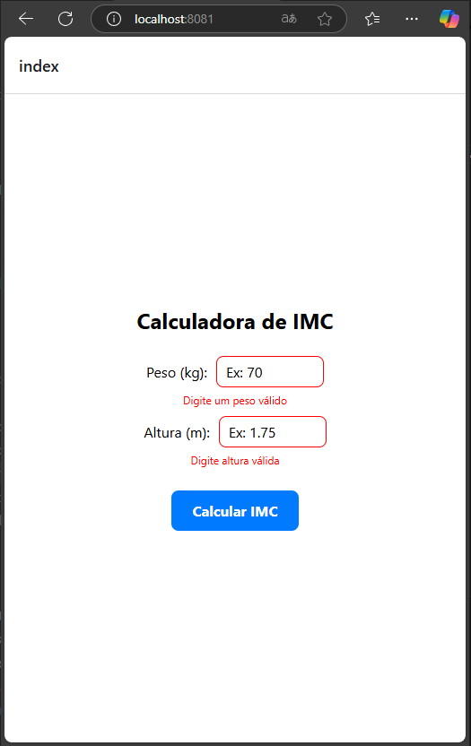

# Mobile-Introduction - IMC-Calculator

# Objetivo: 
Este repositório tem como objetivo dar uma introdução rápida ao desenvolvimento de um app para dispositivos android com o foco em aplicações mobile. 

A ideia é de forma rápida e objetiva conseguir instalar e utilizar um app no celular.

Todo o guia vai ser baseado em react native em função de sua pratividade e facilidade na analise e aprendizado, além de ser um frameork bem aceito no mercado. 

## Pré Requisitos

Esta seção aborda os pré requisistos necessários para podermos proseguir com o aprendizado.

### Pré Requisitos

- [Expo - instalção no dispositivo mobile](https://expo.dev/go/)
- [Node.JS ](https://nodejs.org/en)
- [VS Code](https://code.visualstudio.com/)

Ajuste de politica de execução do PowerShell. Por padrão, o PowerShell não permite a execução de scripts não assinados, como o **npx**. Abaixo o comando para o determinado ajuste.

- Abrir o PowerShell como Administrador
- Pressione **Win + X** e selecione **"Windows PowerShell (Admin)"**.
- Ou procure por **"PowerShell"** no menu iniciar, clique com o botão direito e escolha **"Executar como Administrador"**.
- Digite o seguinte comando no PowerShell para permitir a execução de scripts locais:

```powershell
Set-ExecutionPolicy RemoteSigned -Scope CurrentUser
```

### Familizarização

Links de conhecimento relacionado ao TypeScript e ao React.

- [Introdução ao TS](https://www.typescriptlang.org/docs/handbook/2/everyday-types.html)
- [Introdução ao React](https://react.dev/learn) 

## 1 - Criando seu primeiro APP

### 1 Inicializar um novo aplicativo EXPO

Dentro do nosso terminal do VS Code, criaremos o nosso app através de uma linha de comando. Lembrando que aqui, temos que executar o comando extamente onde queremos que o projeto seja inicializado. 

obs: Recomendo que criem uma pasta na raiz do computador conforme modelo abaixo:

c:\desenvolvimento\mobile\

```sh
npx create-expo-app@latest StickerSmash
```
O comando vai criar um diretório usando um modelo padrão de app, com biblioteca essenciais. 

Algumas Vantagens de usar um modelo padrão para desenvolvimento:
- Cria um novo projeto React Native com expoo pacote instalado
- Inclui ferramentas recomendadas, como Expo CLI
- Inclui um navegador de abas do Expo Router para fornecer um sistema de navegação básico
- Configurado automaticamente para executar um projeto em várias plataformas: Android, iOS e web
TypeScript configurado por padrão

### 2 Script Reset

Como vamos criar o nosso aplicativo do zero, vamos resetar ele e com isto retirar alguns arquivos desnecessários. 

```sh
npm run reset-project
```

Com isto nossa pasta de APP fica com dois arquivos ( index.tsx e _layout.tsx ) os demais foram movidos para a pasta app-example. 

### 3 executando o aplicativo no Celular

Primeiramente executamos o comando abaixo para instalar as dependencias caso falte alguma relacionado ao ferramental do expo. 

```sh
npm install expo
```

Posterior iniciamos o nosso projeto com o comando abaixo.

```sh
npx expo start
```
Se no momento da instalação, aparecer uma mensagem solicitando a liberação do node.js no firewall do windoes, libere tanto para redes publicas como privadas. Este passo é bem iportante pois caso não configuremos estas permissoes, podemos ter impacto para emular o projeto. 

O comando acima iniciara o nosso servidor de desenvolvimento. Caso solicite para instalar alguma dependencia a mesma deve ser instalada.

Estado da nossa aplicação até o momento:



## 2 - Começando 

### 1 Entendendo IMC

Vamos criar um aplicativo que calcula o IMC. As regras do calculo são simples.

Para calcularmos o IMC, primeiramente precisamos do peso e da altura da pessoa.

Posterior realizamos um calculo simples onde "peso / (altura x altura)" e o resultado comparamos com a tabela abaixo: 


| Faixa de IMC           | Classificação         |
|------------------------|-----------------------|
| Abaixo de 18,5         | Abaixo do normal      |
| Entre 18,6 e 24,9      | Normal                |
| Entre 25,0 e 29,9      | Sobrepeso             |
| Entre 30,0 e 34,9      | Obesidade grau I      |
| Entre 35,0 e 39,9      | Obesidade grau II     |
| Acima de 40,0          | Obesidade grau III    |

### 2 Iniciando o desenvolvimento

Vamos seguir a seguinte estrutura para o nosso projeto conforme abaixo. Ainda não é necessário criar toda astrutura, ela vai ir evoluindo conforme formos realizando os fluxos do passo a passo. 

```java
IMCCalculator/
├── app/
│   ├── index.tsx         <- Tela principal (podemos colocar o IMC aqui)
│   ├── _layout.tsx
│   └── ...
├── components/           <- Lugar ideal para seus componentes reutilizáveis
├── ...
```

Primeiramente vamos realizar alguns ajustes simples na nossa tela inicial conforme código abaixo: 

```tsx
import React, { useState } from 'react';
import { View, Text, TextInput, StyleSheet } from 'react-native';

export default function IndexScreen() {
  return (
    <View style={styles.container}>
      <Text style={styles.title}>Calculadora de IMC</Text>     
    </View>
  );
}

const styles = StyleSheet.create({
  container: {
    flex: 1,
    backgroundColor: '#fff',
    paddingHorizontal: 20,
    justifyContent: 'center',
  },
  title: {
    fontSize: 24,
    fontWeight: 'bold',
    marginBottom: 24,
    textAlign: 'center',    
  },  
});

```

<details>
  <summary>📱 Explicação simples do Stack e das rotas</summary>

1. **Importação de módulos**  
   - O código importa `React` e o hook `useState` para gerenciar estados.  
   - Também importa componentes do React Native: `View`, `Text`, `TextInput` e `StyleSheet`.

2. **Componente `IndexScreen`**  
   - Retorna uma estrutura com um `View` principal (Container) que contém um `Text` exibindo o título **"Calculadora de IMC"**.

3. **Estilos (`styles`)**  
   - `container`: Define um fundo branco, espaçamento lateral (`paddingHorizontal: 20`) e alinha os elementos verticalmente no centro.  
   - `title`: Define o título com fonte grande (`fontSize: 24`), negrito (`fontWeight: 'bold'`) e centralização (`textAlign: 'center'`).

</details>


### 3 Adicionanndo o nosso primeiro label

Nosso objetivo atual é criarmos o primeiro campo. Vamos começar pelo campo peso:

```less
Peso (kg):   [       70       ]
```

Vamos adaptar o nosso código e adicionar o nosso primeiro label de peso:

```tsx
import React, { useState } from 'react';
import { View, Text, TextInput, StyleSheet } from 'react-native';

export default function IndexScreen() {

  return (
    <View style={styles.container}>
      <Text style={styles.title}>Calculadora de IMC</Text>

      {/* Linha com o label e o campo */}
      <View style={styles.inputRow}>
        <Text style={styles.label}>Peso (kg):</Text>        
      </View>
    </View>
  );
}

const styles = StyleSheet.create({
  container: {
    flex: 1,
    backgroundColor: '#fff',
    paddingHorizontal: 20,
    justifyContent: 'center',
    alignItems: 'center', // centraliza horizontalmente
  },
  title: {
    fontSize: 24,
    fontWeight: 'bold',
    marginBottom: 24,
    textAlign: 'center',
  },
  inputRow: {
    flexDirection: 'row',         // coloca os itens lado a lado
    alignItems: 'center',         // alinha verticalmente no centro
    marginBottom: 16,
  },
  label: {
    fontSize: 16,
    marginRight: 10,
  },  
});

```

Posterior verifique o projeto em seu computador, para ver como está ficando a evolução do mesmo.



### 4  Adicionanndo o nosso primeiro label

Vamos adicionar um imput e uma configuração de extilo para o mesmo

```tsx
   //Código se mantem igual
<Text style={styles.label}>Peso (kg):</Text>
<TextInput
          style={styles.input}
          placeholder="Ex: 70"
          keyboardType="numeric"
          value={peso}
          onChangeText={setPeso}
        />
   //Código se mantem igual

const styles = StyleSheet.create({
   //Código se mantem igual
   input: {
    borderWidth: 1,
    borderColor: '#ccc',
    borderRadius: 8,
    paddingHorizontal: 10,
    paddingVertical: 6,
    width: 120,
    fontSize: 16,
  },
});

```


<details>
  <summary>📱 Explicação simples código acima</summary>

- View style={inputRow}: cria uma linha horizontal.
- flexDirection: 'row': deixa o label e o input lado a lado.
- alignItems: 'center': centraliza verticalmente o texto e o campo.
- alignItems: 'center' no container: centraliza todo o conteúdo horizontalmente.
- width: 120 no TextInput: evita que ele fique gigante.

</details>

### 5 Repetindo código


Como queremos dois campos, um para altura e outro para o peso:

```less
Peso (kg):     [       70       ]
Altura (kg):   [       1.70     ]
```

Vamos simplismente repetir os códigos criados de campo e label para de altura conforme código abaixo:

```tsx
import React, { useState } from 'react';
import { View, Text, TextInput, StyleSheet } from 'react-native';

export default function IndexScreen() {
  const [peso, setPeso] = useState<string>('');
  const [altura, setAltura] = useState<string>('');

  return (
    <View style={styles.container}>
      <Text style={styles.title}>Calculadora de IMC</Text>

      {/* Campo de Peso */}
      <View style={styles.inputRow}>
        <Text style={styles.label}>Peso (kg):</Text>
        <TextInput
          style={styles.input}
          placeholder="Ex: 70"
          keyboardType="numeric"
          value={peso}
          onChangeText={setPeso}
        />
      </View>

      {/* Campo de Altura */}
      <View style={styles.inputRow}>
        <Text style={styles.label}>Altura (m):</Text>
        <TextInput
          style={styles.input}
          placeholder="Ex: 1.75"
          keyboardType="numeric"
          value={altura}
          onChangeText={setAltura}
        />
      </View>
    </View>
  );
}

const styles = StyleSheet.create({
  container: {
    flex: 1,
    backgroundColor: '#fff',
    paddingHorizontal: 20,
    justifyContent: 'center',
    alignItems: 'center',
  },
  title: {
    fontSize: 24,
    fontWeight: 'bold',
    marginBottom: 24,
    textAlign: 'center',
  },
  inputRow: {
    flexDirection: 'row',
    alignItems: 'center',
    marginBottom: 16,
  },
  label: {
    fontSize: 16,
    marginRight: 10,
  },
  input: {
    borderWidth: 1,
    borderColor: '#ccc',
    borderRadius: 8,
    paddingHorizontal: 10,
    paddingVertical: 6,
    width: 120,
    fontSize: 16,
  },
});

```

<details>
  <summary>🧠 O que fizemos aqui?</summary>

- Adicionamos um novo estado: altura, com useState<string>('').
- Criamos outro bloco View com inputRow para manter o layout idêntico ao campo de peso.
- Usamos o placeholder="Ex: 1.75" para orientar o usuário.

</details>

Até o momento o nosso projeto está neste formato: 



### 6 Próximo passo: Adicionando o botão "Calcular IMC"

Vamos atualizar o nosso código com a criação de um botão:

```tsx
import React, { useState } from 'react';
import { View, Text, TextInput, StyleSheet, TouchableOpacity } from 'react-native';

export default function IndexScreen() {
  const [peso, setPeso] = useState<string>('');
  const [altura, setAltura] = useState<string>('');

  return (
    <View style={styles.container}>
      <Text style={styles.title}>Calculadora de IMC</Text>

      {/* Campo de Peso */}
      <View style={styles.inputRow}>
        <Text style={styles.label}>Peso (kg):</Text>
        <TextInput
          style={styles.input}
          placeholder="Ex: 70"
          keyboardType="numeric"
          value={peso}
          onChangeText={setPeso}
        />
      </View>

      {/* Campo de Altura */}
      <View style={styles.inputRow}>
        <Text style={styles.label}>Altura (m):</Text>
        <TextInput
          style={styles.input}
          placeholder="Ex: 1.75"
          keyboardType="numeric"
          value={altura}
          onChangeText={setAltura}
        />
      </View>

      {/* Botão de calcular - incluido nesta etapa além da estilização do buttonText e button */}
      <TouchableOpacity style={styles.button}>
        <Text style={styles.buttonText}>Calcular IMC</Text>
      </TouchableOpacity>
    </View>
  );
}

const styles = StyleSheet.create({
  container: {
    flex: 1,
    backgroundColor: '#fff',
    paddingHorizontal: 20,
    justifyContent: 'center',
    alignItems: 'center',
  },
  title: {
    fontSize: 24,
    fontWeight: 'bold',
    marginBottom: 24,
    textAlign: 'center',
  },
  inputRow: {
    flexDirection: 'row',
    alignItems: 'center',
    marginBottom: 16,
  },
  label: {
    fontSize: 16,
    marginRight: 10,
  },
  input: {
    borderWidth: 1,
    borderColor: '#ccc',
    borderRadius: 8,
    paddingHorizontal: 10,
    paddingVertical: 6,
    width: 120,
    fontSize: 16,
  },
  button: {
    backgroundColor: '#007bff',
    paddingVertical: 12,
    paddingHorizontal: 24,
    borderRadius: 8,
    marginTop: 16,
  },
  buttonText: {
    color: '#fff',
    fontSize: 16,
    fontWeight: 'bold',
  },
});

```


<details>
  <summary>🧠 Explicação:</summary>

- TouchableOpacity: componente que responde ao toque, ideal para botões simples.
- style={styles.button}: usamos padding, borderRadius e backgroundColor para deixar o botão bonito.
- Text dentro do botão recebe styles.buttonText para o texto branco e negrito.

</details>

### 7 opa, nossos campos aceitam letras e agora? 

Caso isso se mantenha, teremos um problema no futuro. Vamos ajustar os nosso dois campos, para somente aceitar numeros com uma formtação mais simples.

A função abaixo faz isto, remove tudo que for caracter diferente de numero (você pode acoplar esta função abaixo do código 'const [altura, setAltura] = useState<string>('');') 

```tsx
// Função que limpa o texto: só permite número + vírgula/ponto
const limparEntrada = (texto: string): string => {
  // Remove tudo que não for número, vírgula ou ponto
  let limpo = texto.replace(/[^0-9.,]/g, '');

  // Se tiver mais de um ponto ou vírgula, remove os extras
  const partes = limpo.split(/[,\.]/);
  if (partes.length > 2) {
    limpo = partes[0] + '.' + partes[1]; // Mantém só um separador
  }

  return limpo;
};

```

Posterior ajustamos os nossos campos:

```tsx
<TextInput
  style={styles.input}
  placeholder="Ex: 70"
  keyboardType="numeric"
  value={peso}
  onChangeText={(text) => setPeso(limparEntrada(text))}
/>

<TextInput
  style={styles.input}
  placeholder="Ex: 1.75"
  keyboardType="numeric"
  value={altura}
  onChangeText={(text) => setAltura(limparEntrada(text))}
/>
```
<details>
  <summary>🧠 Benefícios dessa abordagem</summary>

- Evita erro na conversão (parseFloat)
- Evita usuário digitando "abc", "70kg", etc
- Dá uma experiência melhor sem precisar de lib externa

</details>


### 8 Calculando!!

Vamos criar a nossa função, que calcula o nosso imc:

Primeiramente temos que criar um estado chamado resultado que vai começar com null. Um estado seria tipo uma variavel. 

Posterior vamos realizar o calculo do IMC. Abaixo o código:

```tsx
const [resultado, setResultado] = useState<number | null>(null);

const calcularIMC = () => {
  const pesoNum = parseFloat(peso.replace(',', '.'));
  const alturaNum = parseFloat(altura.replace(',', '.'));

  if (!isNaN(pesoNum) && !isNaN(alturaNum) && alturaNum > 0) {
    const imc = pesoNum / (alturaNum * alturaNum);
    setResultado(imc);
  } else {
    setResultado(null);
  }
};
```

<details>
  <summary>🧠 O que essa função faz?</summary>

- Converte os textos digitados em número decimal
- Usa replace(',', '.') para aceitar vírgula também
- Valida se os valores são válidos com isNaN (evita bug)
- Se tudo estiver certo:
- Calcula o IMC com a fórmula clássica peso / (altura²)
- Atualiza o estado resultado com o valor calculado
- Se estiver errado:
- Coloca null no resultado (não mostra nada)

</details>

Agora vamos adicionar um botão que faz o calculo do nosso imc:

```tsx
<TouchableOpacity style={styles.button} onPress={calcularIMC}>
  <Text style={styles.buttonText}>Calcular IMC</Text>
</TouchableOpacity>
```

<details>
  <summary>🧠 Explicando:</summary>

- TouchableOpacity é um botão que fica mais transparente quando pressionado
- onPress={calcularIMC} faz o botão executar a função de cálculo
- O Text é só o rótulo do botão ("Calcular IMC")
- O estilo foi aplicado pra deixar visualmente agradável

</details>

Vamos mostrar o resultado na tela: 

```tsx
{resultado !== null && (
  <Text style={styles.resultado}>
    Seu IMC é: {resultado.toFixed(2)}
  </Text>
)}

// formatção do resultado:

  resultado: {
    marginTop: 20,
    fontSize: 18,
    fontWeight: 'bold',
    color: '#333',
  },
```

<details>
  <summary>🧠 O que isso faz?</summary>

- Esse bloco só aparece se o resultado não for null
- Mostra o texto: "Seu IMC é: 22.53" por exemplo
- Usa .toFixed(2) para limitar a 2 casas decimais

</details>


Até este momento temos os seguintes resultados: 



### 9 Adicionando classificação ao resultado

Primeiramente vamos criar uma nova constante apra mostrar o resultado do nosso imc, podemos colocar logo abaixo da nossa constante resultado:

```tsx
const [classificacao, setClassificacao] = useState<string | null>(null);]
```

Vamos também atualizar o nosso calculo de IMC para nos mostrar a classificação:
Subistituimos a nossa função de calculo de IMC pela seguinte: 

```tsx
const calcularIMC = () => {
  const pesoNum = parseFloat(peso.replace(',', '.'));
  const alturaNum = parseFloat(altura.replace(',', '.'));

  if (!isNaN(pesoNum) && !isNaN(alturaNum) && alturaNum > 0) {
    const imc = pesoNum / (alturaNum * alturaNum);
    setResultado(imc);

    // Classificação
    let classificacaoTexto = '';
    if (imc < 18.5) {
      classificacaoTexto = 'Abaixo do normal';
    } else if (imc >= 18.6 && imc <= 24.9) {
      classificacaoTexto = 'Normal';
    } else if (imc >= 25.0 && imc <= 29.9) {
      classificacaoTexto = 'Sobrepeso';
    } else if (imc >= 30.0 && imc <= 34.9) {
      classificacaoTexto = 'Obesidade grau I';
    } else if (imc >= 35.0 && imc <= 39.9) {
      classificacaoTexto = 'Obesidade grau II';
    } else if (imc >= 40.0) {
      classificacaoTexto = 'Obesidade grau III';
    }

    setClassificacao(classificacaoTexto);
  } else {
    setResultado(null);
    setClassificacao(null);
  }
};
```

Posterior organizamos o nosso resultado em tela além de adicionarmos uma estilização da classificação:

```tsx
//codigo continua igual
{resultado !== null && (
  <>
    <Text style={styles.resultado}>
      Seu IMC é: {resultado.toFixed(2)}
    </Text>
    <Text style={styles.classificacao}>
      Classificação: {classificacao}
    </Text>
  </>
)}
//codigo continua igual

classificacao: {
  marginTop: 8,
  fontSize: 16,
  color: '#555',
  textAlign: 'center',
},
```
Abaixo vemos como está a nossa aplicação até o momento


### 10 Criando uma validação dos campos

Nesta sessão vamos criar uma validação dos campo, validando se os mesmos estão preenchidos e caso não estejam, adicionamos uma sinalização. 

Primeiramente criamos os estados de erro logo abaixo dos demais estados: 

```tsx
const [erroPeso, setErroPeso] = useState<boolean>(false);
const [erroAltura, setErroAltura] = useState<boolean>(false);
```

Modificamos a nossa função de calculo do imc para validar se os campos estão digitados ou não: 

```tsx
const calcularIMC = () => {
  const pesoNum = parseFloat(peso.replace(',', '.'));
  const alturaNum = parseFloat(altura.replace(',', '.'));

  // Validação dos campos
  const pesoValido = !isNaN(pesoNum);
  const alturaValida = !isNaN(alturaNum) && alturaNum > 0;

  setErroPeso(!pesoValido);
  setErroAltura(!alturaValida);

  if (pesoValido && alturaValida) {
    const imc = pesoNum / (alturaNum * alturaNum);
    setResultado(imc);

    // Classificação
    let classificacaoTexto = '';
    if (imc < 18.5) {
      classificacaoTexto = 'Abaixo do normal';
    } else if (imc >= 18.6 && imc <= 24.9) {
      classificacaoTexto = 'Normal';
    } else if (imc >= 25.0 && imc <= 29.9) {
      classificacaoTexto = 'Sobrepeso';
    } else if (imc >= 30.0 && imc <= 34.9) {
      classificacaoTexto = 'Obesidade grau I';
    } else if (imc >= 35.0 && imc <= 39.9) {
      classificacaoTexto = 'Obesidade grau II';
    } else if (imc >= 40.0) {
      classificacaoTexto = 'Obesidade grau III';
    }

    setClassificacao(classificacaoTexto);
  } else {
    setResultado(null);
    setClassificacao(null);
  }
};

```

No nosso estilo, colocmos o seguinte imput de erro: 

```tsx
inputErro: {
  borderColor: 'red',
},
```

Posterior adicionamos o condicional de erro aos nossos campos: 

Altura: 

```tsx
<TextInput
  style={[styles.input, erroAltura && styles.inputErro]}
  placeholder="Ex: 1.75"
  keyboardType="numeric"
  value={altura}
  onChangeText={(text) => {
    setAltura(text);
    if (erroAltura) setErroAltura(false); // limpa erro ao digitar
  }}
/>

```

Peso:

```tsx
<TextInput
  style={[styles.input, erroPeso && styles.inputErro]}
  placeholder="Ex: 70"
  keyboardType="numeric"
  value={peso}
  onChangeText={(text) => {
    setPeso(text);
    if (erroPeso) setErroPeso(false); // limpa erro ao digitar
  }}
/>

```

<details>
  <summary>🧪 Resultado:</summary>

- Se o usuário clicar em "Calcular IMC" sem digitar peso ou altura:
- A borda do campo fica vermelha
- O cálculo não é feito
- Ao começar a digitar, o erro desaparece

</details>



### 11  Melhorando o erro

Vamos colocar uma mensagem para melhorar o nosso erro.

Primeiramente criamos o estilo textoErro, conrforme abaixo:

```tsx
textoErro: {
  color: 'red',
  fontSize: 12,
  marginTop: -10,
  marginBottom: 10,
},
```

Posterior colocamos a seguinte linha abaixo de cada um dos campos: 

```tsx
{erroPeso && <Text style={styles.textoErro}>Digite um peso válido</Text>}
```

Nosso código completo até o momento: 

```tsx
import React, { useState } from 'react';
import { View, Text, TextInput, StyleSheet, TouchableOpacity } from 'react-native';

export default function IndexScreen() {
  const [peso, setPeso] = useState<string>('');
  const [altura, setAltura] = useState<string>('');
  const [resultado, setResultado] = useState<number | null>(null);
  const [classificacao, setClassificacao] = useState<string | null>(null);
  const [erroPeso, setErroPeso] = useState<boolean>(false);
  const [erroAltura, setErroAltura] = useState<boolean>(false);

  const calcularIMC = () => {
    const pesoNum = parseFloat(peso.replace(',', '.'));
    const alturaNum = parseFloat(altura.replace(',', '.'));

      // Validação dos campos
    const pesoValido = !isNaN(pesoNum);
    const alturaValida = !isNaN(alturaNum) && alturaNum > 0;

    setErroPeso(!pesoValido);
    setErroAltura(!alturaValida);
  
    if (!isNaN(pesoNum) && !isNaN(alturaNum) && alturaNum > 0) {
      const imc = pesoNum / (alturaNum * alturaNum);
      setResultado(imc);
  
      // Classificação
      let classificacaoTexto = '';
      if (imc < 18.5) {
        classificacaoTexto = 'Abaixo do normal';
      } else if (imc >= 18.6 && imc <= 24.9) {
        classificacaoTexto = 'Normal';
      } else if (imc >= 25.0 && imc <= 29.9) {
        classificacaoTexto = 'Sobrepeso';
      } else if (imc >= 30.0 && imc <= 34.9) {
        classificacaoTexto = 'Obesidade grau I';
      } else if (imc >= 35.0 && imc <= 39.9) {
        classificacaoTexto = 'Obesidade grau II';
      } else if (imc >= 40.0) {
        classificacaoTexto = 'Obesidade grau III';
      }
  
      setClassificacao(classificacaoTexto);
    } else {
      setResultado(null);
      setClassificacao(null);
    }
  };

  const limparEntrada = (texto: string): string => {
    // Remove tudo que não for número, vírgula ou ponto
    let limpo = texto.replace(/[^0-9.,]/g, '');
  
    // Se tiver mais de um ponto ou vírgula, remove os extras
    const partes = limpo.split(/[,\.]/);
    if (partes.length > 2) {
      limpo = partes[0] + '.' + partes[1]; // Mantém só um separador
    }
  
    return limpo;
  };

  return (
    <View style={styles.container}>
      <Text style={styles.title}>Calculadora de IMC</Text>

      {/* Campo de Peso */}
      <View style={styles.inputRow}>
        <Text style={styles.label}>Peso (kg):</Text>
        <TextInput
          style={[styles.input, erroPeso && styles.inputErro]}
          placeholder="Ex: 70"
          keyboardType="numeric"
          value={peso}
          onChangeText={(text) => {
            setPeso(text);
            if (erroPeso) setErroPeso(false); // limpa erro ao digitar
          }}
        />
        {erroPeso && <Text style={styles.textoErro}>Digite um peso válido</Text>}
      </View>
      

      {/* Campo de Altura */}
      <View style={styles.inputRow}>
        <Text style={styles.label}>Altura (m):</Text>
        <TextInput
          style={[styles.input, erroAltura && styles.inputErro]}
          placeholder="Ex: 1.75"
          keyboardType="numeric"
          value={altura}
          onChangeText={(text) => {
            setAltura(text);
            if (erroAltura) setErroAltura(false); // limpa erro ao digitar
          }}
        />
        {erroPeso && <Text style={styles.textoErro}>Digite altura válida</Text>}
      </View>
      

      <TouchableOpacity style={styles.button} onPress={calcularIMC}>
        <Text style={styles.buttonText}>Calcular IMC</Text>
      </TouchableOpacity>

      {resultado !== null && (
        <>
          <Text style={styles.resultado}>
            Seu IMC é: {resultado.toFixed(2)}
          </Text>
          <Text style={styles.classificacao}>
            Classificação: {classificacao}
          </Text>
        </>
      )}
      
    </View>
    
  );
}

const styles = StyleSheet.create({
  container: {
    flex: 1,
    backgroundColor: '#fff',
    paddingHorizontal: 20,
    justifyContent: 'center',
    alignItems: 'center',
  },
  title: {
    fontSize: 24,
    fontWeight: 'bold',
    marginBottom: 24,
    textAlign: 'center',
  },
  inputRow: {
    flexDirection: 'row',
    alignItems: 'center',
    marginBottom: 16,
  },
  label: {
    fontSize: 16,
    marginRight: 10,
  },
  input: {
    borderWidth: 1,
    borderColor: '#ccc',
    borderRadius: 8,
    paddingHorizontal: 10,
    paddingVertical: 6,
    width: 120,
    fontSize: 16,
  },
  button: {
    backgroundColor: '#007bff',
    paddingVertical: 12,
    paddingHorizontal: 24,
    borderRadius: 8,
    marginTop: 16,
  },
  buttonText: {
    color: '#fff',
    fontSize: 16,
    fontWeight: 'bold',
  },
  resultado: {
    marginTop: 20,
    fontSize: 18,
    fontWeight: 'bold',
    color: '#333',
  },
  classificacao: {
    marginTop: 8,
    fontSize: 16,
    color: '#555',
    textAlign: 'center',
  },
  inputErro: {
    borderColor: 'red',
  },
  textoErro: {
    color: 'red',
    fontSize: 12,
    marginTop: -10,
    marginBottom: 10,
  },
});

```

Vamos ajustar o nosso _layout.tsx para atualizar o nome da nossa aba de calculadora:

```tsx
import { Stack } from 'expo-router';

export default function Layout() {
  return (
    <Stack>
      <Stack.Screen 
        name="index" 
        options={{ title: 'Calculadora IMC' }} 
      />
    </Stack>
  );
}
```

### 12 Gerando um apk da calculadora

Nos passos 13 em diante vamos deixar a nossa calculadora mais bonita.
Mas de momento vamos ver a nossa calculadora funcionando diretamente no nosso celular através de um apk.

#### 1 Buildando um apk

---
Antes de continuarmos, devemos criar uma conta na plataforma [EAS](https://expo.dev/signup).(Caso ja tenha conta, pode igonrar esse passo)

Posterior necessitamos intalar o pacote de build do expo. O comando abaixo instala de forma global(Caso ja tenha instalado, pode igonrar esse passo)

```sh
npm install -g eas-cli
```

Logamos na plataforma eas com o seguinte comando
Colocamos usuário e senha criado nos passos anteriores.

```sh
eas login
```

Geramos a configuração do projeto:

```sh
eas build:configure
```

Alteramos o arquivo eas.json criado com as seguintes configurações: 

```json
{
  "build": {
    "preview": {
      "android": {
        "buildType": "apk"
      }
    }
  }
}
```

Posterior buildamos o nosso apk com o seguinte comando: 
Observação: O processo demora em função de estarmos com uma licença free para build na plataforma EAS.

```sh
eas build --profile preview --platform android
```


### 3 Instalando o app no celular

Pegamos o arquivo gerado através da URL do build. O mesmo vai entregar um arquivo.apk.

Posterior, enviamos esta arquivo APK para o nosso android via drive ou outra ferramenta de escolha. 

Ao final, instalamos o mesmo em nosso celular. Para a instalação ser possível o android tem que estar em modo desenvolvedor e o apk em diretório local.
---


