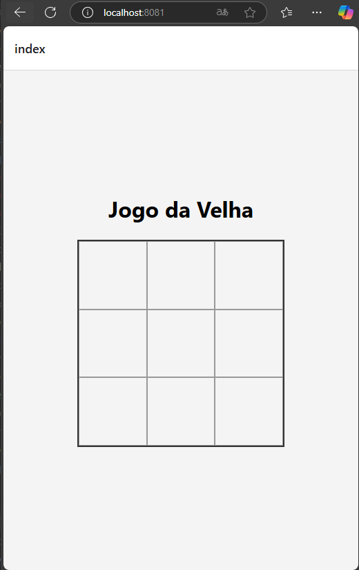
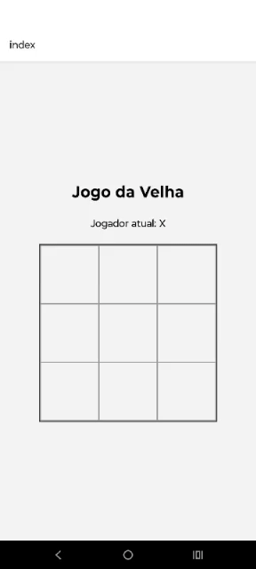
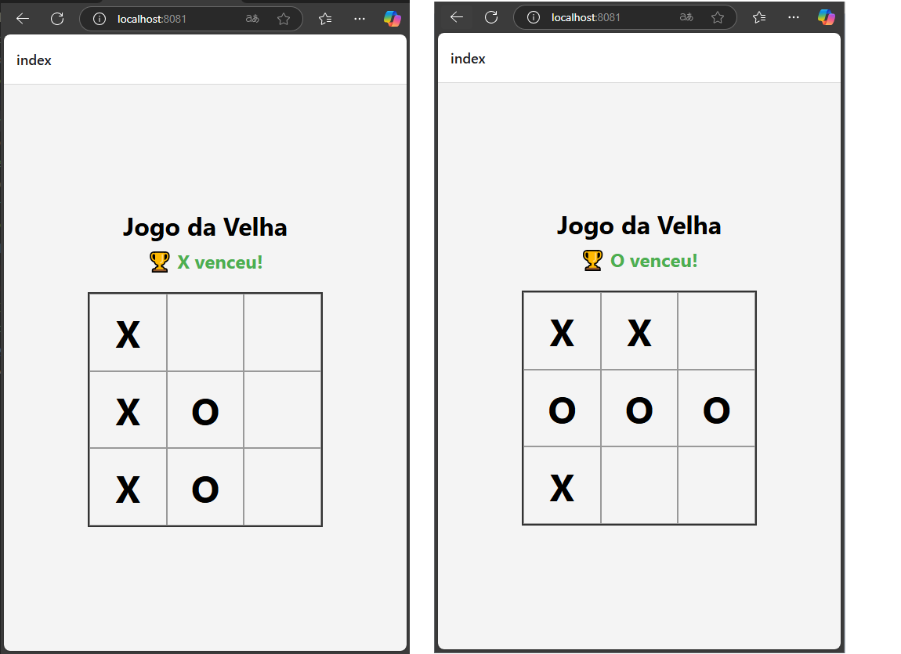
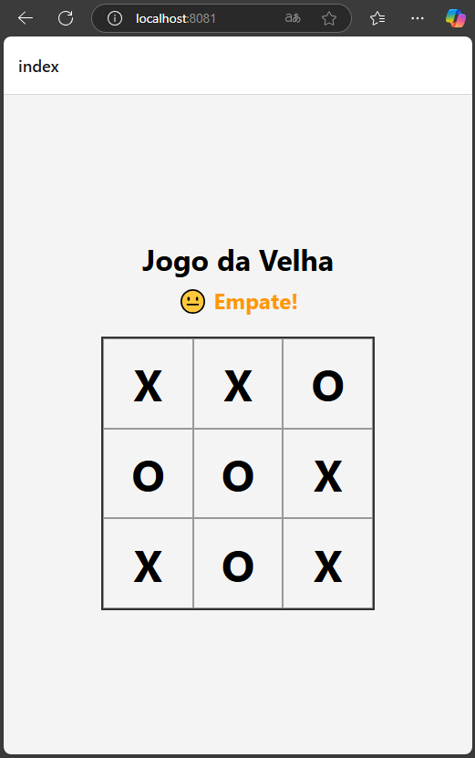
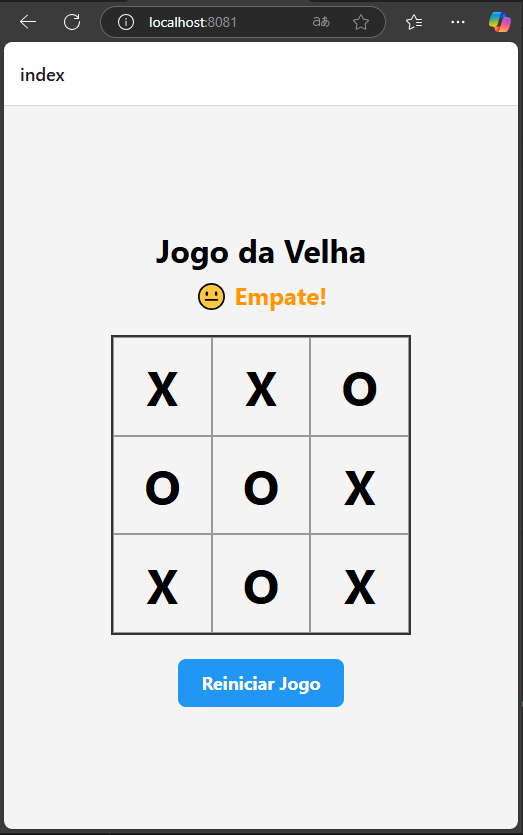
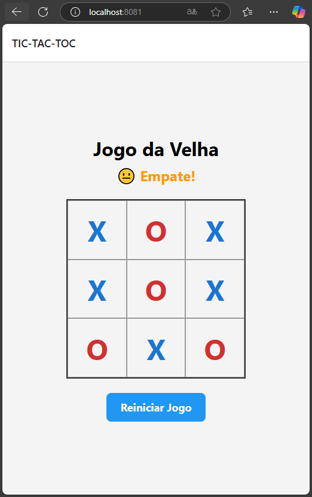

# Mobile-Introduction - TIC-TAC-TOE

# Objetivo: 
Este repositório tem como objetivo dar uma introdução rápida ao desenvolvimento de um app para dispositivos android com o foco em aplicações mobile. 

A ideia é de forma rápida e objetiva conseguir instalar e utilizar um app no celular.

Todo o guia vai ser baseado em react native em função de sua pratividade e facilidade na analise e aprendizado, além de ser um frameork bem aceito no mercado. 

## Pré Requisitos

Esta seção aborda os pré requisistos necessários para podermos proseguir com o aprendizado.

### Pré Requisitos

- [Expo - instalção no dispositivo mobile](https://expo.dev/go/)
- [Node.JS ](https://nodejs.org/en)
- [VS Code](https://code.visualstudio.com/)

Ajuste de politica de execução do PowerShell. Por padrão, o PowerShell não permite a execução de scripts não assinados, como o **npx**. Abaixo o comando para o determinado ajuste.

- Abrir o PowerShell como Administrador
- Pressione **Win + X** e selecione **"Windows PowerShell (Admin)"**.
- Ou procure por **"PowerShell"** no menu iniciar, clique com o botão direito e escolha **"Executar como Administrador"**.
- Digite o seguinte comando no PowerShell para permitir a execução de scripts locais:

```powershell
Set-ExecutionPolicy RemoteSigned -Scope CurrentUser
```

### Familizarização

Links de conhecimento relacionado ao TypeScript e ao React.

- [Introdução ao TS](https://www.typescriptlang.org/docs/handbook/2/everyday-types.html)
- [Introdução ao React](https://react.dev/learn) 

## 1 - Criando seu primeiro APP

### 1 Inicializar um novo aplicativo EXPO

Dentro do nosso terminal do VS Code, criaremos o nosso app através de uma linha de comando. Lembrando que aqui, temos que executar o comando extamente onde queremos que o projeto seja inicializado. 

obs: Recomendo que criem uma pasta na raiz do computador conforme modelo abaixo:

c:\desenvolvimento\mobile\

```sh
npx create-expo-app@latest tic-tac-toe
```
O comando vai criar um diretório usando um modelo padrão de app, com biblioteca essenciais. 

Algumas Vantagens de usar um modelo padrão para desenvolvimento:
- Cria um novo projeto React Native com expoo pacote instalado
- Inclui ferramentas recomendadas, como Expo CLI
- Inclui um navegador de abas do Expo Router para fornecer um sistema de navegação básico
- Configurado automaticamente para executar um projeto em várias plataformas: Android, iOS e web
TypeScript configurado por padrão

### 2 Script Reset

Como vamos criar o nosso aplicativo do zero, vamos resetar ele e com isto retirar alguns arquivos desnecessários. 

```sh
npm run reset-project
```

Com isto nossa pasta de APP fica com dois arquivos ( index.tsx e _layout.tsx ) os demais foram movidos para a pasta app-example. 

### 3 executando o aplicativo no Celular

Primeiramente executamos o comando abaixo para instalar as dependencias caso falte alguma relacionado ao ferramental do expo. 

```sh
npm install expo
```

Posterior iniciamos o nosso projeto com o comando abaixo.

```sh
npx expo start
```
Se no momento da instalação, aparecer uma mensagem solicitando a liberação do node.js no firewall do windoes, libere tanto para redes publicas como privadas. Este passo é bem iportante pois caso não configuremos estas permissoes, podemos ter impacto para emular o projeto. 

O comando acima iniciara o nosso servidor de desenvolvimento. Caso solicite para instalar alguma dependencia a mesma deve ser instalada.

Estado da nossa aplicação até o momento:


## 2 - Começando 

### 1 Entendendo IMC

Vamos criar um aplicativo do jogo da velha onde em sua primeira versão, vamos jogar em dois players no mesmo celular. (No futuro colocamos uma intgração com alguma IA para jogar contra a gente);

|   |   |   |
|---|---|---|
| X | O | X |
|   | X |   |
| O |   | O |

### 2 Iniciando o desenvolvimento

Vamos seguir a seguinte estrutura para o nosso projeto conforme abaixo. Ainda não é necessário criar toda astrutura, ela vai ir evoluindo conforme formos realizando os fluxos do passo a passo. 

```java
IMCCalculator/
├── app/
│   ├── index.tsx         <- Tela principal (Vamos  o TIC-TOC-TAC aqui)
│   ├── _layout.tsx
│   └── ...
├── components/           <- Lugar ideal para seus componentes reutilizáveis
├── ...
```

Primeiramente vamos realizar alguns ajustes simples na nossa tela inicial conforme código abaixo: 

```tsx
import { View, Text, StyleSheet } from 'react-native';

export default function HomeScreen() {
  return (
    <View style={styles.container}>
      <Text style={styles.title}>Jogo da Velha</Text>
      <View style={styles.board}>
        <Text>Aqui vai o tabuleiro!</Text>
      </View>
    </View>
  );
}

const styles = StyleSheet.create({
  container: {
    flex: 1,
    backgroundColor: '#F4F4F4',
    alignItems: 'center',
    justifyContent: 'center',
    padding: 16,
  },
  title: {
    fontSize: 32,
    fontWeight: 'bold',
    marginBottom: 24,
  },
  board: {
    width: 300,
    height: 300,
    backgroundColor: '#DDD',
    justifyContent: 'center',
    alignItems: 'center',
  },
});
```


<details>
  <summary>🧠 O que esse código faz:</summary>

- Mostra um título centralizado: Jogo da Velha.
- Cria uma View (Container) que será o nosso tabuleiro futuramente (por enquanto é só uma caixinha cinza com texto).
- Tudo está centralizado na tela.

</details>


## 3 - Quandrados, muitos quadrados, hahahaha

Nesta ponto vamos começar pelo basico, com muita estilização.

Primeiramente vamos adaptar o nosso código como abaixo: 

```tsx
import { View, Text, StyleSheet, TouchableOpacity } from 'react-native';

export default function HomeScreen() {
  // Um array com 9 elementos para representar as 9 casas do tabuleiro
  const cells = Array.from({ length: 9 }, (_, index) => index);

  return (
    <View style={styles.container}>
      <Text style={styles.title}>Jogo da Velha</Text>

      <View style={styles.board}>
        {cells.map((cell, index) => (
          <TouchableOpacity key={index} style={styles.cell}>
            <Text style={styles.cellText}> </Text>
          </TouchableOpacity>
        ))}
      </View>
    </View>
  );
}

const styles = StyleSheet.create({
  container: {
    flex: 1,
    backgroundColor: '#F4F4F4',
    alignItems: 'center',
    justifyContent: 'center',
    padding: 16,
  },
  title: {
    fontSize: 32,
    fontWeight: 'bold',
    marginBottom: 24,
  },
  board: {
    width: 300,
    height: 300,
    flexDirection: 'row',
    flexWrap: 'wrap', // Quebra de linha após 3 itens
    borderWidth: 2,
    borderColor: '#333',
  },
  cell: {
    width: '33.33%', // 3 células por linha
    height: '33.33%',
    borderWidth: 1,
    borderColor: '#999',
    alignItems: 'center',
    justifyContent: 'center',
  },
  cellText: {
    fontSize: 48,
    fontWeight: 'bold',
  },
});
```

Se formos observar o código acima, adicionamos um container para ser o nosso tabuleiro, trabalhamos o estilo para gerar um formato de 3 blocos, ao chegarmos no terceiros bloco, quebramos para os próximos 3 e assim por diante. 

<details>
  <summary>🔍 O que está acontecendo aqui? (Leitura Imprescindível)</summary>

- cells: usamos Array.from para gerar um array de 9 posições (0 a 8), representando o tabuleiro.
- TouchableOpacity: usamos como botão interativo para cada casa.
- flexWrap: 'wrap': faz com que os elementos “quebrem de linha” automaticamente, formando uma grade.
- width: '33.33%': cada célula ocupa 1/3 da largura da tela (3 colunas).
- Text dentro da célula: por enquanto vazio. Depois, vamos exibir X ou O aqui.

</details>

Até o momento o nosso jogo está assim: 



## 4 - Alteranando entre O e X

Para começarmos, vamos criar a função que faz esse fluxo de alternancia, vamos colocar o código em partes abaixo e no final ele vai estar completo, caso tenham dificuldade em entender o que está ocorrendo. Também a comentarios para ajudar a entender o fluxo.

```tsx
import React, { useState } from 'react';

xport default function HomeScreen() {
  // Estado do tabuleiro: array com 9 posições, inicialmente todas vazias
  const [board, setBoard] = useState(Array(9).fill(''));
  // Estado do jogador atual
  const [currentPlayer, setCurrentPlayer] = useState<'X' | 'O'>('X');

  const handleCellPress = (index: number) => {
    // Se a célula já estiver preenchida, não faz nada
    if (board[index] !== '') return;

    // Copia o estado atual do tabuleiro
    const newBoard = [...board];
    newBoard[index] = currentPlayer;

    // Atualiza o estado do tabuleiro
    setBoard(newBoard);

    // Alterna o jogador
    setCurrentPlayer(currentPlayer === 'X' ? 'O' : 'X');
  };
  // abaixo vamos ajustar nos próximos passos
```

<details>
  <summary>🔁 Passo a passo do fluxo! (Leitura Imprescindível)</summary>

1. Estado inicial:
   - board: é um array com 9 posições, representando as 9 células do jogo. Começa vazio: ['', '', '', '', '', '', '', '', ''].
   - currentPlayer: começa com 'X', o primeiro jogador.

2. Quando o jogador toca em uma célula (handleCellPress):
   - Primeiro ele verifica se essa célula já foi jogada (if (board[index] !== '') return;).
   - Se estiver vazia, ele copia o estado atual do tabuleiro (const newBoard = [...board]) e coloca o símbolo do jogador atual na célula escolhida.
   - Depois atualiza o tabuleiro com setBoard(newBoard).
   - E então alterna o jogador atual: se era 'X', vira 'O', e vice-versa.

🧠 Exemplo rápido

Jogador 'X' toca na célula 0 → tabuleiro vira: ['X', '', '', '', '', '', '', '', ''] → próximo jogador é 'O'

Jogador 'O' toca na célula 4 → tabuleiro vira: ['X', '', '', '', 'O', '', '', '', ''] → próximo jogador é 'X'

</details>

Posterior adicionamos outro trecho de código: 

```tsx
return (
    <View style={styles.container}>
      <Text style={styles.title}>Jogo da Velha</Text>
      <Text style={styles.subtitle}>Jogador atual: {currentPlayer}</Text>

      <View style={styles.board}>
        {board.map((value, index) => (
          <TouchableOpacity
            key={index}
            style={styles.cell}
            onPress={() => handleCellPress(index)}
          >
            <Text style={styles.cellText}>{value}</Text>
          </TouchableOpacity>
        ))}
      </View>
    </View>
  );


  // nos estilos adicionamos o subtitle

  subtitle: {
    fontSize: 20,
    marginBottom: 24,
  },
```

<details>
  <summary>🔁 Passo a passo do fluxo! (Leitura Imprescindível este aqui é o mais de todos)</summary>

📦 return ( ... )
Esse trecho está dentro do componente principal, então tudo que estiver dentro do return é renderizado na tela.

🧱 <View style={styles.container}>
É o container principal da tela. Ele agrupa todos os outros elementos e aplica o estilo styles.container (como fundo escuro, centralização etc).

🏷️ <Text style={styles.title}>Jogo da Velha</Text>
Exibe o título da página na tela com o texto "Jogo da Velha".

🔄 <Text style={styles.subtitle}>Jogador atual: {currentPlayer}</Text>
Mostra de forma dinâmica quem é o jogador da vez, usando o valor da variável currentPlayer, que pode ser 'X' ou 'O'.

🎯 <View style={styles.board}>
É o tabuleiro (3x3). Esse View agrupa todas as células do jogo.

🔁 {board.map((value, index) => (...)}
- O board é um array com 9 posições (uma para cada casa do jogo).
- O .map() percorre cada uma dessas posições.
- Para cada célula, ele cria um botão com TouchableOpacity.

🎮 <TouchableOpacity ...>
- Esse é o botão que representa uma célula do tabuleiro.
- key={index} → Identificador único para cada célula.
- style={styles.cell} → Estilo da célula (tamanho, borda, etc).
- onPress={() => handleCellPress(index)} → Ao clicar, chama a função handleCellPress passando o índice da célula clicada.

🔤 <Text style={styles.cellText}>{value}</Text>
- Exibe o valor atual da célula: 'X', 'O' ou '' (vazio).
- O valor vem do array board[index].

</details>

✅ Em resumo os ajustes acima nos entregam:

- Elemento: Função
- View:	Agrupa e organiza a tela
- Text:	Exibe textos como título e jogador atual
- TouchableOpacity:	Botões clicáveis representando cada célula do tabuleiro
- onPress:	Define o que acontece quando o jogador clica em uma célula

Nosso código até o momento:

```tsx
import React, { useState } from 'react';
import { View, Text, StyleSheet, TouchableOpacity } from 'react-native';

export default function HomeScreen() {
  // Estado do tabuleiro: array com 9 posições, inicialmente todas vazias
  const [board, setBoard] = useState(Array(9).fill(''));
  // Estado do jogador atual
  const [currentPlayer, setCurrentPlayer] = useState<'X' | 'O'>('X');

  const handleCellPress = (index: number) => {
    // Se a célula já estiver preenchida, não faz nada
    if (board[index] !== '') return;

    // Copia o estado atual do tabuleiro
    const newBoard = [...board];
    newBoard[index] = currentPlayer;

    // Atualiza o estado do tabuleiro
    setBoard(newBoard);

    // Alterna o jogador
    setCurrentPlayer(currentPlayer === 'X' ? 'O' : 'X');
  };

  return (
    <View style={styles.container}>
      <Text style={styles.title}>Jogo da Velha</Text>
      <Text style={styles.subtitle}>Jogador atual: {currentPlayer}</Text>

      <View style={styles.board}>
        {board.map((value, index) => (
          <TouchableOpacity
            key={index}
            style={styles.cell}
            onPress={() => handleCellPress(index)}
          >
            <Text style={styles.cellText}>{value}</Text>
          </TouchableOpacity>
        ))}
      </View>
    </View>
  );
}

const styles = StyleSheet.create({
  container: {
    flex: 1,
    backgroundColor: '#F4F4F4',
    alignItems: 'center',
    justifyContent: 'center',
    padding: 16,
  },
  title: {
    fontSize: 32,
    fontWeight: 'bold',
    marginBottom: 8,
  },
  subtitle: {
    fontSize: 20,
    marginBottom: 24,
  },
  board: {
    width: 300,
    height: 300,
    flexDirection: 'row',
    flexWrap: 'wrap',
    borderWidth: 2,
    borderColor: '#333',
  },
  cell: {
    width: '33.33%',
    height: '33.33%',
    borderWidth: 1,
    borderColor: '#999',
    alignItems: 'center',
    justifyContent: 'center',
  },
  cellText: {
    fontSize: 48,
    fontWeight: 'bold',
  },
});

```
Até o momento o nosso jogo está assim: 




## 5 Validando Vencedor

Vamos adicionar um código que valide o vencedor e jogue na tela uma mensagem.
Há comentarios nesse bloco de código explicando o que está ocorrendo com as novas alterações. 

```tsx
// acima permanece igual
export default function HomeScreen() {
  const [board, setBoard] = useState(Array(9).fill(''));
  const [currentPlayer, setCurrentPlayer] = useState<'X' | 'O'>('X');
  const [winner, setWinner] = useState<null | 'X' | 'O'>(null);

   // Todas as possibilidades para um possível vencedor
  const winningCombinations = [
    [0, 1, 2], // linhas
    [3, 4, 5],
    [6, 7, 8],
    [0, 3, 6], // colunas
    [1, 4, 7],
    [2, 5, 8],
    [0, 4, 8], // diagonais
    [2, 4, 6],
  ];

   // cria a função que valida se a um vencedor
  const checkWinner = (newBoard: string[]) => {
    for (const combination of winningCombinations) {
      const [a, b, c] = combination;
      if (
        newBoard[a] &&
        newBoard[a] === newBoard[b] &&
        newBoard[a] === newBoard[c]
      ) {
        return newBoard[a] as 'X' | 'O'; // 'X' ou 'O'
      }
    }
    return null;
  };

   // adaptamos a função para validar se há um vencedor e se não há, deixa o proximo player jogar
  const handleCellPress = (index: number) => {
    if (board[index] !== '' || winner) return;

    const newBoard = [...board];
    newBoard[index] = currentPlayer;

    const foundWinner = checkWinner(newBoard);

    if (foundWinner) {
      setWinner(foundWinner);
    }

    setBoard(newBoard);

    if (!foundWinner) {
      setCurrentPlayer(currentPlayer === 'X' ? 'O' : 'X');
    }
  };

// Abaixo nao muda
  return (
    // Aqui também não muda
    // Abaixo adicionamos uma lógica que se tiver vencedor, escreve na tela, se nao mantem o titulo
     {winner ? (
        <Text style={styles.winnerText}>🏆 {winner} venceu!</Text>
      ) : (
        <Text style={styles.subtitle}>Jogador atual: {currentPlayer}</Text>
      )}
  );
  // Aqui também não muda
}

const styles = StyleSheet.create({
 // Nao muda
 // Adicionamos um estilo para sinalizar o vencedor
  winnerText: {
    fontSize: 24,
    fontWeight: 'bold',
    color: '#4CAF50',
    marginBottom: 24,
  },// Nao muda
});
```

Código completo até o momento:

```tsx
import React, { useState } from 'react';
import { View, Text, StyleSheet, TouchableOpacity } from 'react-native';

export default function HomeScreen() {
  const [board, setBoard] = useState(Array(9).fill(''));
  const [currentPlayer, setCurrentPlayer] = useState<'X' | 'O'>('X');
  const [winner, setWinner] = useState<null | 'X' | 'O'>(null);

  const winningCombinations = [
    [0, 1, 2], // linhas
    [3, 4, 5],
    [6, 7, 8],
    [0, 3, 6], // colunas
    [1, 4, 7],
    [2, 5, 8],
    [0, 4, 8], // diagonais
    [2, 4, 6],
  ];

  const checkWinner = (newBoard: string[]) => {
    for (const combination of winningCombinations) {
      const [a, b, c] = combination;
      if (
        newBoard[a] &&
        newBoard[a] === newBoard[b] &&
        newBoard[a] === newBoard[c]
      ) {
        return newBoard[a] as 'X' | 'O'; // 'X' ou 'O'
      }
    }
    return null;
  };

  const handleCellPress = (index: number) => {
    if (board[index] !== '' || winner) return;

    const newBoard = [...board];
    newBoard[index] = currentPlayer;

    const foundWinner = checkWinner(newBoard);

    if (foundWinner) {
      setWinner(foundWinner);
    }

    setBoard(newBoard);

    if (!foundWinner) {
      setCurrentPlayer(currentPlayer === 'X' ? 'O' : 'X');
    }
  };

  return (
    <View style={styles.container}>
      <Text style={styles.title}>Jogo da Velha</Text>
      {winner ? (
        <Text style={styles.winnerText}>🏆 {winner} venceu!</Text>
      ) : (
        <Text style={styles.subtitle}>Jogador atual: {currentPlayer}</Text>
      )}

      <View style={styles.board}>
        {board.map((value, index) => (
          <TouchableOpacity
            key={index}
            style={styles.cell}
            onPress={() => handleCellPress(index)}
          >
            <Text style={styles.cellText}>{value}</Text>
          </TouchableOpacity>
        ))}
      </View>
    </View>
  );
}

const styles = StyleSheet.create({
  container: {
    flex: 1,
    backgroundColor: '#F4F4F4',
    alignItems: 'center',
    justifyContent: 'center',
    padding: 16,
  },
  title: {
    fontSize: 32,
    fontWeight: 'bold',
    marginBottom: 8,
  },
  subtitle: {
    fontSize: 20,
    marginBottom: 24,
  },
  winnerText: {
    fontSize: 24,
    fontWeight: 'bold',
    color: '#4CAF50',
    marginBottom: 24,
  },
  board: {
    width: 300,
    height: 300,
    flexDirection: 'row',
    flexWrap: 'wrap',
    borderWidth: 2,
    borderColor: '#333',
  },
  cell: {
    width: '33.33%',
    height: '33.33%',
    borderWidth: 1,
    borderColor: '#999',
    alignItems: 'center',
    justifyContent: 'center',
  },
  cellText: {
    fontSize: 48,
    fontWeight: 'bold',
  },
});

```

✅ Comportamento atual do nosso jogo:
- Depois de cada jogada, o app verifica se algum jogador ganhou.
- Se alguém vencer:
   - Mostra 🏆 X venceu! ou 🏆 O venceu!.
   - Impede que outros cliques funcionem (o handleCellPress ignora caso já tenha winner).

Até o momento o nosso jogo está assim: 



## 6  Validando se deu velha eheheh

Agora vamos colocar a classica validação se ocorreu um empate ou seja deu velha!! 
Lembrando que ao final teremos o código completo

Vamos adicionar o estado isDraw junto com os outros:

```tsx
const [isDraw, setIsDraw] = useState(false);
```

Vamos atualizar a nossa função handleCellPress com a lógica de empate:

```tsx
const handleCellPress = (index: number) => {
  if (board[index] !== '' || winner || isDraw) return;

  const newBoard = [...board];
  newBoard[index] = currentPlayer;

  const foundWinner = checkWinner(newBoard);

  if (foundWinner) {
    setWinner(foundWinner);
  } else if (!newBoard.includes('')) {
    // Não tem vencedor e todas as casas estão preenchidas
    setIsDraw(true);
  } else {
    // Continua o jogo
    setCurrentPlayer(currentPlayer === 'X' ? 'O' : 'X');
  }

  setBoard(newBoard);
};

```

Atualizar a área que exibe o status do jogo:

```tsx
{winner ? (
  <Text style={styles.winnerText}>🏆 {winner} venceu!</Text>
) : isDraw ? (
  <Text style={styles.drawText}>😐 Empate!</Text>
) : (
  <Text style={styles.subtitle}>Jogador atual: {currentPlayer}</Text>
)}
```

Adicione o estilo para a mensagem de empate:

```tsx
drawText: {
  fontSize: 24,
  fontWeight: 'bold',
  color: '#FF9800',
  marginBottom: 24,
},

```

🎯 Objetivo desta etapa foi:
- Verificar se todas as células foram preenchidas e ninguém venceu.
- Exibir a mensagem: Empate! quando isso acontecer.

🧠 Lógica:
- Após cada jogada, se:
- não houver vencedor, e todas as casas estiverem preenchidas, então é empate!
- Vamos adicionar um novo estado chamado isDraw.

✅ Comportamento esperado após os ajustes:
- Se todas as casas forem preenchidas sem nenhum ganhador, a mensagem 😐 Empate! aparece.
- O jogo também para (nenhum clique nas células faz efeito).
- O estado isDraw controla isso.

Com isto o nosso código completo fica do seguinte jeito: 

```tsx
import React, { useState } from 'react';
import { View, Text, StyleSheet, TouchableOpacity } from 'react-native';

export default function HomeScreen() {
  const [board, setBoard] = useState(Array(9).fill(''));
  const [currentPlayer, setCurrentPlayer] = useState<'X' | 'O'>('X');
  const [winner, setWinner] = useState<null | 'X' | 'O'>(null);
  const [isDraw, setIsDraw] = useState(false);

  const winningCombinations = [
    [0, 1, 2], // linhas
    [3, 4, 5],
    [6, 7, 8],
    [0, 3, 6], // colunas
    [1, 4, 7],
    [2, 5, 8],
    [0, 4, 8], // diagonais
    [2, 4, 6],
  ];

  const checkWinner = (newBoard: string[]) => {
    for (const combination of winningCombinations) {
      const [a, b, c] = combination;
      if (
        newBoard[a] &&
        newBoard[a] === newBoard[b] &&
        newBoard[a] === newBoard[c]
      ) {
        return newBoard[a] as 'X' | 'O'; // 'X' ou 'O'
      }
    }
    return null;
  };

  const handleCellPress = (index: number) => {
    if (board[index] !== '' || winner || isDraw) return;
  
    const newBoard = [...board];
    newBoard[index] = currentPlayer;
  
    const foundWinner = checkWinner(newBoard);
  
    if (foundWinner) {
      setWinner(foundWinner);
    } else if (!newBoard.includes('')) {
      // Não tem vencedor e todas as casas estão preenchidas
      setIsDraw(true);
    } else {
      // Continua o jogo
      setCurrentPlayer(currentPlayer === 'X' ? 'O' : 'X');
    }
  
    setBoard(newBoard);
  };

  return (
    <View style={styles.container}>
      <Text style={styles.title}>Jogo da Velha</Text>
      {winner ? (
      <Text style={styles.winnerText}>🏆 {winner} venceu!</Text>
      ) : isDraw ? (
      <Text style={styles.drawText}>😐 Empate!</Text>
      ) : (
      <Text style={styles.subtitle}>Jogador atual: {currentPlayer}</Text>
      )}

      <View style={styles.board}>
        {board.map((value, index) => (
          <TouchableOpacity
            key={index}
            style={styles.cell}
            onPress={() => handleCellPress(index)}
          >
            <Text style={styles.cellText}>{value}</Text>
          </TouchableOpacity>
        ))}
      </View>
    </View>
  );
}

const styles = StyleSheet.create({
  container: {
    flex: 1,
    backgroundColor: '#F4F4F4',
    alignItems: 'center',
    justifyContent: 'center',
    padding: 16,
  },
  title: {
    fontSize: 32,
    fontWeight: 'bold',
    marginBottom: 8,
  },
  drawText: {
    fontSize: 24,
    fontWeight: 'bold',
    color: '#FF9800',
    marginBottom: 24,
  },  
  subtitle: {
    fontSize: 20,
    marginBottom: 24,
  },
  winnerText: {
    fontSize: 24,
    fontWeight: 'bold',
    color: '#4CAF50',
    marginBottom: 24,
  },
  board: {
    width: 300,
    height: 300,
    flexDirection: 'row',
    flexWrap: 'wrap',
    borderWidth: 2,
    borderColor: '#333',
  },
  cell: {
    width: '33.33%',
    height: '33.33%',
    borderWidth: 1,
    borderColor: '#999',
    alignItems: 'center',
    justifyContent: 'center',
  },
  cellText: {
    fontSize: 48,
    fontWeight: 'bold',
  },
});

```

Até o momento o nosso jogo está assim: 



## 7 Vamos resetar o nosso jogo!!

Vamos Adicionar um botão visível sempre que o jogo terminar (por vitória ou empate).

🎯 Objetivo:
- Ao tocar no botão, tudo volta ao estado inicial:
   - Tabuleiro limpo
   - Jogador X começa
   - Nenhum vencedor ou empate marcado

Caso se percam com os códigos abaixo, o código completo vai estar ao final desta sessão. 

Vamos adicionar o botao abaixo do tabuleiro:
```tsx
  {(winner || isDraw) && (
    <TouchableOpacity style={styles.resetButton} onPress={resetGame}>
      <Text style={styles.resetButtonText}>Reiniciar Jogo</Text>
    </TouchableOpacity>
  )}
```

Vamos adicionar a função resetGame (Logo abaixo do handleCellPress):

```tsx
const resetGame = () => {
  setBoard(Array(9).fill(''));
  setCurrentPlayer('X');
  setWinner(null);
  setIsDraw(false);
};
```

Vamos adicionar os estilos (Ao final do nosso StyleSheet.create(...)): 

```tsx
resetButton: {
  marginTop: 24,
  paddingVertical: 12,
  paddingHorizontal: 24,
  backgroundColor: '#2196F3',
  borderRadius: 8,
},
resetButtonText: {
  color: '#fff',
  fontSize: 18,
  fontWeight: 'bold',
},
```

```tsx
O nosso código completo fica assim: 

import React, { useState } from 'react';
import { View, Text, StyleSheet, TouchableOpacity } from 'react-native';

export default function HomeScreen() {
  const [board, setBoard] = useState(Array(9).fill(''));
  const [currentPlayer, setCurrentPlayer] = useState<'X' | 'O'>('X');
  const [winner, setWinner] = useState<null | 'X' | 'O'>(null);
  const [isDraw, setIsDraw] = useState(false);

  const winningCombinations = [
    [0, 1, 2], // linhas
    [3, 4, 5],
    [6, 7, 8],
    [0, 3, 6], // colunas
    [1, 4, 7],
    [2, 5, 8],
    [0, 4, 8], // diagonais
    [2, 4, 6],
  ];

  const checkWinner = (newBoard: string[]) => {
    for (const combination of winningCombinations) {
      const [a, b, c] = combination;
      if (
        newBoard[a] &&
        newBoard[a] === newBoard[b] &&
        newBoard[a] === newBoard[c]
      ) {
        return newBoard[a] as 'X' | 'O'; // 'X' ou 'O'
      }
    }
    return null;
  };

  const handleCellPress = (index: number) => {
    if (board[index] !== '' || winner || isDraw) return;
  
    const newBoard = [...board];
    newBoard[index] = currentPlayer;
  
    const foundWinner = checkWinner(newBoard);
  
    if (foundWinner) {
      setWinner(foundWinner);
    } else if (!newBoard.includes('')) {
      // Não tem vencedor e todas as casas estão preenchidas
      setIsDraw(true);
    } else {
      // Continua o jogo
      setCurrentPlayer(currentPlayer === 'X' ? 'O' : 'X');
    }
  
    setBoard(newBoard);
  };
  const resetGame = () => {
    setBoard(Array(9).fill(''));
    setCurrentPlayer('X');
    setWinner(null);
    setIsDraw(false);
  };

  return (
    <View style={styles.container}>
      <Text style={styles.title}>Jogo da Velha</Text>
      {winner ? (
      <Text style={styles.winnerText}>🏆 {winner} venceu!</Text>
      ) : isDraw ? (
      <Text style={styles.drawText}>😐 Empate!</Text>
      ) : (
      <Text style={styles.subtitle}>Jogador atual: {currentPlayer}</Text>
      )}

      <View style={styles.board}>
        {board.map((value, index) => (
          <TouchableOpacity
            key={index}
            style={styles.cell}
            onPress={() => handleCellPress(index)}
          >
            <Text style={styles.cellText}>{value}</Text>
          </TouchableOpacity>
        ))}
      </View>
      {(winner || isDraw) && (
        <TouchableOpacity style={styles.resetButton} onPress={resetGame}>
          <Text style={styles.resetButtonText}>Reiniciar Jogo</Text>
        </TouchableOpacity>
      )}
    </View>
  );
}

const styles = StyleSheet.create({
  container: {
    flex: 1,
    backgroundColor: '#F4F4F4',
    alignItems: 'center',
    justifyContent: 'center',
    padding: 16,
  },
  title: {
    fontSize: 32,
    fontWeight: 'bold',
    marginBottom: 8,
  },
  drawText: {
    fontSize: 24,
    fontWeight: 'bold',
    color: '#FF9800',
    marginBottom: 24,
  },  
  subtitle: {
    fontSize: 20,
    marginBottom: 24,
  },
  winnerText: {
    fontSize: 24,
    fontWeight: 'bold',
    color: '#4CAF50',
    marginBottom: 24,
  },
  board: {
    width: 300,
    height: 300,
    flexDirection: 'row',
    flexWrap: 'wrap',
    borderWidth: 2,
    borderColor: '#333',
  },
  cell: {
    width: '33.33%',
    height: '33.33%',
    borderWidth: 1,
    borderColor: '#999',
    alignItems: 'center',
    justifyContent: 'center',
  },
  cellText: {
    fontSize: 48,
    fontWeight: 'bold',
  },
  resetButton: {
    marginTop: 24,
    paddingVertical: 12,
    paddingHorizontal: 24,
    backgroundColor: '#2196F3',
    borderRadius: 8,
  },
  resetButtonText: {
    color: '#fff',
    fontSize: 18,
    fontWeight: 'bold',
  },
});
```

Até o momento o nosso jogo está assim: 



Caso voce queira que o botão de reset apareca sempre em tela, fica como desafio ajustar! 

## 8 Colcando cor nos jogadores e atualizando o nosso nome de index

Primeiro vamos começar atualizando a nomenclatura do nosso index:

Dentro do arquivo _layout.tsx, colocamos o seguinte código:

```tsx
import { Stack } from 'expo-router';

export default function Layout() {
  return (
    <Stack>
      <Stack.Screen 
        name="index" 
        options={{ title: 'TIC-TAC-TOC' }} 
      />
    </Stack>
  );
}

```

🎯 Objetivo agora:
Deixar o X em azul e o O em vermelho.

🧠 Como fazer?
- No Text da célula, usamos style={[styles.cellText, getSymbolStyle(value)]}.
- A função getSymbolStyle() retorna o estilo com base se for X ou O.

Vamos criar a função getSymbolStyle antes do return principal:

```tsx
const getSymbolStyle = (value: string) => {
  if (value === 'X') return { color: '#1976D2' }; // azul
  if (value === 'O') return { color: '#D32F2F' }; // vermelho
  return {};
};
```

Posterior vamos substituir o return da celula:

Substitua isso:
```tsx
<Text style={styles.cellText}>{value}</Text>
```

```tsx
<Text style={[styles.cellText, getSymbolStyle(value)]}>{value}</Text>
```

✅ Agora o visual:
- X = Azul (#1976D2)
- O = Vermelho (#D32F2F)

Muito mais estiloso, né? 😎

Desafio neste ponto é voce tentar realizar os dois ajustes sem ter o código completo, para termos um aprendizado de adaptação de código.

A versão 1.0 do nosso app está assim:




## 9 Gerando um apk do TIC-TAC_TOC

Nos passos 10 em diante vamos deixar a nossa calculadora mais bonita e adicionar novas funcionalidades.
Mas de momento vamos ver a nossa calculadora funcionando diretamente no nosso celular através de um apk.

#### 1 Buildando um apk

---
Antes de continuarmos, devemos criar uma conta na plataforma [EAS](https://expo.dev/signup).(Caso ja tenha conta, pode igonrar esse passo)

Posterior necessitamos intalar o pacote de build do expo. O comando abaixo instala de forma global(Caso ja tenha instalado, pode igonrar esse passo)

```sh
npm install -g eas-cli
```

Logamos na plataforma eas com o seguinte comando
Colocamos usuário e senha criado nos passos anteriores.

```sh
eas login
```

Geramos a configuração do projeto:

```sh
eas build:configure
```

Alteramos o arquivo eas.json criado com as seguintes configurações: 

```json
{
  "build": {
    "preview": {
      "android": {
        "buildType": "apk"
      }
    }
  }
}
```

Posterior buildamos o nosso apk com o seguinte comando: 
Observação: O processo demora em função de estarmos com uma licença free para build na plataforma EAS.

```sh
eas build --profile preview --platform android
```


### 3 Instalando o app no celular

Pegamos o arquivo gerado através da URL do build. O mesmo vai entregar um arquivo.apk.

Posterior, enviamos esta arquivo APK para o nosso android via drive ou outra ferramenta de escolha. 

Ao final, instalamos o mesmo em nosso celular. Para a instalação ser possível o android tem que estar em modo desenvolvedor e o apk em diretório local.
---

## 10 Proximas possíveis evoluções:

🚀 Próximas sugestões pra evoluir o jogo:
🎯 Placar: mostrar quantas partidas X e O venceram.
😄 Emojis ou carinhas: ao vencer, mostrar uma animação fofa ou emoji diferente.
🔊 Som: adicionar efeito sonoro ao clicar, vencer ou empatar.
🤖 Você vs ChatGPT (modo solo): ao jogar X, o O é automático (bot).
🕹️ Modo vs amigo na mesma tela (já está feito na prática).
⏳ Timer ou tempo por jogada.
📱 Responsividade total: se adaptar perfeitamente a qualquer tela (tablet, celular).

🌙 Tema escuro/claro.