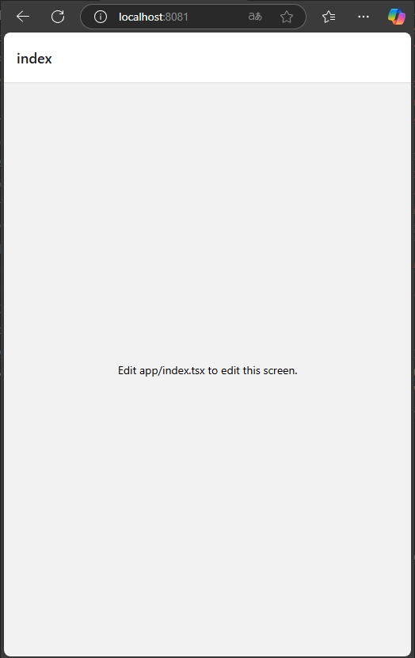
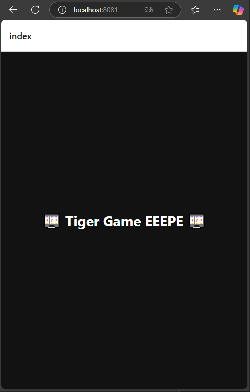
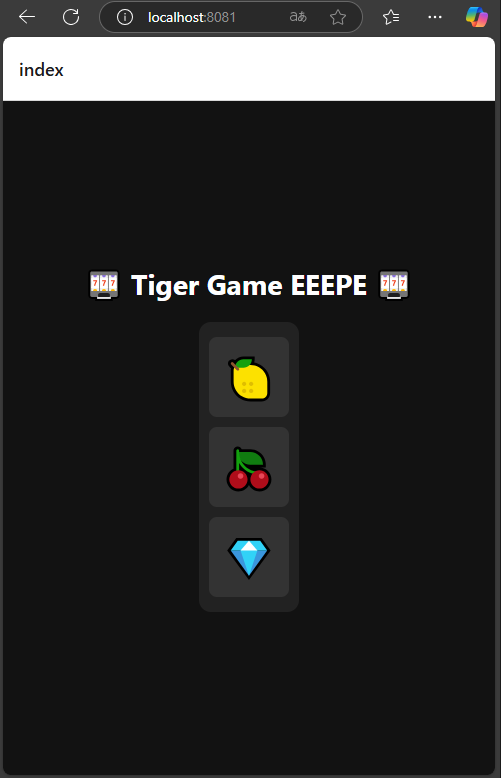
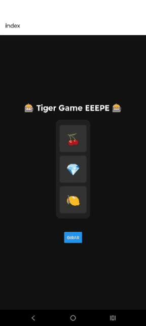
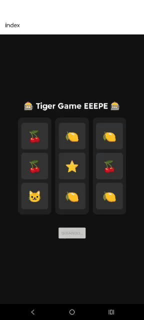
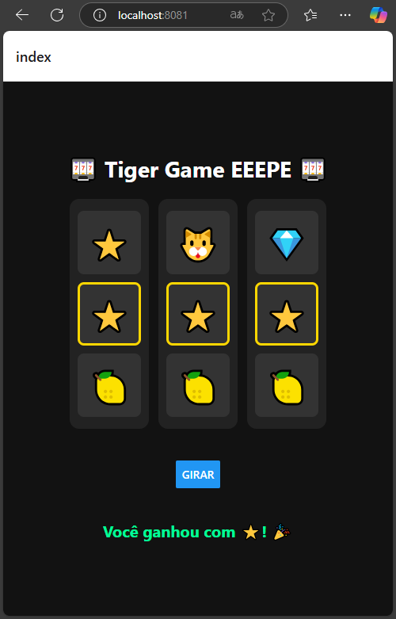
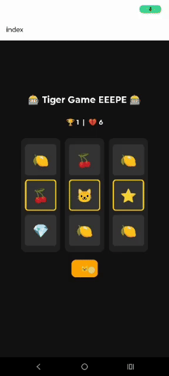
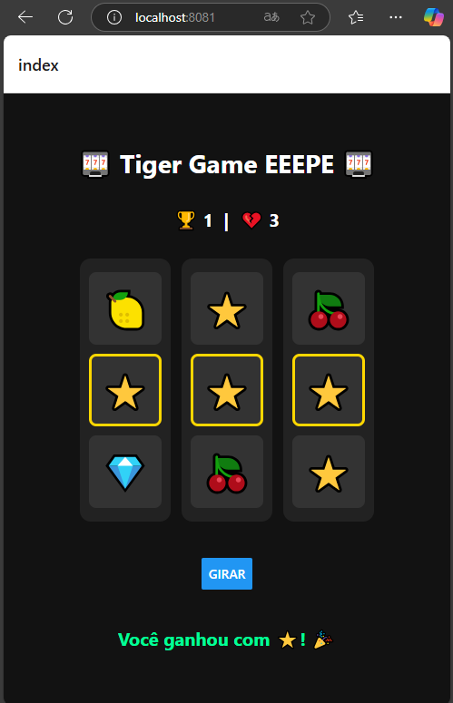
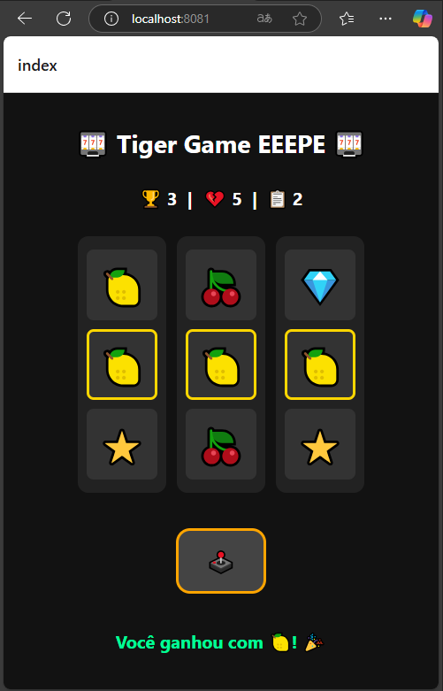
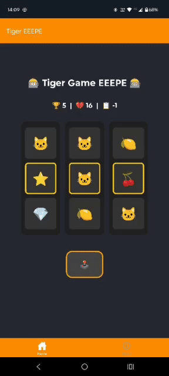

# Mobile-Introduction - TIGER-GAME EEEPE

# Objetivo: 
Este repositório tem como objetivo dar uma introdução rápida ao desenvolvimento de um app para dispositivos android com o foco em aplicações mobile. 

A ideia é de forma rápida e objetiva conseguir instalar e utilizar um app no celular.

Todo o guia vai ser baseado em react native em função de sua pratividade e facilidade na analise e aprendizado, além de ser um frameork bem aceito no mercado. 

## Pré Requisitos

Esta seção aborda os pré requisistos necessários para podermos proseguir com o aprendizado.

### Pré Requisitos

- [Expo - instalção no dispositivo mobile](https://expo.dev/go/)
- [Node.JS ](https://nodejs.org/en)
- [VS Code](https://code.visualstudio.com/)

Ajuste de politica de execução do PowerShell. Por padrão, o PowerShell não permite a execução de scripts não assinados, como o **npx**. Abaixo o comando para o determinado ajuste.

- Abrir o PowerShell como Administrador
- Pressione **Win + X** e selecione **"Windows PowerShell (Admin)"**.
- Ou procure por **"PowerShell"** no menu iniciar, clique com o botão direito e escolha **"Executar como Administrador"**.
- Digite o seguinte comando no PowerShell para permitir a execução de scripts locais:

```powershell
Set-ExecutionPolicy RemoteSigned -Scope CurrentUser
```

### Familizarização

Links de conhecimento relacionado ao TypeScript e ao React.

- [Introdução ao TS](https://www.typescriptlang.org/docs/handbook/2/everyday-types.html)
- [Introdução ao React](https://react.dev/learn) 

## 1 - Criando seu primeiro APP

### 1 Inicializar um novo aplicativo EXPO

Dentro do nosso terminal do VS Code, criaremos o nosso app através de uma linha de comando. Lembrando que aqui, temos que executar o comando extamente onde queremos que o projeto seja inicializado. 

obs: Recomendo que criem uma pasta na raiz do computador conforme modelo abaixo:

c:\desenvolvimento\mobile\

```sh
npx create-expo-app@latest tiger-game
```
O comando vai criar um diretório usando um modelo padrão de app, com biblioteca essenciais. 

Algumas Vantagens de usar um modelo padrão para desenvolvimento:
- Cria um novo projeto React Native com expoo pacote instalado
- Inclui ferramentas recomendadas, como Expo CLI
- Inclui um navegador de abas do Expo Router para fornecer um sistema de navegação básico
- Configurado automaticamente para executar um projeto em várias plataformas: Android, iOS e web
TypeScript configurado por padrão

### 2 Script Reset

Como vamos criar o nosso aplicativo do zero, vamos resetar ele e com isto retirar alguns arquivos desnecessários. 

```sh
npm run reset-project
```

Com isto nossa pasta de APP fica com dois arquivos ( index.tsx e _layout.tsx ) os demais foram movidos para a pasta app-example. 

### 3 executando o aplicativo no Celular

Primeiramente executamos o comando abaixo para instalar as dependencias caso falte alguma relacionado ao ferramental do expo. 

```sh
npm install expo
```

Posterior iniciamos o nosso projeto com o comando abaixo.

```sh
npx expo start
```
Se no momento da instalação, aparecer uma mensagem solicitando a liberação do node.js no firewall do windoes, libere tanto para redes publicas como privadas. Este passo é bem iportante pois caso não configuremos estas permissoes, podemos ter impacto para emular o projeto. 

O comando acima iniciara o nosso servidor de desenvolvimento. Caso solicite para instalar alguma dependencia a mesma deve ser instalada.

Estado da nossa aplicação até o momento:



## 2 - Começando 

### 1 Entendendo Tiger-Game da EEEPE

Vamos criar um aplicativo do jogo do tigrinho (slot machine) onde a vitoria acontece quando 3 icones cam em posições iguais, centrais (imaginando um teclado, 456). Vamos começar elaborando somente uma coluna e depois replicamos a lógica para as demais. 

🧱 Estrutura do Tabuleiro

```md
7 | 8 | 9
---------
4 | 5 | 6   ← LINHA CENTRAL (verifica vitória aqui)
---------
1 | 2 | 3
```

A animação vai consistir em os icones andarem de cima para baixo das posições 741, 852,963 gerando um resultado ao final do giro. 

### 2 Iniciando o desenvolvimento

Vamos seguir a seguinte estrutura para o nosso projeto conforme abaixo. Ainda não é necessário criar toda astrutura, ela vai ir evoluindo conforme formos realizando os fluxos do passo a passo. 

```java
IMCCalculator/
├── app/
│   ├── index.tsx         <- Tela principal (Vamos colocar o tiger-game aqui)
│   ├── _layout.tsx
│   └── ...
├── components/           <- Lugar onde iram nossos componentes reutilizáveis
│   ├── SlotColumn.tsx
├── ...
```

Primeiramente vamos realizar alguns ajustes simples na nossa tela inicial conforme código abaixo: 

```tsx
import { View, Text, StyleSheet } from "react-native";

export default function HomeScreen() {
  return (
    <View style={styles.container}>
      <Text style={styles.title}>🎰 Tiger Game EEEPE 🎰</Text>
    </View>
  );
}

const styles = StyleSheet.create({
  container: {
    flex: 1,
    backgroundColor: "#121212",
    alignItems: "center",
    justifyContent: "center",
  },
  title: {
    fontSize: 28,
    fontWeight: "bold",
    color: "white",
  },
});

```


<details>
  <summary>🧠 O que esse código faz:</summary>

- Mostra um título centralizado: Tiger Game EEEPE
- Cria uma View (Container) que será o nosso board game futuramente.
- Tudo está centralizado na tela
- Temos um fundo preto

</details>

### 3 - Ccomponente SlotColumn e sua estrutura

Vamos criar um componente animado que simula a rotação de ícones. Colocaremos isso em components/SlotColumn.tsx.

📦 Crie a pasta e arquivo (Presentinho do console abaixo eheheheh):

```bash
mkdir components
New-Item -Path "./components/SlotColumn.tsx" -ItemType "File"
```

🔁 Código do componente

Abaixo temos o código que colocaremos no nosso componente. 

```tsx
import React, { useEffect, useState } from "react";
import { View, Text, StyleSheet } from "react-native";

const icons = ["🐱", "🍒", "💎", "🍋", "⭐"];

export const SlotColumn = () => {
  const [currentIcons, setCurrentIcons] = useState(["🍒", "💎", "🍋"]);

  useEffect(() => {
    const interval = setInterval(() => {
      const newIcons = [
        icons[Math.floor(Math.random() * icons.length)],
        icons[Math.floor(Math.random() * icons.length)],
        icons[Math.floor(Math.random() * icons.length)],
      ];
      setCurrentIcons(newIcons);
    }, 150);

    return () => clearInterval(interval);
  }, []);

  return (
    <View style={styles.column}>
      {currentIcons.map((icon, index) => (
        <View key={index} style={styles.slot}>
          <Text style={styles.icon}>{icon}</Text>
        </View>
      ))}
    </View>
  );
};

const styles = StyleSheet.create({
  column: {
    justifyContent: "center",
    alignItems: "center",
    padding: 10,
    backgroundColor: "#222",
    borderRadius: 12,
  },
  slot: {
    width: 80,
    height: 80,
    backgroundColor: "#333",
    marginVertical: 5,
    borderRadius: 8,
    justifyContent: "center",
    alignItems: "center",
  },
  icon: {
    fontSize: 40,
  },
});
```

<details>
  <summary>🧠 O que esse código faz (Explicação em blocos, vale apena ver):</summary>

---
✅ 1. Imports

```tsx
import React, { useEffect, useState } from "react";
import { View, Text, StyleSheet } from "react-native";
```

- Importa o React, os hooks useState e useEffect, e componentes do React Native: View, Text e StyleSheet.

---
✅ 2. Ícones disponíveis

```tsx
const icons = ["🐱", "🍒", "💎", "🍋", "⭐"];
```

- Uma lista com os emojis que representam os ícones da máquina caça-níquel.
- Esses ícones serão sorteados para formar a rolagem da coluna.

---
✅ 3. Componente SlotColumn

```tsx
export const SlotColumn = () => {
```

- Declara um componente funcional chamado SlotColumn.
- Ele será exportado para ser usado em outras partes do app.

---
✅ 4. Estado dos ícones exibidos

```tsx
const [currentIcons, setCurrentIcons] = useState(["🍒", "💎", "🍋"]);
```
- currentIcons armazena os ícones atualmente visíveis na coluna (são 3).
- Inicialmente começa com ["🍒", "💎", "🍋"].

---

✅ 5. Efeito para rotação (useEffect)
```tsx
useEffect(() => {
  const interval = setInterval(() => {
    const newIcons = [
      icons[Math.floor(Math.random() * icons.length)],
      icons[Math.floor(Math.random() * icons.length)],
      icons[Math.floor(Math.random() * icons.length)],
    ];
    setCurrentIcons(newIcons);
  }, 150);

  return () => clearInterval(interval);
}, []);

```
- useEffect roda uma vez quando o componente é montado.
- Cria um setInterval que:
- A cada 150ms, sorteia 3 novos ícones aleatórios da lista.
- Atualiza o estado currentIcons com esses ícones.
- clearInterval limpa o intervalo quando o componente for desmontado (boa prática).

---

✅ 6. Renderização da coluna

```tsx
return (
  <View style={styles.column}>
    {currentIcons.map((icon, index) => (
      <View key={index} style={styles.slot}>
        <Text style={styles.icon}>{icon}</Text>
      </View>
    ))}
  </View>
);
```
- Renderiza uma coluna vertical (View) com 3 "slots".
- Cada slot mostra um dos ícones do estado currentIcons.
- Usa .map() para percorrer os ícones e renderizar um Text dentro de uma View estilizada.

---

✅ 7. Estilos

```tsx
const styles = StyleSheet.create({
  column: {
    justifyContent: "center",
    alignItems: "center",
    padding: 10,
    backgroundColor: "#222",
    borderRadius: 12,
  },
  slot: {
    width: 80,
    height: 80,
    backgroundColor: "#333",
    marginVertical: 5,
    borderRadius: 8,
    justifyContent: "center",
    alignItems: "center",
  },
  icon: {
    fontSize: 40,
  },
});
```

---

</details>

Se executarmos o nosso projeto, ele vai estar conforme abaixo: 



Se formos ver, tudo que criamos no arquivo SlotColumn.tsx ainda não apareçe no nosso programa, e isto se dá porque não importamos a determinada tela. Faremos isto em sequência. 

### 4 - Usando o SlotColumn na index.tsx

Nesta etapa vamos importar e usar o componente animado. 

```tsx
import { SlotColumn } from "../components/SlotColumn";

// dentro do return
<SlotColumn />
```

Com o nosso código ficando assim: 

```tsx

import { View, Text, StyleSheet } from "react-native";
import { SlotColumn } from "../components/SlotColumn";

export default function HomeScreen() {
  return (
    <View style={styles.container}>
      <Text style={styles.title}>🎰 Tiger Game EEEPE 🎰</Text>
      <SlotColumn />
    </View>
  );
}

const styles = StyleSheet.create({
  container: {
    flex: 1,
    backgroundColor: "#121212",
    alignItems: "center",
    justifyContent: "center",
    gap: 20,
  },
  title: {
    fontSize: 28,
    fontWeight: "bold",
    color: "white",
  },
});
```


Agora o nosso jogo está ficando com este formato: 



No próximo passo vamos vamos implementar um botão e ao clicarmos o mesmo gera animação de giro para o sorteio. 

### 5 - Aidicnando um botao para controle do giro. 

🎯 Objetivo atual
- Adicionar botão “Girar”
- Ao clicar, a coluna começa a animar
- Depois de 2 segundos, a animação para

Vamos fazer que a nossa home, o nosso index controel o inicio e fim da animação.

Primeiramente vamos ajustar o nosso arquivo SlotColumn.tsx, com os seguintes ajuses: 

```tsx
// imports permanecem iguais

type SlotColumnProps = {
  isSpinning: boolean;
};

export const SlotColumn = () => {
const [currentIcons, setCurrentIcons] = useState(["🍒", "💎", "🍋"]);
const [intervalId, setIntervalId] = useState<ReturnType<typeof setInterval> | null>(null);

  useEffect(() => {
    if (isSpinning) {
      const id = setInterval(() => {
        const newIcons = [
          icons[Math.floor(Math.random() * icons.length)],
          icons[Math.floor(Math.random() * icons.length)],
          icons[Math.floor(Math.random() * icons.length)],
        ];
        setCurrentIcons(newIcons);
      }, 100);
      setIntervalId(id);
    } else {
      if (intervalId) {
        clearInterval(intervalId);
        setIntervalId(null);
      }
    }

    // cleanup quando o componente for desmontado
    return () => {
      if (intervalId) {
        clearInterval(intervalId);
      }
    };
  }, [isSpinning]);


// abaixo se mantem
```

O nosso código da página SlotcColumn.tsx acaba por ficar assim: 

```tsx
import React, { useEffect, useState } from "react";
import { View, Text, StyleSheet } from "react-native";

const icons = ["🐱", "🍒", "💎", "🍋", "⭐"];

type SlotColumnProps = {
  isSpinning: boolean;
};

export const SlotColumn = ({ isSpinning }: SlotColumnProps) => {
  const [currentIcons, setCurrentIcons] = useState(["🍒", "💎", "🍋"]);
  const [intervalId, setIntervalId] = useState<ReturnType<typeof setInterval> | null>(null);

  useEffect(() => {
    if (isSpinning) {
      const id = setInterval(() => {
        const newIcons = [
          icons[Math.floor(Math.random() * icons.length)],
          icons[Math.floor(Math.random() * icons.length)],
          icons[Math.floor(Math.random() * icons.length)],
        ];
        setCurrentIcons(newIcons);
      }, 100);
      setIntervalId(id);
    } else {
      if (intervalId) {
        clearInterval(intervalId);
        setIntervalId(null);
      }
    }

    // cleanup quando o componente for desmontado
    return () => {
      if (intervalId) {
        clearInterval(intervalId);
      }
    };
  }, [isSpinning]);

  return (
    <View style={styles.column}>
      {currentIcons.map((icon, index) => (
        <View key={index} style={styles.slot}>
          <Text style={styles.icon}>{icon}</Text>
        </View>
      ))}
    </View>
  );
};

const styles = StyleSheet.create({
  column: {
    justifyContent: "center",
    alignItems: "center",
    padding: 10,
    backgroundColor: "#222",
    borderRadius: 12,
  },
  slot: {
    width: 80,
    height: 80,
    backgroundColor: "#333",
    marginVertical: 5,
    borderRadius: 8,
    justifyContent: "center",
    alignItems: "center",
  },
  icon: {
    fontSize: 40,
  },
});

```
<details>
  <summary>🧠 O que esse código faz (Explicação em blocos, vale apena ver):</summary>

---
🔹 Props do componente

```tsx
type SlotColumnProps = {
  isSpinning: boolean;
};
```

- Define que o componente recebe uma prop booleana chamada isSpinning, que indica se a coluna deve girar ou não.

---

---
🧠 useState – Estados Internos

```tsx
const [currentIcons, setCurrentIcons] = useState(["🍒", "💎", "🍋"]);

```

- currentIcons: armazena os três ícones que estão atualmente sendo exibidos na coluna.
- Inicializa com três emojis fixos.
- setCurrentIcons é usado para atualizar esses ícones.
---


🌀 Se isSpinning for true
```tsx
const id = setInterval(() => {
  const newIcons = [
    icons[Math.floor(Math.random() * icons.length)],
    icons[Math.floor(Math.random() * icons.length)],
    icons[Math.floor(Math.random() * icons.length)],
  ];
  setCurrentIcons(newIcons);
}, 100);
setIntervalId(id);
```
- Cria um setInterval que a cada 100ms:
- Gera três emojis aleatórios.
- Atualiza o estado com os novos ícones.
---

🛑 Se isSpinning for false

```tsx
if (intervalId) {
  clearInterval(intervalId);
  setIntervalId(null);
}
```
- Cancela o intervalo se ele estiver ativo.
- Garante que os ícones parem de mudar.
---
🧱 Renderização da Coluna

```tsx
return (
  <View style={styles.column}>
    {currentIcons.map((icon, index) => (
      <View key={index} style={styles.slot}>
        <Text style={styles.icon}>{icon}</Text>
      </View>
    ))}
  </View>
);
```
- Exibe a coluna da máquina com os três ícones empilhados verticalmente.
- Para cada ícone atual (currentIcons), cria um bloco visual (slot) com o emoji (icon).
- O key={index} é necessário para identificar cada elemento na renderização.

---

</details>

Antes de prosseguirmos, temos que fazer uns ajustes na nossa home para ajustar alguns erros gerados pelas alterações que fizemos na SlotColumn e tmb adaptar ela para o uso do botão. 

Adaptamos a mesma para este fluxo: 


```tsx
import { useState } from "react";
import { View, Text, StyleSheet, Button } from "react-native";
import { SlotColumn } from "../components/SlotColumn";

export default function HomeScreen() {
  const [isSpinning, setIsSpinning] = useState(false);

  const handleSpin = () => {
    if (isSpinning) return; // já está girando

    setIsSpinning(true);

    setTimeout(() => {
      setIsSpinning(false);
    }, 2000); // gira por 2 segundos
  };

  return (
    <View style={styles.container}>
      <Text style={styles.title}>🎰 Tiger Game EEEPE 🎰</Text>
      <SlotColumn isSpinning={isSpinning} />
      <View style={styles.buttonContainer}>
        <Button title={isSpinning ? "Girando..." : "Girar"} onPress={handleSpin} disabled={isSpinning} />
      </View>
    </View>
  );
}

const styles = StyleSheet.create({
  container: {
    flex: 1,
    backgroundColor: "#121212",
    alignItems: "center",
    justifyContent: "center",
    gap: 20,
  },
  title: {
    fontSize: 28,
    fontWeight: "bold",
    color: "white",
  },
  buttonContainer: {
    marginTop: 20,
  },
});

```

<details>
  <summary>🧠 O que esse código faz (Explicação em blocos, vale apena ver):</summary>


---
🌀 1. Função handleSpin

```tsx
const handleSpin = () => {
  if (isSpinning) return; // já está girando

  setIsSpinning(true); // começa a girar

  setTimeout(() => {
    setIsSpinning(false); // para de girar depois de 2 segundos
  }, 2000);
};

```
- Impede que o botão seja clicado várias vezes seguidas.
- Ativa a rotação mudando o estado isSpinning para true.
- Após 2 segundos, muda de volta para false, parando a rotação da coluna.

---

🧱 2. Bloco return do componente

```tsx
return (
  <View style={styles.container}>
    <Text style={styles.title}>🎰 Tiger Game EEEPE 🎰</Text>

    <SlotColumn isSpinning={isSpinning} />

    <View style={styles.buttonContainer}>
      <Button
        title={isSpinning ? "Girando..." : "Girar"}
        onPress={handleSpin}
        disabled={isSpinning}
      />
    </View>
  </View>
);

```

- Mostra o título do jogo.
- Exibe a SlotColumn, que gira ou para com base no isSpinning.
- Mostra um botão que muda o texto para "Girando..." enquanto a rotação está ativa, e impede múltiplos cliques desativando o botão.
</details>


Abaixo como está o funcionamento do nosso jogo até o momento:



Como podemos ver, agora ao clicarmos no botao, a coluna gira (Meio aleatória mas gira eheheh).
Como próximo passo vamos adicionar outras colunas e mudar o tempo de giro de cada uma delas.

### 6 - Adicionando mais colunas

🎯 Objetivo deste passo
- Adicionar 3 colunas lado a lado
- Todas giram ao clicar no botão
- Ainda sem delay entre paradas, isso vem depois

Vamos adicionar mais spinners ao nosso arquivo index.tsx:
Se repararmos bem, criamos uma view (Container), adicionando mais 3 spinns em uma div com um estilo especifico. 

```tsx
return (
    <View style={styles.container}>
      <Text style={styles.title}>🎰 Tiger Game EEEPE 🎰</Text>

      <View style={styles.slotWrapper}>
        <SlotColumn isSpinning={isSpinning} />
        <SlotColumn isSpinning={isSpinning} />
        <SlotColumn isSpinning={isSpinning} />
      </View>

      <View style={styles.buttonContainer}>
        <Button title={isSpinning ? "Girando..." : "Girar"} onPress={handleSpin} disabled={isSpinning} />
      </View>
    </View>
  );

  // Novo estilo
   slotWrapper: {
    flexDirection: "row",
    gap: 12,
  },
```

Abaixo o arquivo adaptado: 

```tsx
import { useState } from "react";
import { View, Text, StyleSheet, Button } from "react-native";
import { SlotColumn } from "../components/SlotColumn";

export default function HomeScreen() {
  const [isSpinning, setIsSpinning] = useState(false);

  const handleSpin = () => {
    if (isSpinning) return;

    setIsSpinning(true);

    setTimeout(() => {
      setIsSpinning(false);
    }, 2000); // gira por 2 segundos
  };

  return (
    <View style={styles.container}>
      <Text style={styles.title}>🎰 Tiger Game EEEPE 🎰</Text>

      <View style={styles.slotWrapper}>
        <SlotColumn isSpinning={isSpinning} />
        <SlotColumn isSpinning={isSpinning} />
        <SlotColumn isSpinning={isSpinning} />
      </View>

      <View style={styles.buttonContainer}>
        <Button title={isSpinning ? "Girando..." : "Girar"} onPress={handleSpin} disabled={isSpinning} />
      </View>
    </View>
  );
}

const styles = StyleSheet.create({
  container: {
    flex: 1,
    backgroundColor: "#121212",
    alignItems: "center",
    justifyContent: "center",
    padding: 20,
    gap: 20,
  },
  title: {
    fontSize: 28,
    fontWeight: "bold",
    color: "white",
  },
  slotWrapper: {
    flexDirection: "row",
    gap: 12,
  },
  buttonContainer: {
    marginTop: 20,
  },
});

```

✅ Resultado esperado
- As três colunas aparecem lado a lado
- Ao clicar em “Girar”, todas giram juntas
- Depois de 2 segundos, todas param ao mesmo tempo

Até o momento a nossa aplicação está assim: 



Como próximo passo vamos colocar um dalay, gerando uma animação de para das colunas uma por vez da esquerda para a direita. 

### 7 - Mas que demora!

🎯 Objetivo deste passo
- Iniciar o giro de todas as colunas ao mesmo tempo
- Parar a coluna 1 depois de 2s
- Parar a coluna 2 depois de 2.5s
- Parar a coluna 3 depois de 3s

As mudanças lógicas neste passo são simples, conforme relatado abaixo: 
Ao analisarmos o código abaixo, criamos 3 giros com tempos diferentes, assim gerando o sentimento de parada entre todos. 

```tsx
//Permanece o mesmo
const handleSpin = () => {
    if (spinningCols.some((col) => col)) return;

    // Começa todas como true
    setSpinningCols([true, true, true]);

    // Para cada uma em tempos diferentes
    setTimeout(() => setSpinningCols((prev) => [false, true, true]), 2000);  // Tempo para coluna 0
    setTimeout(() => setSpinningCols((prev) => [false, false, true]), 2500); // Tempo para coluna 1
    setTimeout(() => setSpinningCols((prev) => [false, false, false]), 3000); // Tempo para coluna 2
  };
//permanece o mesmo
  <View style={styles.slotWrapper}>
        <SlotColumn isSpinning={spinningCols[0]} />
        <SlotColumn isSpinning={spinningCols[1]} />
        <SlotColumn isSpinning={spinningCols[2]} />
      </View>
```

✅ O que muda agora?
- Ao clicar “Girar”, todas giram juntas
- Coluna 1 para após 2s
- Coluna 2 para após 2.5s
- Coluna 3 para após 3s
- Botão “Girar” é bloqueado até todas pararem

Nosso próximo passo agora é deixar meio que subentendido que a vitoria so vai acontecer se as os elementos do meio do nosso board estiverem alinhados. 

### 8 - Destacando a linha central

🎯 Objetivo agora

- Alterar SlotColumn para saber qual slot é o do meio.
- Aplicar estilo diferente nele (borda dourada, que é mais amarelo ehehehe)

Vamos criar uma prop prop highlightMiddle (booleana). E no estilo, vamos aplicar ela quando for o slot do meio.

Lembrem que os ajustes abaixo vão no SlotColumn.tsx

```tsx
// depois do const icons
type SlotColumnProps = {
  isSpinning: boolean;
  highlightMiddle?: boolean;
};

return (
    <View style={styles.column}>
      {currentIcons.map((icon, index) => (
        <View
          key={index}
          style={[
            styles.slot,
            highlightMiddle && index === 1 && styles.middleSlotHighlight,
          ]}
        >
          <Text style={styles.icon}>{icon}</Text>
        </View>
      ))}
    </View>
  );

  // Estilo

    middleSlotHighlight: {
    borderColor: "#FFD700",
    borderWidth: 3,
  },
  ```

Nosso SlotColumn.tsx vai ficar deste jeito:

```tsx
import React, { useEffect, useState } from "react";
import { View, Text, StyleSheet } from "react-native";

const icons = ["🐱", "🍒", "💎", "🍋", "⭐"];

type SlotColumnProps = {
  isSpinning: boolean;
  highlightMiddle?: boolean;
};

export const SlotColumn = ({ isSpinning, highlightMiddle }: SlotColumnProps) => {
  const [currentIcons, setCurrentIcons] = useState(["🍒", "💎", "🍋"]);
  const [intervalId, setIntervalId] = useState<ReturnType<typeof setInterval> | null>(null);

  useEffect(() => {
    if (isSpinning) {
      const id = setInterval(() => {
        const newIcons = [
          icons[Math.floor(Math.random() * icons.length)],
          icons[Math.floor(Math.random() * icons.length)],
          icons[Math.floor(Math.random() * icons.length)],
        ];
        setCurrentIcons(newIcons);
      }, 100);
      setIntervalId(id);
    } else {
      if (intervalId) {
        clearInterval(intervalId);
        setIntervalId(null);
      }
    }

    return () => {
      if (intervalId) clearInterval(intervalId);
    };
  }, [isSpinning]);

  return (
    <View style={styles.column}>
      {currentIcons.map((icon, index) => (
        <View
          key={index}
          style={[
            styles.slot,
            highlightMiddle && index === 1 && styles.middleSlotHighlight,
          ]}
        >
          <Text style={styles.icon}>{icon}</Text>
        </View>
      ))}
    </View>
  );
};

const styles = StyleSheet.create({
  column: {
    justifyContent: "center",
    alignItems: "center",
    padding: 10,
    backgroundColor: "#222",
    borderRadius: 12,
  },
  slot: {
    width: 80,
    height: 80,
    backgroundColor: "#333",
    marginVertical: 5,
    borderRadius: 8,
    justifyContent: "center",
    alignItems: "center",
  },
  middleSlotHighlight: {
    borderColor: "#FFD700",
    borderWidth: 3,
  },
  icon: {
    fontSize: 40,
  },
});

```

Também necessitamos realizar um ajsute na nossa index.tsx ondde mostramos as nossas colunas (Desafio: Ajustar no ponto exato, Barbada!):

```tsx
 return (
    <View style={styles.container}>
      <Text style={styles.title}>🎰 Tiger Game EEEPE 🎰</Text>

      <View style={styles.slotWrapper}>
        <SlotColumn isSpinning={spinningCols[0]} highlightMiddle />
        <SlotColumn isSpinning={spinningCols[1]} highlightMiddle />
        <SlotColumn isSpinning={spinningCols[2]} highlightMiddle />
      </View>

      <View style={styles.buttonContainer}>
        <Button title={isSpinning ? "Girando..." : "Girar"} onPress={handleSpin} disabled={isSpinning} />
      </View>
    </View>
  );
```

✅ Resultado
- Os ícones do meio de cada coluna (456) ficam com borda dourada
- Ajuda o jogador a perceber onde olhar
- Visualmente mais claro: a vitória vem dali

### 9 - Complexidade da vitória! 

As modificações futuras são um pouco mais compelxas em relação ao que viemos fazendo até o momento. Neste tópico vamos criar um fluxo de vitória onde a cada 10 partidas esperamos que o nosso player ganhe aproximadamente 3 partidas, para diminuir um pouco a alaeatoridade do jogo. Esta lógica deixa o nosso jogo com uma certa complexidade. 

Vamos analisar por blocos as modificações. Caso você nao consiga acompanhar as modificações, nao se preocupe pois ao final das explicações principais, teremos o nosso fonte atualizado. 


<details>
  <summary>🧠 🔵 HomeScreen.tsx (Ao final deste details, temos o arquivo completo)</summary>

---


1. Importações e auxiliares

```tsx
import { useState, useRef } from "react";
import { View, Text, StyleSheet, Button } from "react-native";
import { SlotColumn } from "../components/SlotColumn";

const icons = ["🐱", "🍒", "💎", "🍋", "⭐"];
const getRandomIcon = () => icons[Math.floor(Math.random() * icons.length)];
```

O que foi feito:
- Importações padrão.
- icons é o conjunto de símbolos possíveis.
- getRandomIcon() serve para gerar um ícone aleatório sempre que necessário.
- Por que:
   - Centralizamos o array de ícones para usar consistentemente no app.
---

2. Estados e referências

```tsx
const [spinningCols, setSpinningCols] = useState([false, false, false]);
const [forcedIcons, setForcedIcons] = useState<(string[] | null)[]>([null, null, null]);
const [message, setMessage] = useState<string | null>(null);
const iconsRef = useRef<string[][]>([[], [], []]);
const lossCounter = useRef(0);
```

O que foi feito:
- spinningCols: controla se cada coluna está girando.
- forcedIcons: armazena os ícones forçados para exibir vitória.
- message: exibe texto de vitória (ou nada).
- iconsRef: salva os ícones atuais visíveis (3 por coluna) para verificar vitória.
- lossCounter: conta quantas derrotas consecutivas ocorreram.
Por que:
- permite controlar o jogo e aplicar a lógica de vitória com base em vitórias forçadas.
- useRef evita re-renderizações desnecessárias.

---
3. Função de chance de vitória

```tsx
const shouldForceWin = () => {
  const r = Math.random();
  if (lossCounter.current >= 7) return true;
  if (lossCounter.current >= 4 && r < 0.7) return true;
  if (lossCounter.current >= 2 && r < 0.3) return true;
  if (r < 0.1) return true;
  return false;
};
```

O que foi feito:
- Essa função retorna true com base na quantidade de derrotas e sorte.
Por que:
- Garante que a vitória ocorra em média 3 em 10 vezes, mas não de forma mecânica.
- Evita ficar 20 rodadas sem ganhar.

---

4. Função de girar

```tsx
const handleSpin = () => {
  if (spinningCols.some(Boolean)) return;
  setMessage(null);

  const isWin = shouldForceWin();
  const winningIcon = getRandomIcon();

  if (isWin) {
    const forced = [0, 1, 2].map(() => [
      getRandomIcon(),
      winningIcon,
      getRandomIcon(),
    ]);
    setForcedIcons(forced);
  } else {
    setForcedIcons([null, null, null]);
  }

  setSpinningCols([true, true, true]);

  setTimeout(() => setSpinningCols([false, true, true]), 2000);
  setTimeout(() => setSpinningCols([false, false, true]), 2500);
  setTimeout(() => {
    setSpinningCols([false, false, false]);

    // Checagem de vitória
    setTimeout(() => {
      const middleIcons = iconsRef.current.map((col) => col[1]);
      const allEqual = middleIcons.every((i) => i === middleIcons[0]);
      if (allEqual && middleIcons[0]) {
        setMessage(`Você ganhou com ${middleIcons[0]}! 🎉`);
        lossCounter.current = 0;
      } else {
        setMessage(null);
        lossCounter.current += 1;
      }
    }, 100);
  }, 3000);
};
```

O que foi feito:
- Evita girar se já está girando.
- Decide se a jogada deve ser vitória forçada.
- Se sim, gera um array com os ícones forçados (com o do meio igual).
- Atualiza os estados e agenda o término de cada coluna.
- Ao fim da rotação, checa se os ícones do meio são iguais.
Por que:
- Mantém fluidez da animação.
- Força vitórias quando necessário.
- Atualiza a interface com a mensagem de vitória.

---

5. Renderização

```tsx
<View style={styles.slotWrapper}>
  {[0, 1, 2].map((index) => (
    <SlotColumn
      key={index}
      isSpinning={spinningCols[index]}
      highlightMiddle
      forcedIcons={forcedIcons[index] ?? undefined}
      onIconsChange={(icons) => {
        iconsRef.current[index] = icons;
      }}
    />
  ))}
</View>
```

O que foi feito:
- Exibe as 3 colunas com SlotColumn, passando:
- isSpinning: define se gira.
- forcedIcons: envia os ícones forçados (se houver).
- onIconsChange: salva os ícones visíveis (em especial o do meio).
Por que:
- Permite que a coluna funcione como um componente independente.
- onIconsChange serve para capturar o resultado final após giro.

---

6. Exibição da mensagem

```tsx
<Text style={styles.victoryText}>{message ?? " "}</Text>
```

O que foi feito:
- Mostra a mensagem de vitória (ou espaço vazio para não pular layout).
Por que:
- Feedback visual simples e eficiente.
---

Com isto temos o nosso arquivo completo: 
```tsx
import { useState, useRef } from "react";
import { View, Text, StyleSheet, Button } from "react-native";
import { SlotColumn } from "../components/SlotColumn";

const icons = ["🐱", "🍒", "💎", "🍋", "⭐"];
const getRandomIcon = () => icons[Math.floor(Math.random() * icons.length)];

export default function HomeScreen() {
  const [spinningCols, setSpinningCols] = useState([false, false, false]);
  const [forcedIcons, setForcedIcons] = useState<(string[] | null)[]>([null, null, null]);
  const [message, setMessage] = useState<string | null>(null);
  const iconsRef = useRef<string[][]>([[], [], []]);
  const lossCounter = useRef(0);

  const shouldForceWin = () => {
    const r = Math.random();
    if (lossCounter.current >= 7) return true;
    if (lossCounter.current >= 4 && r < 0.7) return true;
    if (lossCounter.current >= 2 && r < 0.3) return true;
    if (r < 0.1) return true;
    return false;
  };

  const handleSpin = () => {
    if (spinningCols.some(Boolean)) return;

    setMessage(null);

    const isWin = shouldForceWin();
    const winningIcon = getRandomIcon();

    if (isWin) {
      const forced = [0, 1, 2].map(() => [
        getRandomIcon(),
        winningIcon,
        getRandomIcon(),
      ]);
      setForcedIcons(forced);
    } else {
      setForcedIcons([null, null, null]);
    }

    setSpinningCols([true, true, true]);

    setTimeout(() => setSpinningCols([false, true, true]), 2000);
    setTimeout(() => setSpinningCols([false, false, true]), 2500);
    setTimeout(() => {
      setSpinningCols([false, false, false]);

      // Checa vitória
      setTimeout(() => {
        const middleIcons = iconsRef.current.map((col) => col[1]);
        const allEqual = middleIcons.every((i) => i === middleIcons[0]);
        if (allEqual && middleIcons[0]) {
          setMessage(`Você ganhou com ${middleIcons[0]}! 🎉`);
          lossCounter.current = 0;
        } else {
          setMessage(null);
          lossCounter.current += 1;
        }
      }, 100);
    }, 3000);
  };

  const isSpinning = spinningCols.some(Boolean);

  return (
    <View style={styles.container}>
      <Text style={styles.title}>🎰 Tiger Game EEEPE 🎰</Text>

      <View style={styles.slotWrapper}>
        {[0, 1, 2].map((index) => (
          <SlotColumn
            key={index}
            isSpinning={spinningCols[index]}
            highlightMiddle
            forcedIcons={forcedIcons[index] ?? undefined}
            onIconsChange={(icons) => {
              iconsRef.current[index] = icons;
            }}
          />
        ))}
      </View>

      <View style={styles.buttonContainer}>
        <Button title={isSpinning ? "Girando..." : "Girar"} onPress={handleSpin} disabled={isSpinning} />
      </View>

      <Text style={styles.victoryText}>{message ?? " "}</Text>
    </View>
  );
}

const styles = StyleSheet.create({
  container: {
    flex: 1,
    backgroundColor: "#121212",
    alignItems: "center",
    justifyContent: "center",
    padding: 20,
    gap: 20,
  },
  title: {
    fontSize: 28,
    fontWeight: "bold",
    color: "white",
  },
  slotWrapper: {
    flexDirection: "row",
    gap: 12,
  },
  buttonContainer: {
    marginTop: 20,
  },
  victoryText: {
    marginTop: 20,
    fontSize: 20,
    color: "#00FF99",
    fontWeight: "bold",
    textAlign: "center",
    minHeight: 30,
  },
});
```

---

</details>


<details>
  <summary>🧠 🔵 SlotColumn.tsx (Ao final deste details, temos o arquivo completo)</summary>

---

1. Constante

```tsx
const getRandomIcon = () => icons[Math.floor(Math.random() * icons.length)];
```
---

2. Props adicionais

```tsx
type SlotColumnProps = {
  isSpinning: boolean;
  highlightMiddle?: boolean;
  onIconsChange?: (icons: string[]) => void;
  forcedIcons?: string[];
};
```

O que foi feito:
- Adicionamos duas novas props:
- onIconsChange: callback para notificar a HomeScreen dos ícones.
- forcedIcons: define os ícones finais ao parar.
Por que:
- Dá controle à HomeScreen para checar vitória e forçar resultados.

---
3. useEffect de controle

```tsx
useEffect(() => {
  if (isSpinning) {
    const id = setInterval(() => {
      const newIcons = [getRandomIcon(), getRandomIcon(), getRandomIcon()];
      setCurrentIcons(newIcons);
      onIconsChange?.(newIcons);
    }, 100);
    setIntervalId(id);
  } else {
    if (intervalId) {
      clearInterval(intervalId);
      setIntervalId(null);
    }

    if (forcedIcons) {
      setCurrentIcons(forcedIcons);
      onIconsChange?.(forcedIcons);
    }
  }

  return () => {
    if (intervalId) clearInterval(intervalId);
  };
}, [isSpinning]);
```
---

O que foi feito:
- Quando isSpinning é true, começa a trocar ícones rapidamente (simulando giro).
- Quando isSpinning vira false:
- Interrompe animação.
- Se há forcedIcons, define esses ícones e notifica via onIconsChange.
Por que:
- Permite controlar a exibição da coluna, sem travar animação.
- Garante sincronização com o jogo.

---

4. Renderização

```tsx
<View style={styles.column}>
  {currentIcons.map((icon, index) => (
    <View
      key={index}
      style={[
        styles.slot,
        highlightMiddle && index === 1 && styles.middleSlotHighlight,
      ]}
    >
      <Text style={styles.icon}>{icon}</Text>
    </View>
  ))}
</View>
```

O que foi feito:
- Exibe os 3 ícones da coluna.
- Aplica borda dourada no do meio se highlightMiddle.
Por que:
- Visual limpo e separado por responsabilidade.

---

Nosso código final após os ajustes:

```tsx
import { useEffect, useState } from "react";
import { View, Text, StyleSheet } from "react-native";

const icons = ["🐱", "🍒", "💎", "🍋", "⭐"];
const getRandomIcon = () => icons[Math.floor(Math.random() * icons.length)];

type SlotColumnProps = {
  isSpinning: boolean;
  highlightMiddle?: boolean;
  onIconsChange?: (icons: string[]) => void;
  forcedIcons?: string[];
};

export const SlotColumn = ({
  isSpinning,
  highlightMiddle,
  onIconsChange,
  forcedIcons,
}: SlotColumnProps) => {
  const [currentIcons, setCurrentIcons] = useState(["🍒", "💎", "🍋"]);
  const [intervalId, setIntervalId] = useState<ReturnType<typeof setInterval> | null>(null);

  useEffect(() => {
    if (isSpinning) {
      const id = setInterval(() => {
        const newIcons = [getRandomIcon(), getRandomIcon(), getRandomIcon()];
        setCurrentIcons(newIcons);
        onIconsChange?.(newIcons);
      }, 100);
      setIntervalId(id);
    } else {
      if (intervalId) {
        clearInterval(intervalId);
        setIntervalId(null);
      }

      if (forcedIcons) {
        setCurrentIcons(forcedIcons);
        onIconsChange?.(forcedIcons);
      }
    }

    return () => {
      if (intervalId) clearInterval(intervalId);
    };
  }, [isSpinning]);

  return (
    <View style={styles.column}>
      {currentIcons.map((icon, index) => (
        <View
          key={index}
          style={[
            styles.slot,
            highlightMiddle && index === 1 && styles.middleSlotHighlight,
          ]}
        >
          <Text style={styles.icon}>{icon}</Text>
        </View>
      ))}
    </View>
  );
};

const styles = StyleSheet.create({
  column: {
    justifyContent: "center",
    alignItems: "center",
    padding: 10,
    backgroundColor: "#222",
    borderRadius: 12,
  },
  slot: {
    width: 80,
    height: 80,
    backgroundColor: "#333",
    marginVertical: 5,
    borderRadius: 8,
    justifyContent: "center",
    alignItems: "center",
  },
  middleSlotHighlight: {
    borderColor: "#FFD700",
    borderWidth: 3,
  },
  icon: {
    fontSize: 40,
  },
});

```
---

</details>

Até o momento o nosso jogo está com o seguinte funcionamento: 



Como próximo passo vamos adicionar um efeito especial a nossa vitória

### 10 - Confetes e mais confetes! Muitos Confetes! 

🎉 Passo a passo para adicionar confetes como comemoração da nossa vitória! 

---
1. 📦 Instale a biblioteca

Rode o comando abaixo no terminal:

```bash
npx expo install react-native-confetti-cannon
```
⚠️ Esse comando usa expo install para garantir a compatibilidade com a versão do React Native que o Expo está usando.

---
2. 🎇 Importando e usando o componente ConfettiCannon
Agora podemos importar e usar o confete dentro do nosso HomeScreen. Como já temos uma verificação de vitória, é só renderizar o efeito quando a vitória for detectada.

---

3. 🧠 Adicionando o estado para controlar o confete

Dentro do nosso HomeScreen:

```tsx
import ConfettiCannon from 'react-native-confetti-cannon';
```

Depois, adicionamos um estado para disparar o confete:

```tsx
const [showConfetti, setShowConfetti] = useState(false);
```
Esta adição tem que ser dentro do nosso HomeScreen()

---

4. 🎯 Disparando o confete quando houver vitória
Dentro da nossa verificação de vitória (na handleSpin):

```tsx
if (allEqual && middleIcons[0]) {
  setMessage(`Você ganhou com ${middleIcons[0]}! 🎉`);
  lossCounter.current = 0;
  setShowConfetti(true); // 👈 dispara o confete
  setTimeout(() => setShowConfetti(false), 3000); // 👈 limpa depois de um tempo
}
```
Chamamos a disparada do confgete em caso de vitória

5. 📍 Renderize o ConfettiCannon

No nosso return do HomeScreen, logo após o <Text style={styles.victoryText}>{message ?? " "}</Text>, adicionamos:

```tsx
{showConfetti && (
  <ConfettiCannon
    count={100}
    origin={{ x: -10, y: 0 }}
    explosionSpeed={400}
    fallSpeed={3000}
    fadeOut
  />
)}
```

🧪 Resultado final do nosso confete

Sempre que  o jogador ganhar, você verá um canhão de confete explodindo 🎉

Abaixo nosso código completo:

```tsx
import { useState, useRef } from "react";
import { View, Text, StyleSheet, Button } from "react-native";
import { SlotColumn } from "../components/SlotColumn";
import ConfettiCannon from 'react-native-confetti-cannon';

const icons = ["🐱", "🍒", "💎", "🍋", "⭐"];
const getRandomIcon = () => icons[Math.floor(Math.random() * icons.length)];


export default function HomeScreen() {
  const [spinningCols, setSpinningCols] = useState([false, false, false]);
  const [forcedIcons, setForcedIcons] = useState<(string[] | null)[]>([null, null, null]);
  const [message, setMessage] = useState<string | null>(null);
  const iconsRef = useRef<string[][]>([[], [], []]);
  const lossCounter = useRef(0);
  const [showConfetti, setShowConfetti] = useState(false);

  const shouldForceWin = () => {
    const r = Math.random();
    if (lossCounter.current >= 7) return true;
    if (lossCounter.current >= 4 && r < 0.7) return true;
    if (lossCounter.current >= 2 && r < 0.3) return true;
    if (r < 0.1) return true;
    return false;
  };

  const handleSpin = () => {
    if (spinningCols.some(Boolean)) return;

    setMessage(null);

    const isWin = shouldForceWin();
    const winningIcon = getRandomIcon();

    if (isWin) {
      const forced = [0, 1, 2].map(() => [
        getRandomIcon(),
        winningIcon,
        getRandomIcon(),
      ]);
      setForcedIcons(forced);
    } else {
      setForcedIcons([null, null, null]);
    }

    setSpinningCols([true, true, true]);

    setTimeout(() => setSpinningCols([false, true, true]), 2000);
    setTimeout(() => setSpinningCols([false, false, true]), 2500);
    setTimeout(() => {
      setSpinningCols([false, false, false]);

      // Checa vitória
      setTimeout(() => {
        const middleIcons = iconsRef.current.map((col) => col[1]);
        const allEqual = middleIcons.every((i) => i === middleIcons[0]);
        if (allEqual && middleIcons[0]) {
          setMessage(`Você ganhou com ${middleIcons[0]}! 🎉`);
          lossCounter.current = 0;
          setShowConfetti(true); // 👈 dispara o confete
          setTimeout(() => setShowConfetti(false), 3000); // 👈 limpa depois de um tempo
        } else {
          setMessage(null);
          lossCounter.current += 1;
        }
      }, 100);
    }, 3000);
  };

  const isSpinning = spinningCols.some(Boolean);

  return (
    <View style={styles.container}>
      <Text style={styles.title}>🎰 Tiger Game EEEPE 🎰</Text>

      <View style={styles.slotWrapper}>
        {[0, 1, 2].map((index) => (
          <SlotColumn
            key={index}
            isSpinning={spinningCols[index]}
            highlightMiddle
            forcedIcons={forcedIcons[index] ?? undefined}
            onIconsChange={(icons) => {
              iconsRef.current[index] = icons;
            }}
          />
        ))}
      </View>

      <View style={styles.buttonContainer}>
        <Button title={isSpinning ? "Girando..." : "Girar"} onPress={handleSpin} disabled={isSpinning} />
      </View>

      <Text style={styles.victoryText}>{message ?? " "}</Text>
      {showConfetti && (
        <ConfettiCannon
        count={100}
        origin={{ x: -10, y: 0 }}
        explosionSpeed={400}
        fallSpeed={3000}
        fadeOut
      />
    )}
    </View>
  );
}

const styles = StyleSheet.create({
  container: {
    flex: 1,
    backgroundColor: "#121212",
    alignItems: "center",
    justifyContent: "center",
    padding: 20,
    gap: 20,
  },
  title: {
    fontSize: 28,
    fontWeight: "bold",
    color: "white",
  },
  slotWrapper: {
    flexDirection: "row",
    gap: 12,
  },
  buttonContainer: {
    marginTop: 20,
  },
  victoryText: {
    marginTop: 20,
    fontSize: 20,
    color: "#00FF99",
    fontWeight: "bold",
    textAlign: "center",
    minHeight: 30,
  },
});

```

Nosso projeto até aqui: 



### 11 - Placar de vitórias x derrotas x pontuação

🧩 O que vamos fazer:
- Criar dois estados: wins e losses
- Atualizar esses valores na lógica de vitória/derrota
- Exibir o placar com um componente simples

<details>
  <summary>🧠 Fluxo para um placar perfeito! </summary>

---
✅ 1. Adicionar os estados
Logo abaixo dos useState já existentes:

```tsx
const [wins, setWins] = useState(0);
const [losses, setLosses] = useState(0);
```

---
✅ 2. Atualizar na lógica de resultado
Dentro da verificação de vitória/derrota, modifique essa parte:

```tsx

if (allEqual && middleIcons[0]) {
  setMessage(`Você ganhou com ${middleIcons[0]}! 🎉`);
  lossCounter.current = 0;
  setWins((prev) => prev + 1);
  setShowConfetti(true);
  setTimeout(() => setShowConfetti(false), 3000);
} else {
  setMessage(null);
  lossCounter.current += 1;
  setLosses((prev) => prev + 1);
}
```

Realizamos a contagem das vitorias e derrotas

---
✅ 3. Adicionando o placar no layout
Logo após o título (<Text style={styles.title}>) e antes do slotWrapper, adicione:

```tsx
<View style={styles.scoreBoard}>
  <Text style={styles.score}>🏆 {wins}  |  💔 {losses}</Text>
</View>
```

✅ 4. Adicionando os estilos
Inclua estes estilos no seu StyleSheet.create:

```tsx
scoreBoard: {
  alignItems: 'center',
  marginVertical: 10,
},
score: {
  fontSize: 20,
  fontWeight: 'bold',
  color: '#fff',
},
```
---

Abaixo o fonte completo

```tsx
import { useState, useRef } from "react";
import { View, Text, StyleSheet, Button } from "react-native";
import { SlotColumn } from "../components/SlotColumn";
import ConfettiCannon from 'react-native-confetti-cannon';

const icons = ["🐱", "🍒", "💎", "🍋", "⭐"];
const getRandomIcon = () => icons[Math.floor(Math.random() * icons.length)];


export default function HomeScreen() {
  const [spinningCols, setSpinningCols] = useState([false, false, false]);
  const [forcedIcons, setForcedIcons] = useState<(string[] | null)[]>([null, null, null]);
  const [message, setMessage] = useState<string | null>(null);
  const iconsRef = useRef<string[][]>([[], [], []]);
  const lossCounter = useRef(0);
  const [showConfetti, setShowConfetti] = useState(false);
  const [wins, setWins] = useState(0);
  const [losses, setLosses] = useState(0);

  const shouldForceWin = () => {
    const r = Math.random();
    if (lossCounter.current >= 7) return true;
    if (lossCounter.current >= 4 && r < 0.7) return true;
    if (lossCounter.current >= 2 && r < 0.3) return true;
    if (r < 0.1) return true;
    return false;
  };

  const handleSpin = () => {
    if (spinningCols.some(Boolean)) return;

    setMessage(null);

    const isWin = shouldForceWin();
    const winningIcon = getRandomIcon();

    if (isWin) {
      const forced = [0, 1, 2].map(() => [
        getRandomIcon(),
        winningIcon,
        getRandomIcon(),
      ]);
      setForcedIcons(forced);
    } else {
      setForcedIcons([null, null, null]);
    }

    setSpinningCols([true, true, true]);

    setTimeout(() => setSpinningCols([false, true, true]), 2000);
    setTimeout(() => setSpinningCols([false, false, true]), 2500);
    setTimeout(() => {
      setSpinningCols([false, false, false]);

      // Checa vitória
      setTimeout(() => {
        const middleIcons = iconsRef.current.map((col) => col[1]);
        const allEqual = middleIcons.every((i) => i === middleIcons[0]);
        if (allEqual && middleIcons[0]) {
          setMessage(`Você ganhou com ${middleIcons[0]}! 🎉`);
          lossCounter.current = 0;
          setWins((prev) => prev + 1);
          setShowConfetti(true);
          setTimeout(() => setShowConfetti(false), 3000);
        } else {
          setMessage(null);
          lossCounter.current += 1;
          setLosses((prev) => prev + 1);
        }
      }, 100);
    }, 3000);
  };

  const isSpinning = spinningCols.some(Boolean);

  return (
    <View style={styles.container}>
      <Text style={styles.title}>🎰 Tiger Game EEEPE 🎰</Text>
      <View style={styles.scoreBoard}>
        <Text style={styles.score}>🏆 {wins}  |  💔 {losses}</Text>
      </View>

      <View style={styles.slotWrapper}>
        {[0, 1, 2].map((index) => (
          <SlotColumn
            key={index}
            isSpinning={spinningCols[index]}
            highlightMiddle
            forcedIcons={forcedIcons[index] ?? undefined}
            onIconsChange={(icons) => {
              iconsRef.current[index] = icons;
            }}
          />
        ))}
      </View>

      <View style={styles.buttonContainer}>
        <Button title={isSpinning ? "Girando..." : "Girar"} onPress={handleSpin} disabled={isSpinning} />
      </View>

      <Text style={styles.victoryText}>{message ?? " "}</Text>
      {showConfetti && (
        <ConfettiCannon
        count={100}
        origin={{ x: -10, y: 0 }}
        explosionSpeed={400}
        fallSpeed={3000}
        fadeOut
      />
    )}
    </View>
  );
}

const styles = StyleSheet.create({
  container: {
    flex: 1,
    backgroundColor: "#121212",
    alignItems: "center",
    justifyContent: "center",
    padding: 20,
    gap: 20,
  },
  title: {
    fontSize: 28,
    fontWeight: "bold",
    color: "white",
  },
  slotWrapper: {
    flexDirection: "row",
    gap: 12,
  },
  buttonContainer: {
    marginTop: 20,
  },
  victoryText: {
    marginTop: 20,
    fontSize: 20,
    color: "#00FF99",
    fontWeight: "bold",
    textAlign: "center",
    minHeight: 30,
  },
  scoreBoard: {
    alignItems: 'center',
    marginVertical: 10,
  },
  score: {
    fontSize: 20,
    fontWeight: 'bold',
    color: '#fff',
  },
  
});
```
---

</details>

Após as modificações e criações do placar, temos o seguinte resultado:



### 12 - Atualizando o botao de jogar

Vamos adaptar o nosso botão de jogo para ele ficar mais intuitivo e representar o tigrinho da EEEPE

Primeiramente vamos comentar o nosso botao antigo:

```tsx
{/*
<View style={styles.buttonContainer}> 
   <Button title={isSpinning ? "Girando..." : "Girar"} onPress={handleSpin} disabled={isSpinning}/>
</View>
*/}
```

Posterior vamos fazer duas adaptações, primeiramente criar o botao:

```tsx
      <View style={styles.buttonContainer}>
        <TouchableOpacity
          style={[
            styles.spinButton,
            isSpinning && styles.spinButtonSpinning,
          ]}
          onPress={handleSpin}
          disabled={isSpinning}
        >
          <Text style={[styles.spinButtonText, isSpinning && styles.spinButtonTextSpinning]}>
            {isSpinning ? "🐯" : "🕹️"}
          </Text>
        </TouchableOpacity>
      </View>
```

Posterior adicionamos o seguinte estilo:

```tsx
spinButton: {
  backgroundColor: "#444",
  paddingVertical: 18, 
  paddingHorizontal: 32, 
  borderRadius: 16,
  borderWidth: 3,
  borderColor: "#FFA500", 
  alignItems: "center",
  justifyContent: "center",
},
spinButtonSpinning: {
  backgroundColor: "#FFA500",
},
spinButtonText: {
  fontSize: 24, // um pouco maior
  fontWeight: "bold",
  color: "#fff",
  textAlign: "center",
},
spinButtonTextSpinning: {
  color: "#222",
},
```

🎯 Resultado:
- Antes de girar: 🕹️ em botão escuro
- Durante o giro: 🐯 com botão laranja e texto escuro


### 13 - Sistema de pontuação e tabela de ajuda! 

Vamos adicionar um sistema de pontuação ao jogo.

<details>
  <summary>🧠 Fluxo para um a tabela de ajuda </summary>

---

✅ 1. Valores dos símbolos

Primeiramente vamos definir valores para os simbolos. 

```tsx

const iconValues: Record<string, number> = {
  "💎": 5,
  "🍒": 2,
  "🍋": 1,
  "🐱": 10,
  "⭐": 4
};
```

O que faz:
- Cria um dicionário (objeto) que associa cada ícone ao seu valor de pontos em uma vitória.

---

✅ 2. Estado adicional no HomeScreen.tsx

Adicionamos as seguintes constantes, logo abaixo as constantes principais. 

```tsx
const [score, setScore] = useState(0);
```

O que faz:
- Adiciona um estado score que guarda os pontos totais acumulados pelo jogador.
---

✅ 3. Mostrando a pontuação da tela


```tsx
<View style={styles.scoreBoard}>
  <Text style={styles.score}>🏆 {wins}  |  💔 {losses}  |  📋 {score}</Text>
</View>

```

O que faz:
- Adiciona o valor da pontuação atual ao lado de vitórias e derrotas na parte superior do jogo.
---

✅ 4. Soma da pontuação ao vencer ou perder

```tsx
 if (allEqual && middleIcons[0]) {
          setMessage(`Você ganhou com ${middleIcons[0]}! 🎉`);
          lossCounter.current = 0;
          setWins((prev) => prev + 1);
          const icon = middleIcons[0];
          setScore((prev) => prev + (iconValues[icon] || 0));
          setShowConfetti(true);
          setTimeout(() => setShowConfetti(false), 3000);
        } else {
          setMessage(null);
          lossCounter.current += 1;
          setLosses((prev) => prev + 1);
          setScore((prev) => prev - 1);
        }
```

O que faz:

- Se ganhar, busca o valor do ícone da linha do meio e adiciona ao placar.
- Se perder, subtrai 1 ponto.
---
O código completo até aqui

```tsx
import { useState, useRef } from "react";
import { View, Text, StyleSheet, Button, TouchableOpacity } from "react-native";
import { SlotColumn } from "../components/SlotColumn";
import ConfettiCannon from 'react-native-confetti-cannon';

const icons = ["🐱", "🍒", "💎", "🍋", "⭐"];
const getRandomIcon = () => icons[Math.floor(Math.random() * icons.length)];

const iconValues: Record<string, number> = {
  "💎": 5,
  "🍒": 2,
  "🍋": 1,
  "🐱": 10,
  "⭐": 4,
};

export default function HomeScreen() {
  const [spinningCols, setSpinningCols] = useState([false, false, false]);
  const [forcedIcons, setForcedIcons] = useState<(string[] | null)[]>([null, null, null]);
  const [message, setMessage] = useState<string | null>(null);
  const iconsRef = useRef<string[][]>([[], [], []]);
  const lossCounter = useRef(0);
  const [showConfetti, setShowConfetti] = useState(false);
  const [wins, setWins] = useState(0);
  const [losses, setLosses] = useState(0);
  const [score, setScore] = useState(0);

  const shouldForceWin = () => {
    const r = Math.random();
    if (lossCounter.current >= 7) return true;
    if (lossCounter.current >= 4 && r < 0.7) return true;
    if (lossCounter.current >= 2 && r < 0.3) return true;
    if (r < 0.1) return true;
    return false;
  };

  const handleSpin = () => {
    if (spinningCols.some(Boolean)) return;

    setMessage(null);

    const isWin = shouldForceWin();
    const winningIcon = getRandomIcon();

    if (isWin) {
      const forced = [0, 1, 2].map(() => [
        getRandomIcon(),
        winningIcon,
        getRandomIcon(),
      ]);
      setForcedIcons(forced);
    } else {
      setForcedIcons([null, null, null]);
    }

    setSpinningCols([true, true, true]);

    setTimeout(() => setSpinningCols([false, true, true]), 2000);
    setTimeout(() => setSpinningCols([false, false, true]), 2500);
    setTimeout(() => {
      setSpinningCols([false, false, false]);

      // Checa vitória
      setTimeout(() => {
        const middleIcons = iconsRef.current.map((col) => col[1]);
        const allEqual = middleIcons.every((i) => i === middleIcons[0]);
        if (allEqual && middleIcons[0]) {
          setMessage(`Você ganhou com ${middleIcons[0]}! 🎉`);
          lossCounter.current = 0;
          setWins((prev) => prev + 1);
          const icon = middleIcons[0];
          setScore((prev) => prev + (iconValues[icon] || 0));
          setShowConfetti(true);
          setTimeout(() => setShowConfetti(false), 3000);
        } else {
          setMessage(null);
          lossCounter.current += 1;
          setLosses((prev) => prev + 1);
          setScore((prev) => prev - 1);
        }
      }, 100);
    }, 3000);
  };

  const isSpinning = spinningCols.some(Boolean);

  return (
    <View style={styles.container}>
      <Text style={styles.title}>🎰 Tiger Game EEEPE 🎰</Text>
      <View style={styles.scoreBoard}>
        <Text style={styles.score}>🏆 {wins}  |  💔 {losses}  |  📋 {score}</Text>
      </View>

      <View style={styles.slotWrapper}>
        {[0, 1, 2].map((index) => (
          <SlotColumn
            key={index}
            isSpinning={spinningCols[index]}
            highlightMiddle
            forcedIcons={forcedIcons[index] ?? undefined}
            onIconsChange={(icons) => {
              iconsRef.current[index] = icons;
            }}
          />
        ))}
      </View>

      <View style={styles.buttonContainer}>
        <TouchableOpacity
          style={[
            styles.spinButton,
            isSpinning && styles.spinButtonSpinning,
          ]}
          onPress={handleSpin}
          disabled={isSpinning}
        >
          <Text style={[styles.spinButtonText, isSpinning && styles.spinButtonTextSpinning]}>
            {isSpinning ? "🐯" : "🕹️"}
          </Text>
        </TouchableOpacity>
      </View>

      <Text style={styles.victoryText}>{message ?? " "}</Text>
      {showConfetti && (
        <ConfettiCannon
          count={100}
          origin={{ x: -10, y: 0 }}
          explosionSpeed={400}
          fallSpeed={3000}
          fadeOut
        />
      )}
    </View>
  );
}

const styles = StyleSheet.create({
  container: {
    flex: 1,
    backgroundColor: "#25292e",
    alignItems: "center",
    justifyContent: "center",
    padding: 20,
    gap: 20,
  },
  title: {
    fontSize: 28,
    fontWeight: "bold",
    color: "white",
  },
  slotWrapper: {
    flexDirection: "row",
    gap: 12,
  },
  buttonContainer: {
    marginTop: 20,
  },
  victoryText: {
    marginTop: 20,
    fontSize: 20,
    color: "#00FF99",
    fontWeight: "bold",
    textAlign: "center",
    minHeight: 30,
  },
  scoreBoard: {
    alignItems: 'center',
    marginVertical: 10,
  },
  score: {
    fontSize: 20,
    fontWeight: 'bold',
    color: '#fff',
  },
  spinButton: {
    backgroundColor: "#444",
    paddingVertical: 18,
    paddingHorizontal: 32,
    borderRadius: 16,
    borderWidth: 3,
    borderColor: "#FFA500",
    alignItems: "center",
    justifyContent: "center",
  },
  spinButtonSpinning: {
    backgroundColor: "#FFA500",
  },
  spinButtonText: {
    fontSize: 24,
    fontWeight: "bold",
    color: "#fff",
    textAlign: "center",
  },
  spinButtonTextSpinning: {
    color: "#222",
  },
});

```
---
</details>

O nosso aplicativo até o momento:



### 14 - Criando uma aba sobre regras

No topico anterior, criamos uma tabela com pontos, para ser o score do nosso jogo:

```tsx
const iconValues: Record<string, number> = {
  "💎": 5,
  "🍒": 2,
  "🍋": 1,
  "🐱": 10,
  "⭐": 4,
};
```

Vamos organizar o nosso sistema com duas abas, com o foco de uma representar o jogo e a outra uma pagina sobre, para explicar o funcionamento do nosso jogo.

Primeiramente vamos criar a página about.tsx dentro do app, com o seguinte conteudo: 
Neste arquivo, temos o descritivo das regras de como nosso jogo vai funcionar.

```tsx
import { View, Text, StyleSheet } from "react-native";

export default function AboutScreen() {
  return (
    <View style={styles.container}>
      <Text style={styles.title}>🎰 Sobre o Tiger Game EEEPE 🐯</Text>

      <Text style={styles.description}>
        Bem-vindo ao <Text style={{ fontWeight: 'bold' }}>Tiger Game!</Text> Aqui vai um resumo das regras e pontuações:
        {"\n\n"}
        👉 Você gira 3 colunas de ícones.{"\n"}
        🏆 Vitória: quando os <Text style={{ fontWeight: 'bold' }}>três ícones do meio</Text> são iguais.{"\n"}
        ❌ Se os ícones do meio não forem iguais, é uma derrota.{"\n\n"}

        📋 Pontuação:
        {"\n"}💎 Diamante: 5 pontos
        {"\n"}🍒 Cereja: 2 pontos
        {"\n"}🍋 Limão: 1 ponto
        {"\n"}⭐ Estrela: 4 pontos
        {"\n"}🐱 Gato: 10 pontos
        {"\n"}🍐 Pera: 3 pontos
        {"\n\n"}
        🏆 = Vitórias{"\n"}
        💔 = Derrotas{"\n"}
        📋 = Pontuação acumulada (ganha pontos apenas quando há vitória com 3 ícones do meio iguais).
      </Text>
    </View>
  );
}

const styles = StyleSheet.create({
  container: {
    flex: 1,
    backgroundColor: '#25292e',
    padding: 20,
    alignItems: 'center',
    justifyContent: 'flex-start',
  },
  title: {
    fontSize: 26,
    fontWeight: 'bold',
    color: '#FFA500', // Laranja vibrante
    textAlign: 'center',
    marginBottom: 20,
  },
  description: {
    fontSize: 16,
    color: '#fff',
    textAlign: 'left',
    lineHeight: 24,
  },
});

```


Posterior vamos atualizar o nosso arquivo de rotas _layout.tsx:
Neste arquivo temos apontamento de duas rotas uma relacionado ao jogo e a outra a como funciona o jogo, que é o arquivo que construimos anteriormente. 

```tsx
import { Tabs } from 'expo-router';
import Ionicons from '@expo/vector-icons/Ionicons';

export default function TabLayout() {
  return (
    <Tabs
      screenOptions={{
        tabBarActiveTintColor: '#fff',
        headerStyle: {
          backgroundColor: '#ff8c00',
        },
        headerShadowVisible: false,
        headerTintColor: '#fff',
        tabBarStyle: {
          backgroundColor: '#ff8c00',
        },
      }}
    >
      <Tabs.Screen
        name="index"
        options={{
          title: 'Tiger EEEPE', // Título exibido no header (topo)
          tabBarLabel: 'Home',     // Texto do ícone na tab bar
          tabBarIcon: ({ color, focused }) => (
            <Ionicons
              name={focused ? 'home-sharp' : 'home-outline'}
              color={color}
              size={24}
            />
          ),
        }}
      />
      <Tabs.Screen
        name="about"
        options={{
          title: 'Sobre', // Título exibido no header (topo)
          tabBarLabel: 'About',     // Texto do ícone na tab bar
          tabBarIcon: ({ color, focused }) => (
            <Ionicons
              name={focused ? 'information-circle' : 'information-circle-outline'}
              color={color}
              size={24}
            />
          ),
        }}
      />
    </Tabs>
  );
}

```

Vamos fazer um ajuste de configuração simples, vamos alterar o nosso arquivo app.json, neles vamos mudar a cor de fundo do nosso app, relacionado ao disposivito movel e tmb ajustar o icone que queremos que mostr ao abrir e instalar o nosso aplicativo.

A propriedade icon: "icon": "./assets/images/tiger.png", "foregroundImage": "./assets/images/tiger.png" e "image": "./assets/images/tiger.png", representa o icone que queremos ver na instalação e na abertura do app. A imagem de icone que queremos fica exatamente no caminho descrito.

Também temos a propriedade de cor de fundo "backgroundColor": "#ff8c00", que coloca uma cor de fundo abaixo do nosso app. Percebemos ela na barra da hora e da bateria. 

```tsx
{
  "expo": {
    "name": "tiger-game",
    "slug": "tiger-game",
    "version": "1.0.0",
    "orientation": "portrait",
    "icon": "./assets/images/tiger.png", 
    "scheme": "myapp",
    "userInterfaceStyle": "automatic",
    "newArchEnabled": true,
    "ios": {
      "supportsTablet": true
    },
    "android": {
      "adaptiveIcon": {
        "foregroundImage": "./assets/images/tiger.png",
        "backgroundColor": "#ff8c00"
      }
    },
    "web": {
      "bundler": "metro",
      "output": "static",
      "favicon": "./assets/images/favicon.png"
    },
    "plugins": [
      "expo-router",
      [
        "expo-splash-screen",
        {
          "image": "./assets/images/tiger.png",
          "imageWidth": 200,
          "resizeMode": "contain",
          "backgroundColor": "#ff8c00"
        }
      ]
    ],
    "experiments": {
      "typedRoutes": true
    }
  }
}
```

 Com isto temos o nosso jogo concluído e podemos buildar o mesmo. Mas primeiro vamos ver uma palinha de como ficou o nosso jogo:




### 15 Buildando um apk

---
Antes de continuarmos, devemos criar uma conta na plataforma [EAS](https://expo.dev/signup).

Posterior necessitamos intalar o pacote de build do expo. O comando abaixo instala de forma global

```sh
npm install -g eas-cli
```

Logamos na plataforma eas com o seguinte comando
Colocamos usuário e senha criado nos passos anteriores.

```sh
eas login
```

Geramos a configuração do projeto:

```sh
eas build:configure
```

Alteramos o arquivo eas.json criado com as seguintes configurações: 

```json
{
  "build": {
    "preview": {
      "android": {
        "buildType": "apk"
      }
    }
  }
}
```

Posterior buildamos o nosso apk com o seguinte comando: 
Observação: O processo demora em função de estarmos com uma licença free para build na plataforma EAS.

```sh
eas build --profile preview --platform android
```


### 3 Instalando o app no celular

Pegamos o arquivo gerado através da URL do build. O mesmo vai entregar um arquivo.apk.

Posterior, enviamos esta arquivo APK para o nosso android via drive ou outra ferramenta de escolha. 

Ao final, instalamos o mesmo em nosso celular. Para a instalação ser possível o android tem que estar em modo desenvolvedor e o apk em diretório local.
---


