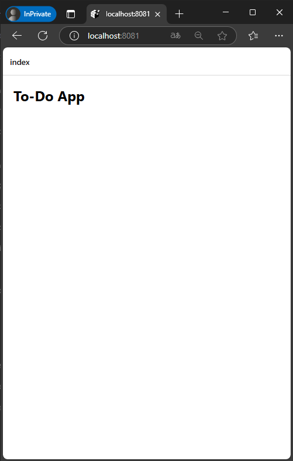
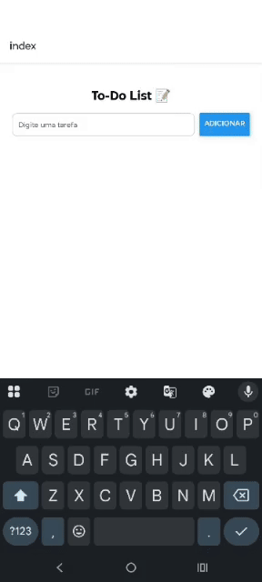
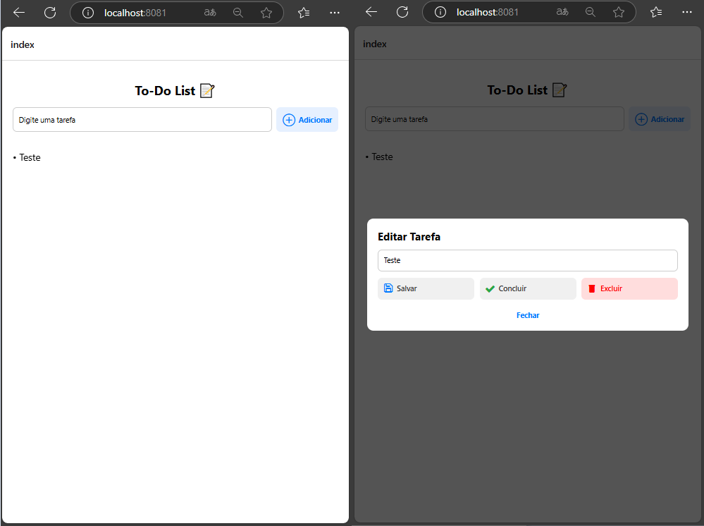
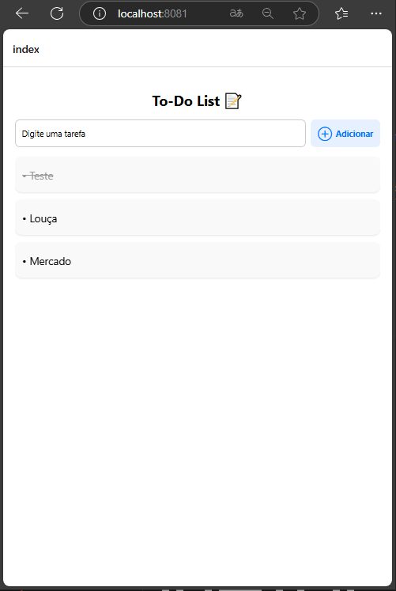
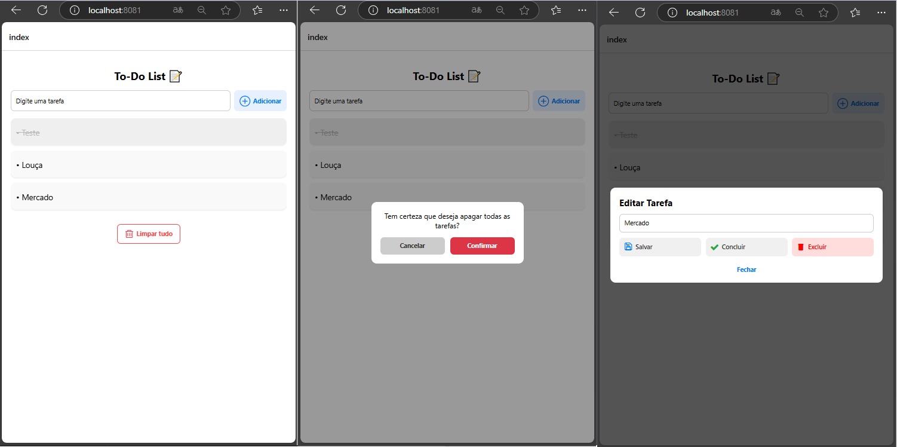
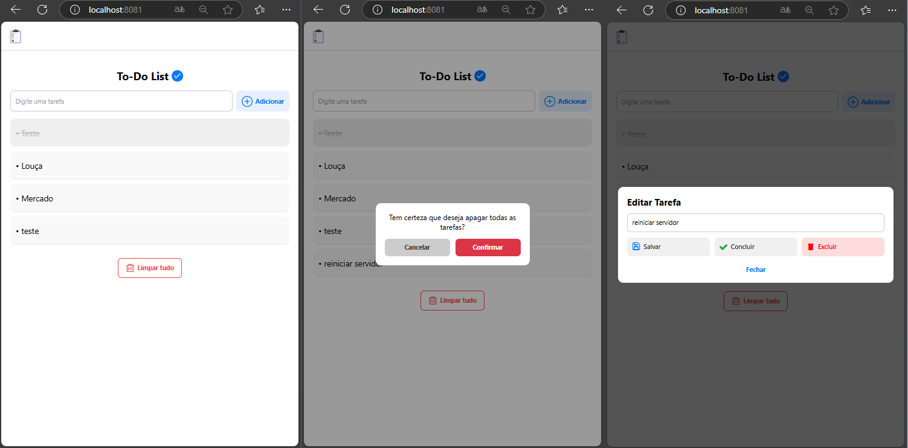

# Mobile-Introduction - TO-DO-APP

# Objetivo: 
Este repositório tem como objetivo dar uma introdução rápida ao desenvolvimento de um app para dispositivos android com o foco em aplicações mobile. 

A ideia é de forma rápida e objetiva conseguir instalar e utilizar um app no celular.

Todo o guia vai ser baseado em react native em função de sua pratividade e facilidade na analise e aprendizado, além de ser um frameork bem aceito no mercado. 

## Pré Requisitos

Esta seção aborda os pré requisistos necessários para podermos proseguir com o aprendizado.

### Pré Requisitos

- [Expo - instalção no dispositivo mobile](https://expo.dev/go/)
- [Node.JS ](https://nodejs.org/en)
- [VS Code](https://code.visualstudio.com/)

Ajuste de politica de execução do PowerShell. Por padrão, o PowerShell não permite a execução de scripts não assinados, como o **npx**. Abaixo o comando para o determinado ajuste.

- Abrir o PowerShell como Administrador
- Pressione **Win + X** e selecione **"Windows PowerShell (Admin)"**.
- Ou procure por **"PowerShell"** no menu iniciar, clique com o botão direito e escolha **"Executar como Administrador"**.
- Digite o seguinte comando no PowerShell para permitir a execução de scripts locais:

```powershell
Set-ExecutionPolicy RemoteSigned -Scope CurrentUser
```

### Familizarização

Links de conhecimento relacionado ao TypeScript e ao React.

- [Introdução ao TS](https://www.typescriptlang.org/docs/handbook/2/everyday-types.html)
- [Introdução ao React](https://react.dev/learn) 

## 1 - Criando seu primeiro APP

### 1 Inicializar um novo aplicativo EXPO

Dentro do nosso terminal do VS Code, criaremos o nosso app através de uma linha de comando. Lembrando que aqui, temos que executar o comando extamente onde queremos que o projeto seja inicializado. 

obs: Recomendo que criem uma pasta na raiz do computador conforme modelo abaixo:

c:\desenvolvimento\mobile\

```sh
npx create-expo-app@latest to-do-app
```
O comando vai criar um diretório usando um modelo padrão de app, com biblioteca essenciais. 

Algumas Vantagens de usar um modelo padrão para desenvolvimento:
- Cria um novo projeto React Native com expoo pacote instalado
- Inclui ferramentas recomendadas, como Expo CLI
- Inclui um navegador de abas do Expo Router para fornecer um sistema de navegação básico
- Configurado automaticamente para executar um projeto em várias plataformas: Android, iOS e web
TypeScript configurado por padrão

### 2 Script Reset

Como vamos criar o nosso aplicativo do zero, vamos resetar ele e com isto retirar alguns arquivos desnecessários. Primeiramente entramos no nosso projeto.

```sh
npm run reset-project
```

Com isto nossa pasta de APP fica com dois arquivos ( index.tsx e _layout.tsx ) os demais foram movidos para a pasta app-example. 

### 3 executando o aplicativo no Celular

Primeiramente executamos o comando abaixo para instalar as dependencias caso falte alguma relacionado ao ferramental do expo. 


Dependencias necessarias, toast traz um tipo especial de msnegaem.
Async storage é para salvar as cosias no sd do andriod.

```sh
npm install expo
npx expo install @react-native-async-storage/async-storage
npx expo install @expo/vector-icons
```

Posterior iniciamos o nosso projeto com o comando abaixo.

```sh
npx expo start
```
Se no momento da instalação, aparecer uma mensagem solicitando a liberação do node.js no firewall do windoes, libere tanto para redes publicas como privadas. Este passo é bem iportante pois caso não configuremos estas permissoes, podemos ter impacto para emular o projeto. 

O comando acima iniciara o nosso servidor de desenvolvimento. Caso solicite para instalar alguma dependencia a mesma deve ser instalada.

Estado da nossa aplicação até o momento:


## 2 - Começando 

### 1 Entendendo To-Do-App

Vamos criar um app de controle de atividades simples. A ideia é adicionarmos uma atividade do nosso dia a dia que vai adicionar a mesma em uma lista. Ao clicarmos na atividade, vamos ver uma modal, nos dando 3 opções:

- Concluir a atividade
- Deletar a atividade
- Alterar a atividade


Todo o fluxo do app vai ser salvo no storage do celular. 

### 2 Iniciando o desenvolvimento

Vamos seguir a seguinte estrutura para o nosso projeto conforme abaixo. Vamos criar as seguintes pastas, conforme os comandos abaixo:

```bash
mkdir -p src/components
mkdir -p src/services
mkdir -p src/utils
code  src/services/ToDoService.ts 
```
O arquivo ToDoService.ts, pode ser criado de forma manual dentro do diretório ou pelo comando acima. Caso optem por criar pelo comando, devem salvar o arquivo, para que o mesmo seja criado. 


A nossa estrutura de arquivos, fica como exemplificada abaixo:

```css
to-do-app/
├── app/
│   ├── _layout.tsx
│   └── index.tsx
├── src/
│   ├── components/
│   ├── services/
│   │   └── ToDoService.ts
│   └── utils/
...
```

Primeiramente vamos realizar alguns ajustes simples na nossa tela inicial index.tsx, conforme código abaixo: 

```tsx
import { View, Text, StyleSheet } from "react-native";

export default function HomeScreen() {
  return (
    <View style={styles.container}>
      <Text style={styles.title}>To-Do App</Text>
    </View>
  );
}

const styles = StyleSheet.create({
  container: {
    flex: 1,
    padding: 24,
    backgroundColor: "#fff",
    justifyContent: "flex-start",
  },
  title: {
    fontSize: 32,
    fontWeight: "bold",
    marginBottom: 20,
  },
});
```

O código acima é muito simples:
- Mostramos um texto através de um container (View)
- Estilos na estrutura final do nosso arquivi.

O resultado do nosso código fica assim: 



### 3 - Input e Botão para Adicionar To-Do


Vamos adicionar o seguinte código ao nosso index:

```tsx
import React, { useState } from "react";
import {
  View,
  Text,
  TextInput,
  Button,
  StyleSheet,
  FlatList,
} from "react-native";

export default function HomeScreen() {
  const [newTask, setNewTask] = useState("");
  const [tasks, setTasks] = useState<string[]>([]);

  function handleAddTask() {
    if (newTask.trim() === "") return;
    setTasks([...tasks, newTask.trim()]);
    setNewTask("");
  }

  return (
    <View style={styles.container}>
      <Text style={styles.title}>To-Do App</Text>

      <TextInput
        style={styles.input}
        placeholder="Digite uma tarefa..."
        value={newTask}
        onChangeText={setNewTask}
      />

      <Button title="Adicionar" onPress={handleAddTask} />

      <FlatList
        data={tasks}
        keyExtractor={(item, index) => `${item}-${index}`}
        renderItem={({ item }) => (
          <Text style={styles.taskItem}>• {item}</Text>
        )}
        style={{ marginTop: 24 }}
      />
    </View>
  );
}

const styles = StyleSheet.create({
  container: {
    flex: 1,
    padding: 24,
    backgroundColor: "#fff",
  },
  title: {
    fontSize: 32,
    fontWeight: "bold",
    marginBottom: 20,
  },
  input: {
    borderWidth: 1,
    borderColor: "#ccc",
    borderRadius: 8,
    padding: 12,
    marginBottom: 10,
  },
  taskItem: {
    fontSize: 18,
    marginVertical: 6,
  },
});

```

<details>
<summary>📌 O que fizemos aqui:</summary>

---
1. Criamos dois estados:
- newTask: texto digitado pelo usuário.
- tasks: lista de tarefas adicionadas.
---

2. Criamos dois estados:
- Impede tarefas vazias.
- Adiciona a nova tarefa no array.
- Limpa o campo de texto.

---

3. Criamos dois estados:
- <TextInput /> para digitação.
- <Button /> para adicionar.
- <FlatList /> para exibir as tarefas.
---

</details>

### 4 - Criando um fluxo de alteração através de uma modal

No nosso index.tsx, vamos adicionar o seguinte código:

```tsx
import React, { useState } from "react";
import {
  View,
  Text,
  TextInput,
  Button,
  StyleSheet,
  FlatList,
  Pressable,
  Modal,
  Alert,
} from "react-native";

type Task = {
  id: string;
  title: string;
  done: boolean;
};

export default function HomeScreen() {
  const [newTask, setNewTask] = useState("");
  const [tasks, setTasks] = useState<Task[]>([]);
  const [selectedTask, setSelectedTask] = useState<Task | null>(null);
  const [isModalVisible, setModalVisible] = useState(false);
  const [editText, setEditText] = useState("");

  function handleAddTask() {
    if (newTask.trim() === "") return;
    const newItem: Task = {
      id: Date.now().toString(),
      title: newTask.trim(),
      done: false,
    };
    setTasks([...tasks, newItem]);
    setNewTask("");
  }

  function handleSelectTask(task: Task) {
    setSelectedTask(task);
    setEditText(task.title);
    setModalVisible(true);
  }

  function handleMarkDone() {
    if (!selectedTask) return;
    setTasks((prev) =>
      prev.map((t) =>
        t.id === selectedTask.id ? { ...t, done: !t.done } : t
      )
    );
    setModalVisible(false);
  }

  function handleDelete() {
    if (!selectedTask) return;
    setTasks((prev) => prev.filter((t) => t.id !== selectedTask.id));
    setModalVisible(false);
  }

  function handleEdit() {
    if (!selectedTask || editText.trim() === "") return;
    setTasks((prev) =>
      prev.map((t) =>
        t.id === selectedTask.id ? { ...t, title: editText.trim() } : t
      )
    );
    setModalVisible(false);
  }

  return (
    <View style={styles.container}>
      <Text style={styles.title}>To-Do App</Text>

      <TextInput
        style={styles.input}
        placeholder="Digite uma tarefa..."
        value={newTask}
        onChangeText={setNewTask}
      />

      <Button title="Adicionar" onPress={handleAddTask} />

      <FlatList
        data={tasks}
        keyExtractor={(item) => item.id}
        style={{ marginTop: 24 }}
        renderItem={({ item }) => (
          <Pressable onPress={() => handleSelectTask(item)}>
            <Text
              style={[
                styles.taskItem,
                item.done && styles.taskItemDone,
              ]}
            >
              • {item.title}
            </Text>
          </Pressable>
        )}
      />

      <Modal visible={isModalVisible} animationType="slide" transparent>
        <View style={styles.modalContainer}>
          <View style={styles.modalContent}>
            <Text style={styles.modalTitle}>Editar tarefa</Text>

            <TextInput
              style={styles.input}
              value={editText}
              onChangeText={setEditText}
            />

            <Button title="Salvar Alterações" onPress={handleEdit} />
            <View style={{ height: 10 }} />
            <Button
              title={selectedTask?.done ? "Desmarcar Concluída" : "Marcar como Concluída"}
              onPress={handleMarkDone}
            />
            <View style={{ height: 10 }} />
            <Button title="Excluir" color="red" onPress={handleDelete} />
            <View style={{ height: 10 }} />
            <Button title="Cancelar" onPress={() => setModalVisible(false)} />
          </View>
        </View>
      </Modal>
    </View>
  );
}

const styles = StyleSheet.create({
  container: {
    flex: 1,
    padding: 24,
    backgroundColor: "#fff",
  },
  title: {
    fontSize: 32,
    fontWeight: "bold",
    marginBottom: 20,
  },
  input: {
    borderWidth: 1,
    borderColor: "#ccc",
    borderRadius: 8,
    padding: 12,
    marginBottom: 10,
  },
  taskItem: {
    fontSize: 18,
    marginVertical: 6,
  },
  taskItemDone: {
    textDecorationLine: "line-through",
    color: "#999",
  },
  modalContainer: {
    flex: 1,
    justifyContent: "center",
    backgroundColor: "rgba(0,0,0,0.4)",
    padding: 20,
  },
  modalContent: {
    backgroundColor: "white",
    borderRadius: 10,
    padding: 20,
  },
  modalTitle: {
    fontSize: 20,
    marginBottom: 10,
    fontWeight: "bold",
  },
});

```

N 

<details>
<summary>📌 ão se assustem com as modificações, vamos entender elas aqui:</summary>

---
1. Cada tarefa agora: 
- id, title, done (completo ou não).
---

2. Ao clicar no item do to-do, uma Modal aparece com:
- Campo de edição.
- Botão para editar.
- Botão para marcar como concluído (ou desmarcar).
- Botão para excluir.

---

3. Tarefas Concluídas aparecem Riscadas
---

</details>

✅ Agora temos um CRUD visual completo via modal!

### 5 - Refatoração de código

Antes de adicionarmos opções de salvar diretamente no storage do nosso celular, vamos refatorar a nossa aplicação, seguindo os fluxos abaixo: 

📦 1. Criar um serviço (ToDoService.ts)
- Esse arquivo será responsável por gerenciar os dados: adicionar, remover, editar, concluir. Assim deixamos a lógica de CRUD fora da UI. Já temos este arquivo criado.

.

🧩 2. Criar um componente TaskItem.tsx

- Um componente reutilizável que:
- Exibe a tarefa.
- Ao ser clicado, chama uma função do pai para abrir a modal.

📦 3. Criar um componente TaskModal.tsx
- Um componente que:
- Recebe a task selecionada.
- Permite editar, excluir e concluir.
- Fica visível ou não conforme a prop visible.

🧠 Por que fazer isso agora?
- Melhora a legibilidade do nosso código.
- Permite testar e evoluir cada parte isoladamente.
- Facilita adicionar o AsyncStorage depois (a persistência, salvar dados fica no ToDoService).

### 6 - ToDoService.ts

📁 Caminho do arquivo (Ja temos criado):

```bash
/src/services/ToDoService.ts
```

📦 Conteúdo de ToDoService.ts:

```tsx
// services/ToDoService.ts

export type Task = {
  id: string;
  title: string;
  done: boolean;
};

export class ToDoService {
  private tasks: Task[] = [];

  getAll(): Task[] {
    return this.tasks;
  }

  add(title: string): void {
    const newTask: Task = {
      id: Date.now().toString(),
      title: title.trim(),
      done: false,
    };
    this.tasks.push(newTask);
  }

  update(id: string, newTitle: string): void {
    this.tasks = this.tasks.map((task) =>
      task.id === id ? { ...task, title: newTitle.trim() } : task
    );
  }

  toggleDone(id: string): void {
    this.tasks = this.tasks.map((task) =>
      task.id === id ? { ...task, done: !task.done } : task
    );
  }

  remove(id: string): void {
    this.tasks = this.tasks.filter((task) => task.id !== id);
  }
}

```

📌 **O que esse serviço faz:**

| Método        | Descrição                          |
|---------------|------------------------------------|
| `getAll()`    | Retorna todas as tarefas           |
| `add()`       | Adiciona uma nova tarefa           |
| `update()`    | Altera o título de uma tarefa      |
| `toggleDone()`| Marca ou desmarca como concluída   |
| `remove()`    | Exclui uma tarefa                  |

🧪 Como vamos usá-lo depois:

No index.tsx, criaremos uma instância do serviço e faremos as chamadas:

```ts
const todoService = new ToDoService();
todoService.add("Nova tarefa");
const tasks = todoService.getAll();
```

Observação: não se preocupe, mais para a frente teremos o index atualizado. 

### 7 - TaskItem.tsx

📁 Caminho do arquivo:
Vamos criar o arquivo no caminho abaixo:

```bash
/src/components/TaskItem.tsx
```

⚙️ Conteúdo de TaskItem.tsx:

```tsx
// components/TaskItem.tsx

import React from "react";
import { Pressable, StyleSheet, Text } from "react-native";
import { Task } from "../services/ToDoService";

type Props = {
  task: Task;
  onPress: (task: Task) => void;
};

export function TaskItem({ task, onPress }: Props) {
  return (
    <Pressable onPress={() => onPress(task)}>
      <Text style={[styles.text, task.done && styles.textDone]}>
        • {task.title}
      </Text>
    </Pressable>
  );
}

const styles = StyleSheet.create({
  text: {
    fontSize: 18,
    marginVertical: 6,
  },
  textDone: {
    textDecorationLine: "line-through",
    color: "#999",
  },
});
```

✅ O que esse componente faz:
- Exibe o título da tarefa com estilo básico.
- Se a tarefa estiver done: true, exibe ela riscada e acinzentada.

🧠 Como usaremos no index.tsx:

```tsx
import { TaskItem } from "../components/TaskItem";

// ...

<FlatList
  data={tasks}
  keyExtractor={(item) => item.id}
  renderItem={({ item }) => (
    <TaskItem task={item} onPress={handleSelectTask} />
  )}
/>

```

Observação: não se preocupe, mais para a frente teremos o index atualizado. 

### 8 - TaskModal.tsx

📁 Criamos o arquivo no caminho abaixo: 


```bash
/src/components/TaskModal.tsx
```

⚙️ Conteúdo de TaskModal.tsx:

```tsx
// components/TaskModal.tsx

import React, { useState } from "react";
import {
  Modal,
  View,
  Text,
  TextInput,
  Button,
  StyleSheet,
} from "react-native";
import { Task } from "../services/ToDoService";

type Props = {
  visible: boolean;
  task: Task | null;
  onClose: () => void;
  onUpdate: (id: string, newTitle: string) => void;
  onToggleDone: (id: string) => void;
  onRemove: (id: string) => void;
};

export function TaskModal({
  visible,
  task,
  onClose,
  onUpdate,
  onToggleDone,
  onRemove,
}: Props) {
  const [editTitle, setEditTitle] = useState("");

  React.useEffect(() => {
    if (task) setEditTitle(task.title);
  }, [task]);

  if (!task) return null;

  return (
    <Modal visible={visible} transparent animationType="slide">
      <View style={styles.overlay}>
        <View style={styles.modal}>
          <Text style={styles.title}>Editar Tarefa</Text>

          <TextInput
            value={editTitle}
            onChangeText={setEditTitle}
            style={styles.input}
            placeholder="Título da tarefa"
          />

          <View style={styles.buttonGroup}>
            <Button
              title="Salvar"
              onPress={() => {
                onUpdate(task.id, editTitle);
                onClose();
              }}
            />
            <Button
              title={task.done ? "Desmarcar" : "Concluir"}
              onPress={() => {
                onToggleDone(task.id);
                onClose();
              }}
            />
            <Button
              title="Excluir"
              color="red"
              onPress={() => {
                onRemove(task.id);
                onClose();
              }}
            />
          </View>

          <Button title="Fechar" onPress={onClose} />
        </View>
      </View>
    </Modal>
  );
}

const styles = StyleSheet.create({
  overlay: {
    flex: 1,
    justifyContent: "center",
    backgroundColor: "#000000aa",
    padding: 24,
  },
  modal: {
    backgroundColor: "white",
    borderRadius: 12,
    padding: 20,
  },
  title: {
    fontSize: 20,
    marginBottom: 12,
    fontWeight: "bold",
  },
  input: {
    borderWidth: 1,
    borderColor: "#ccc",
    padding: 10,
    borderRadius: 8,
    marginBottom: 12,
  },
  buttonGroup: {
    flexDirection: "column",
    gap: 8,
    marginBottom: 10,
  },
});

```

✅ **O que esse componente faz:**

| Ação               | Comportamento                            |
|--------------------|------------------------------------------|
| Editar título      | Edita a tarefa e fecha a modal           |
| Concluir/Desmarcar | Altera o status de done e fecha a modal  |
| Excluir            | Remove a tarefa e fecha a modal          |
| Fechar             | Fecha a modal sem alterar nada           |


🧠 Como usaremos no index.tsx:

```tsx
<TaskModal
  visible={modalVisible}
  task={selectedTask}
  onClose={() => setModalVisible(false)}
  onUpdate={handleUpdate}
  onToggleDone={handleToggleDone}
  onRemove={handleRemove}
/>

```

Observação: não se preocupe, mais para a frente teremos o index atualizado. 

### 9 - Integrando tudo ao nosso index

⚙️ Conteúdo atualizado de index.tsx:

Agora sim, vamos atualizar o nosso index, com a estrutura que construimos

```tsx
// app/index.tsx

import React, { useState } from "react";
import {
  View,
  Text,
  TextInput,
  Button,
  FlatList,
  StyleSheet,
} from "react-native";
import { ToDoService, Task } from "../src/services/ToDoService";
import { TaskItem } from "../src/components/TaskItem";
import { TaskModal } from "../src/components/TaskModal";

// 1. Criamos a instância do serviço
const todoService = new ToDoService();

export default function HomeScreen() {
  const [tasks, setTasks] = useState<Task[]>(todoService.getAll());
  const [input, setInput] = useState("");
  const [modalVisible, setModalVisible] = useState(false);
  const [selectedTask, setSelectedTask] = useState<Task | null>(null);

  // 2. Adicionar nova tarefa
  const handleAdd = () => {
    if (input.trim() === "") return;
    todoService.add(input);
    setTasks(todoService.getAll());
    setInput("");
  };

  // 3. Selecionar tarefa para abrir modal
  const handleSelectTask = (task: Task) => {
    setSelectedTask(task);
    setModalVisible(true);
  };

  // 4. Atualizar tarefa
  const handleUpdate = (id: string, newTitle: string) => {
    todoService.update(id, newTitle);
    setTasks(todoService.getAll());
  };

  // 5. Concluir tarefa
  const handleToggleDone = (id: string) => {
    todoService.toggleDone(id);
    setTasks(todoService.getAll());
  };

  // 6. Remover tarefa
  const handleRemove = (id: string) => {
    todoService.remove(id);
    setTasks(todoService.getAll());
  };

  return (
    <View style={styles.container}>
      <Text style={styles.title}>To-Do List 📝</Text>

      <View style={styles.inputGroup}>
        <TextInput
          placeholder="Digite uma tarefa"
          value={input}
          onChangeText={setInput}
          style={styles.input}
        />
        <Button title="Adicionar" onPress={handleAdd} />
      </View>

      <FlatList
        data={tasks}
        keyExtractor={(item) => item.id}
        renderItem={({ item }) => (
          <TaskItem task={item} onPress={handleSelectTask} />
        )}
        contentContainerStyle={{ paddingVertical: 12 }}
      />

      <TaskModal
        visible={modalVisible}
        task={selectedTask}
        onClose={() => setModalVisible(false)}
        onUpdate={handleUpdate}
        onToggleDone={handleToggleDone}
        onRemove={handleRemove}
      />
    </View>
  );
}

const styles = StyleSheet.create({
  container: {
    flex: 1,
    padding: 20,
    paddingTop: 40,
    backgroundColor: "#fff",
  },
  title: {
    fontSize: 24,
    marginBottom: 16,
    fontWeight: "bold",
    textAlign: "center",
  },
  inputGroup: {
    flexDirection: "row",
    gap: 8,
    marginBottom: 16,
  },
  input: {
    flex: 1,
    borderWidth: 1,
    borderColor: "#ccc",
    padding: 10,
    borderRadius: 8,
  },
});

```

🧠 Resultado até aqui:

- ✅ UI modular e bem separada.
- ✅ Todas as ações de CRUD funcionando.
- ✅ Fácil de manter e escalar.

🚫 Ainda sem persistência — isso vem na próxima etapa.

Mas que diabos é persistencia? Gravar no disco!!


Como está o nosso app até este momento: 



### 10 - Salvando dados com AsyncStorage

📦 Instale o AsyncStorage:

Fizemos isto na etapa inicial do projeto, caso você não tenha feito, segue os comandos abaixo:

```tsx
npx expo install @react-native-async-storage/async-storage
```

Vamos atualizar o nosso arquivo /services/ToDoService.ts, com o seguinte foco: 

- Salvar tarefas no armazenamento interno com AsyncStorage;
- Carregar as tarefas ao iniciar o app;
- Permitir que a HomeScreen receba uma lista já persistida.

⚙️ Novo conteúdo de ToDoService.ts:

```tsx
// src/services/ToDoService.ts
import AsyncStorage from "@react-native-async-storage/async-storage";

export type Task = {
  id: string;
  title: string;
  done: boolean;
};

export class ToDoService {
  private tasks: Task[] = [];

  async init() {
    const json = await AsyncStorage.getItem("TASKS");
    this.tasks = json ? JSON.parse(json) : [];
  }

  getAll(): Task[] {
    return this.tasks;
  }

  private async save() {
    await AsyncStorage.setItem("TASKS", JSON.stringify(this.tasks));
  }

  async add(title: string): Promise<void> {
    const newTask: Task = {
      id: Date.now().toString(),
      title: title.trim(),
      done: false,
    };
    this.tasks.push(newTask);
    await this.save();
  }

  async update(id: string, newTitle: string): Promise<void> {
    this.tasks = this.tasks.map((task) =>
      task.id === id ? { ...task, title: newTitle.trim() } : task
    );
    await this.save();
  }

  async toggleDone(id: string): Promise<void> {
    this.tasks = this.tasks.map((task) =>
      task.id === id ? { ...task, done: !task.done } : task
    );
    await this.save();
  }

  async remove(id: string): Promise<void> {
    this.tasks = this.tasks.filter((task) => task.id !== id);
    await this.save();
  }
}

```

Nesta etapa teremos um pequeno erro na função "import { v4 as uuidv4 } from "uuid";", para isco clicar com o botao direito em cima e solicitar a instalação da dependencia. 

🔁 Mas atenção: agora tudo é assíncrono!
Então precisamos ajustar o index.tsx para trabalhar com await e carregar os dados na montagem do componente.

### 11 Atualizando o nosso index, para o salvamento

⚙️ Tornar index.tsx assíncrono:

🧠 Mudanças principais:
- Carregar tarefas no useEffect;
- Transformar todas as chamadas (add, update, toggleDone, remove) em chamadas await;
- Atualizar a tela após cada operação com o método getAll().

🧾 Novo conteúdo de index.tsx

```tsx
// app/index.tsx
import React, { useEffect, useState } from "react";
import {
  View,
  Text,
  TextInput,
  Button,
  FlatList,
  StyleSheet,
} from "react-native";
import { ToDoService, Task } from "../src/services/ToDoService";
import { TaskItem } from "../src/components/TaskItem";
import { TaskModal } from "../src/components/TaskModal";

const todoService = new ToDoService();

export default function HomeScreen() {
  const [tasks, setTasks] = useState<Task[]>([]);
  const [input, setInput] = useState("");
  const [modalVisible, setModalVisible] = useState(false);
  const [selectedTask, setSelectedTask] = useState<Task | null>(null);

  useEffect(() => {
    const load = async () => {
      await todoService.init(); // ← carrega do AsyncStorage
      setTasks(todoService.getAll());
    };
    load();
  }, []);

  const handleAdd = async () => {
    if (input.trim() === "") return;
    await todoService.add(input);
    setTasks(todoService.getAll());
    setInput("");
  };

  const handleSelectTask = (task: Task) => {
    setSelectedTask(task);
    setModalVisible(true);
  };

  const handleUpdate = async (id: string, newTitle: string) => {
    await todoService.update(id, newTitle);
    setTasks(todoService.getAll());
  };

  const handleToggleDone = async (id: string) => {
    await todoService.toggleDone(id);
    setTasks(todoService.getAll());
  };

  const handleRemove = async (id: string) => {
    await todoService.remove(id);
    setTasks(todoService.getAll());
  };

  return (
    <View style={styles.container}>
      <Text style={styles.title}>To-Do List 📝</Text>

      <View style={styles.inputGroup}>
        <TextInput
          placeholder="Digite uma tarefa"
          value={input}
          onChangeText={setInput}
          style={styles.input}
        />
        <Button title="Adicionar" onPress={handleAdd} />
      </View>

      <FlatList
        data={tasks}
        keyExtractor={(item) => item.id}
        renderItem={({ item }) => (
          <TaskItem task={item} onPress={handleSelectTask} />
        )}
        contentContainerStyle={{ paddingVertical: 12 }}
      />

      <TaskModal
        visible={modalVisible}
        task={selectedTask}
        onClose={() => setModalVisible(false)}
        onUpdate={handleUpdate}
        onToggleDone={handleToggleDone}
        onRemove={handleRemove}
      />
    </View>
  );
}

const styles = StyleSheet.create({
  container: {
    flex: 1,
    padding: 20,
    paddingTop: 40,
    backgroundColor: "#fff",
  },
  title: {
    fontSize: 24,
    marginBottom: 16,
    fontWeight: "bold",
    textAlign: "center",
  },
  inputGroup: {
    flexDirection: "row",
    gap: 8,
    marginBottom: 16,
  },
  input: {
    flex: 1,
    borderWidth: 1,
    borderColor: "#ccc",
    padding: 10,
    borderRadius: 8,
  },
});

```

✅ Agora temos:
- Salvamento automático de tarefas;
- Recuperação de tarefas mesmo após fechar o app;
- Fluxo todo funcional e persistente.

Até o momento a nossa aplicação está igual, porém mais organizada e salvando no nosso storage. Como próximo passo, vamos melhorar o visual da nossa aplicação.

### 12 - A que ponto chegamos! 

🔍 Diagnóstico Atual

Nosso app já possui:
- ✅ Tela única (index.tsx) com:
   - Campo de entrada + botão para adicionar tarefas.
   - Lista de tarefas interativa.

- ✅ Modal com opções de editar, concluir, excluir e fechar.
- ✅ Salvamento local com AsyncStorage.
- ✅ Arquitetura separada:
   - TaskItem: componente visual.
   - TaskModal: modal de ações.
   - ToDoService: lógica isolada de persistência.

### 12 - Feedback visual e melhorias de usabilidade

Vamos refinar o vizual do nosso software neste ponto.

Melhorando o botao adicionar em tela, vamos alterar os seguintes pontos (Desafio, tente ajustar seu código): 

```tsx
import { AntDesign } from "@expo/vector-icons"; // ← ADICIONE NO TOPO

// Substitua o botão dentro de inputGroup:
        <Pressable style={styles.addButton} onPress={handleAdd}>
          <AntDesign name="pluscircleo" size={24} color="#007bff" />
          <Text style={styles.addButtonText}>Adicionar</Text>
        </Pressable>
```

<details>
<summary>Index completo! </summary>

```tsx
// app/index.tsx
import React, { useEffect, useState } from "react";
import { View, Text, TextInput, FlatList, StyleSheet, Pressable } from "react-native";
import { ToDoService, Task } from "../src/services/ToDoService";
import { TaskItem } from "../src/components/TaskItem";
import { TaskModal } from "../src/components/TaskModal";
import { AntDesign } from "@expo/vector-icons"; // ← ADICIONE NO TOPO

const todoService = new ToDoService();

export default function HomeScreen() {
  const [tasks, setTasks] = useState<Task[]>([]);
  const [input, setInput] = useState("");
  const [modalVisible, setModalVisible] = useState(false);
  const [selectedTask, setSelectedTask] = useState<Task | null>(null);

  useEffect(() => {
    const load = async () => {
      await todoService.init(); // ← carrega do AsyncStorage
      setTasks(todoService.getAll());
    };
    load();
  }, []);

  const handleAdd = async () => {
    if (input.trim() === "") return;
    await todoService.add(input);
    setTasks(todoService.getAll());
    setInput("");
  };

  const handleSelectTask = (task: Task) => {
    setSelectedTask(task);
    setModalVisible(true);
  };

  const handleUpdate = async (id: string, newTitle: string) => {
    await todoService.update(id, newTitle);
    setTasks(todoService.getAll());
  };

  const handleToggleDone = async (id: string) => {
    await todoService.toggleDone(id);
    setTasks(todoService.getAll());
  };

  const handleRemove = async (id: string) => {
    await todoService.remove(id);
    setTasks(todoService.getAll());
  };

  return (
    <View style={styles.container}>
      <Text style={styles.title}>To-Do List 📝</Text>

      <View style={styles.inputGroup}>
        <TextInput
          placeholder="Digite uma tarefa"
          value={input}
          onChangeText={setInput}
          style={styles.input}
        />
        <Pressable style={styles.addButton} onPress={handleAdd}>
          <AntDesign name="pluscircleo" size={24} color="#007bff" />
          <Text style={styles.addButtonText}>Adicionar</Text>
        </Pressable>
      </View>

      <FlatList
        data={tasks}
        keyExtractor={(item) => item.id}
        renderItem={({ item }) => (
          <TaskItem task={item} onPress={handleSelectTask} />
        )}
        contentContainerStyle={{ paddingVertical: 12 }}
      />

      <TaskModal
        visible={modalVisible}
        task={selectedTask}
        onClose={() => setModalVisible(false)}
        onUpdate={handleUpdate}
        onToggleDone={handleToggleDone}
        onRemove={handleRemove}
      />
    </View>
  );
}

const styles = StyleSheet.create({
  container: {
    flex: 1,
    padding: 20,
    paddingTop: 40,
    backgroundColor: "#fff",
  },
  title: {
    fontSize: 24,
    marginBottom: 16,
    fontWeight: "bold",
    textAlign: "center",
  },
  inputGroup: {
    flexDirection: "row",
    gap: 8,
    marginBottom: 16,
  },
  input: {
    flex: 1,
    borderWidth: 1,
    borderColor: "#ccc",
    padding: 10,
    borderRadius: 8,
  },
  addButton: {
    flexDirection: "row",
    alignItems: "center",
    gap: 6,
    backgroundColor: "#e6f0ff",
    paddingHorizontal: 12,
    paddingVertical: 10,
    borderRadius: 8,
  },
  addButtonText: {
    color: "#007bff",
    fontWeight: "bold",
  },
});

```
</details>

Também vamos melhorar a estrutura de icones da nossa modal (Dentro do TaskModal.tsx):

```tsx
import React, { useState } from "react";
import {
  Modal,
  View,
  Text,
  TextInput,
  Pressable,
  StyleSheet,
  TouchableWithoutFeedback,
  Keyboard,
} from "react-native";
import { Task } from "../services/ToDoService";
import { FontAwesome, Feather, MaterialIcons } from "@expo/vector-icons";

type Props = {
  visible: boolean;
  task: Task | null;
  onClose: () => void;
  onUpdate: (id: string, newTitle: string) => void;
  onToggleDone: (id: string) => void;
  onRemove: (id: string) => void;
};

export function TaskModal({
  visible,
  task,
  onClose,
  onUpdate,
  onToggleDone,
  onRemove,
}: Props) {
  const [editTitle, setEditTitle] = useState("");

  React.useEffect(() => {
    if (task) setEditTitle(task.title);
  }, [task]);

  if (!task) return null;

  return (
    <Modal visible={visible} transparent animationType="slide">
      <TouchableWithoutFeedback onPress={onClose}>
        <View style={styles.overlay}>
          <TouchableWithoutFeedback onPress={() => {}}>
            <View style={styles.modal}>
              <Text style={styles.title}>Editar Tarefa</Text>

              <TextInput
                value={editTitle}
                onChangeText={setEditTitle}
                style={styles.input}
                placeholder="Título da tarefa"
              />

              <View style={styles.buttonRow}>
                <Pressable
                  style={styles.modalButton}
                  onPress={() => {
                    onUpdate(task.id, editTitle);
                    onClose();
                  }}
                >
                  <Feather name="save" size={20} color="#007bff" />
                  <Text style={styles.modalButtonText}>Salvar</Text>
                </Pressable>

                <Pressable
                  style={styles.modalButton}
                  onPress={() => {
                    onToggleDone(task.id);
                    onClose();
                  }}
                >
                  <FontAwesome
                    name={task.done ? "undo" : "check"}
                    size={20}
                    color={task.done ? "#999" : "#28a745"}
                  />
                  <Text style={styles.modalButtonText}>
                    {task.done ? "Desmarcar" : "Concluir"}
                  </Text>
                </Pressable>

                <Pressable
                  style={[styles.modalButton, { backgroundColor: "#fdd" }]}
                  onPress={() => {
                    onRemove(task.id);
                    onClose();
                  }}
                >
                  <MaterialIcons name="delete" size={20} color="red" />
                  <Text style={[styles.modalButtonText, { color: "red" }]}>
                    Excluir
                  </Text>
                </Pressable>
              </View>

              <Pressable onPress={onClose} style={styles.closeButton}>
                <Text style={styles.closeButtonText}>Fechar</Text>
              </Pressable>
            </View>
          </TouchableWithoutFeedback>
        </View>
      </TouchableWithoutFeedback>
    </Modal>
  );
}

const styles = StyleSheet.create({
  overlay: {
    flex: 1,
    justifyContent: "center",
    backgroundColor: "#000000aa",
    padding: 24,
  },
  modal: {
    backgroundColor: "white",
    borderRadius: 12,
    padding: 20,
  },
  title: {
    fontSize: 20,
    marginBottom: 12,
    fontWeight: "bold",
  },
  input: {
    borderWidth: 1,
    borderColor: "#ccc",
    padding: 10,
    borderRadius: 8,
    marginBottom: 12,
  },
  buttonGroup: {
    flexDirection: "column",
    gap: 8,
    marginBottom: 10,
  },

  buttonRow: {
    flexDirection: "row",
    flexWrap: "wrap",
    gap: 10,
    justifyContent: "space-between",
    marginBottom: 16,
  },

  modalButton: {
    flexDirection: "row",
    alignItems: "center",
    gap: 6,
    backgroundColor: "#f0f0f0",
    padding: 10,
    borderRadius: 8,
    flexGrow: 1,
    flexBasis: "30%",
  },

  modalButtonText: {
    fontSize: 14,
    fontWeight: "500",
    color: "#333",
  },

  closeButton: {
    alignSelf: "center",
    marginTop: 4,
  },

  closeButtonText: {
    color: "#007bff",
    fontWeight: "bold",
  },
});

```

Unicamente alteramos a estrutura dos icones e também melhoramos o seu vizual, deixando o nosso software no seguinte formato: 



### 13 - Vamos ajustar a nossa lista

- Mais padding e espaçamento entre tarefas.
- Cada tarefa como um “cartão” com leve sombra.
- Estilo visual mais limpo e agradável para celulares.

✅ AQUI ESTÁ O CÓDIGO AJUSTADO:

```tsx
// app/index.tsx
import React, { useEffect, useState } from "react";
import {
  View,
  Text,
  TextInput,
  FlatList,
  StyleSheet,
  Pressable,
} from "react-native";
import { ToDoService, Task } from "../src/services/ToDoService";
import { TaskItem } from "../src/components/TaskItem";
import { TaskModal } from "../src/components/TaskModal";
import { AntDesign } from "@expo/vector-icons";

const todoService = new ToDoService();

export default function HomeScreen() {
  const [tasks, setTasks] = useState<Task[]>([]);
  const [input, setInput] = useState("");
  const [modalVisible, setModalVisible] = useState(false);
  const [selectedTask, setSelectedTask] = useState<Task | null>(null);

  useEffect(() => {
    const load = async () => {
      await todoService.init();
      setTasks(todoService.getAll());
    };
    load();
  }, []);

  const handleAdd = async () => {
    if (input.trim() === "") return;
    await todoService.add(input);
    setTasks(todoService.getAll());
    setInput("");
  };

  const handleSelectTask = (task: Task) => {
    setSelectedTask(task);
    setModalVisible(true);
  };

  const handleUpdate = async (id: string, newTitle: string) => {
    await todoService.update(id, newTitle);
    setTasks(todoService.getAll());
  };

  const handleToggleDone = async (id: string) => {
    await todoService.toggleDone(id);
    setTasks(todoService.getAll());
  };

  const handleRemove = async (id: string) => {
    await todoService.remove(id);
    setTasks(todoService.getAll());
  };

  return (
    <View style={styles.container}>
      <Text style={styles.title}>To-Do List 📝</Text>

      <View style={styles.inputGroup}>
        <TextInput
          placeholder="Digite uma tarefa"
          value={input}
          onChangeText={setInput}
          style={styles.input}
        />
        <Pressable style={styles.addButton} onPress={handleAdd}>
          <AntDesign name="pluscircleo" size={24} color="#007bff" />
          <Text style={styles.addButtonText}>Adicionar</Text>
        </Pressable>
      </View>

      <FlatList
        data={tasks}
        keyExtractor={(item) => item.id}
        renderItem={({ item }) => (
          <View style={styles.taskCard}>
            <TaskItem task={item} onPress={handleSelectTask} />
          </View>
        )}
        contentContainerStyle={styles.taskList}
      />

      <TaskModal
        visible={modalVisible}
        task={selectedTask}
        onClose={() => setModalVisible(false)}
        onUpdate={handleUpdate}
        onToggleDone={handleToggleDone}
        onRemove={handleRemove}
      />
    </View>
  );
}

const styles = StyleSheet.create({
  container: {
    flex: 1,
    padding: 20,
    paddingTop: 40,
    backgroundColor: "#fff",
  },
  title: {
    fontSize: 24,
    marginBottom: 16,
    fontWeight: "bold",
    textAlign: "center",
  },
  inputGroup: {
    flexDirection: "row",
    gap: 8,
    marginBottom: 16,
  },
  input: {
    flex: 1,
    borderWidth: 1,
    borderColor: "#ccc",
    padding: 10,
    borderRadius: 8,
  },
  addButton: {
    flexDirection: "row",
    alignItems: "center",
    gap: 6,
    backgroundColor: "#e6f0ff",
    paddingHorizontal: 12,
    paddingVertical: 10,
    borderRadius: 8,
  },
  addButtonText: {
    color: "#007bff",
    fontWeight: "bold",
  },
  taskList: {
    paddingBottom: 24,
    gap: 12,
  },
  taskCard: {
    backgroundColor: "#f9f9f9",
    borderRadius: 12,
    padding: 12,
    shadowColor: "#000",
    shadowOffset: { width: 0, height: 2 },
    shadowOpacity: 0.1,
    shadowRadius: 3,
    elevation: 2,
  },
});

```

Nao alteramos lógica, somente estilos no nosso index.




### 14 - Botao pra excluir todas as atividades

Como o nosso to-do é algo mais focado como lembrede de tarefas diarias, vamos ter um botão para excluir as nossas tarefas como um todo. 

✅ 1. Criar o componente ConfirmModal.tsx

Criamos este arquivo em src/components/ConfirmModal.tsx:

```tsx
// src/components/ConfirmModal.tsx
import React from "react";
import {
  Modal,
  View,
  Text,
  StyleSheet,
  Pressable,
  Platform,
} from "react-native";

type Props = {
  visible: boolean;
  message: string;
  onCancel: () => void;
  onConfirm: () => void;
};

export function ConfirmModal({ visible, message, onCancel, onConfirm }: Props) {
  return (
    <Modal
      animationType="fade"
      transparent
      visible={visible}
      statusBarTranslucent
    >
      <View style={styles.overlay}>
        <View style={styles.modal}>
          <Text style={styles.message}>{message}</Text>
          <View style={styles.buttonRow}>
            <Pressable style={styles.cancelButton} onPress={onCancel}>
              <Text style={styles.cancelText}>Cancelar</Text>
            </Pressable>
            <Pressable style={styles.confirmButton} onPress={onConfirm}>
              <Text style={styles.confirmText}>Confirmar</Text>
            </Pressable>
          </View>
        </View>
      </View>
    </Modal>
  );
}

const styles = StyleSheet.create({
  overlay: {
    flex: 1,
    backgroundColor: "rgba(0,0,0,0.4)",
    justifyContent: "center",
    alignItems: "center",
  },
  modal: {
    backgroundColor: "#fff",
    padding: 20,
    borderRadius: 12,
    width: "80%",
    maxWidth: 340,
  },
  message: {
    fontSize: 16,
    marginBottom: 16,
    textAlign: "center",
  },
  buttonRow: {
    flexDirection: "row",
    justifyContent: "space-between",
    gap: 12,
  },
  cancelButton: {
    flex: 1,
    backgroundColor: "#ccc",
    paddingVertical: 10,
    borderRadius: 8,
    alignItems: "center",
  },
  cancelText: {
    color: "#333",
    fontWeight: "bold",
  },
  confirmButton: {
    flex: 1,
    backgroundColor: "#dc3545",
    paddingVertical: 10,
    borderRadius: 8,
    alignItems: "center",
  },
  confirmText: {
    color: "#fff",
    fontWeight: "bold",
  },
});

```

✅ 2. Atualizando nosso index.tsx com tudo pronto

```tsx
// app/index.tsx
import React, { useEffect, useState } from "react";
import {
  View,
  Text,
  TextInput,
  FlatList,
  StyleSheet,
  Pressable,
  Alert,
} from "react-native";
import { ToDoService, Task } from "../src/services/ToDoService";
import { TaskItem } from "../src/components/TaskItem";
import { TaskModal } from "../src/components/TaskModal";
import { AntDesign, Feather } from "@expo/vector-icons";
import { ConfirmModal } from "@/src/components/ConfirmModal";


const todoService = new ToDoService();

export default function HomeScreen() {
  const [tasks, setTasks] = useState<Task[]>([]);
  const [input, setInput] = useState("");
  const [modalVisible, setModalVisible] = useState(false);
  const [selectedTask, setSelectedTask] = useState<Task | null>(null);
  const [confirmVisible, setConfirmVisible] = useState(false);

  useEffect(() => {
    const load = async () => {
      await todoService.init();
      setTasks(todoService.getAll());
    };
    load();
  }, []);

  const handleAdd = async () => {
    if (input.trim() === "") return;
    await todoService.add(input);
    setTasks(todoService.getAll());
    setInput("");
  };

  const handleSelectTask = (task: Task) => {
    setSelectedTask(task);
    setModalVisible(true);
  };

  const handleUpdate = async (id: string, newTitle: string) => {
    await todoService.update(id, newTitle);
    setTasks(todoService.getAll());
  };

  const handleToggleDone = async (id: string) => {
    await todoService.toggleDone(id);
    setTasks(todoService.getAll());
  };

  const handleRemove = async (id: string) => {
    await todoService.remove(id);
    setTasks(todoService.getAll());
  };

  const handleClearAll = async () => {
    await todoService.clear();
    setTasks([]);
    setConfirmVisible(false);
  };

  return (
    <View style={styles.container}>
      <Text style={styles.title}>To-Do List 📝</Text>

      <View style={styles.inputGroup}>
        <TextInput
          placeholder="Digite uma tarefa"
          placeholderTextColor="#999" // cinza visível em qualquer tema
          value={input}
          onChangeText={setInput}
          style={styles.input}
        />
        <Pressable style={styles.addButton} onPress={handleAdd}>
          <AntDesign name="pluscircleo" size={24} color="#007bff" />
          <Text style={styles.addButtonText}>Adicionar</Text>
        </Pressable>
      </View>

      <FlatList
        data={tasks}
        keyExtractor={(item) => item.id}
        renderItem={({ item }) => (
          <View
            style={[
              styles.taskCard,
              item.done && styles.taskCardDone,
            ]}
          >
            <TaskItem task={item} onPress={handleSelectTask} />
          </View>
        )}
        contentContainerStyle={styles.taskList}
        ListFooterComponent={
          tasks.length > 0 ? (
            <Pressable
            style={styles.clearButton}
            onPress={() => setConfirmVisible(true)}
          >
            <AntDesign name="delete" size={20} color="#dc3545" />
            <Text style={styles.clearButtonText}>Limpar tudo</Text>
          </Pressable>
          ) : null
        }
      />


      <TaskModal
        visible={modalVisible}
        task={selectedTask}
        onClose={() => setModalVisible(false)}
        onUpdate={handleUpdate}
        onToggleDone={handleToggleDone}
        onRemove={handleRemove}
      />

<ConfirmModal
        visible={confirmVisible}
        message="Tem certeza que deseja apagar todas as tarefas?"
        onCancel={() => setConfirmVisible(false)}
        onConfirm={handleClearAll}
      />
    </View>
  );
}

const styles = StyleSheet.create({
  container: {
    flex: 1,
    padding: 20,
    paddingTop: 40,
    backgroundColor: "#fff",
  },
  title: {
    fontSize: 24,
    marginBottom: 16,
    fontWeight: "bold",
    textAlign: "center",
  },
  inputGroup: {
    flexDirection: "row",
    gap: 8,
    marginBottom: 16,
  },
  input: {
    flex: 1,
    borderWidth: 1,
    borderColor: "#ccc",
    padding: 10,
    borderRadius: 8,
  },
  addButton: {
    flexDirection: "row",
    alignItems: "center",
    gap: 6,
    backgroundColor: "#e6f0ff",
    paddingHorizontal: 12,
    paddingVertical: 10,
    borderRadius: 8,
  },
  addButtonText: {
    color: "#007bff",
    fontWeight: "bold",
  },
  taskList: {
    paddingBottom: 32,
    gap: 12,
  },
  taskCard: {
    backgroundColor: "#f9f9f9",
    borderRadius: 12,
    padding: 12,
    shadowColor: "#000",
    shadowOffset: { width: 0, height: 2 },
    shadowOpacity: 0.1,
    shadowRadius: 3,
    elevation: 2,
  },
  taskCardDone: {
    backgroundColor: "#e8e8e8",
    opacity: 0.7,
  },
  clearButton: {
    marginTop: 20,
    alignSelf: "center",
    flexDirection: "row",
    gap: 6,
    paddingVertical: 10,
    paddingHorizontal: 16,
    borderRadius: 8,
    borderWidth: 1,
    borderColor: "#ff4444",
  },
  clearButtonText: {
    color: "#ff4444",
    fontWeight: "bold",
  },
});

```

O que fizemos foi criar uma modal de conclusão e chamar a mesma no index após clicarmos no botao limpar tudo. O botao de excluir so vai aparecer se tiver itens a serem feitos. 

Ao final temos as seguintes telas no nosso software: 



### 15 - Ajustes finos

Vamos ajustar a nossa rota para melhorar o descritivo de index na mesma: 

import { Stack } from 'expo-router';

```tsx
export default function Layout() {
  return (
    <Stack>
      <Stack.Screen 
        name="index" 
        options={{ title: 'EEEPE-TO-DO' }} 
      />
    </Stack>
  );
}
```

Vamos ajustar também o nosso app.json, atualizando as imagens do projeto:

```tsx
{
  "expo": {
    "name": "to-do-app",
    "slug": "to-do-app",
    "version": "1.0.0",
    "orientation": "portrait",
    "icon": "./assets/images/todo-list.png",
    "scheme": "todoapp",
    "userInterfaceStyle": "automatic",
    "newArchEnabled": true,
    "ios": {
      "supportsTablet": true
    },
    "android": {
      "adaptiveIcon": {
        "foregroundImage": "./assets/images/todo-list.png",
        "backgroundColor": "#ffffff"
      },
      "edgeToEdgeEnabled": true
    },
    "web": {
      "bundler": "metro",
      "output": "static",
      "favicon": "./assets/images/todo-list.png"
    },
    "plugins": [
      "expo-router",
      [
        "expo-splash-screen",
        {
          "image": "./assets/images/todo-list.png",
          "imageWidth": 200,
          "resizeMode": "contain",
          "backgroundColor": "#ffffff"
        }
      ]
    ],
    "experiments": {
      "typedRoutes": true
    }
  }
}

```

### 16 Gerando um apk do TO-DO_APP

No momento vamos ver a nossa lista de taefas funcionando diretamente no nosso celular através de um apk.

#### 1 Buildando um apk

---
Antes de continuarmos, devemos criar uma conta na plataforma [EAS](https://expo.dev/signup).(Caso ja tenha conta, pode igonrar esse passo)

Posterior necessitamos intalar o pacote de build do expo. O comando abaixo instala de forma global(Caso ja tenha instalado, pode igonrar esse passo)

```sh
npm install -g eas-cli
```

Logamos na plataforma eas com o seguinte comando
Colocamos usuário e senha criado nos passos anteriores.

```sh
eas login
```

Geramos a configuração do projeto:

```sh
eas build:configure
```

Alteramos o arquivo eas.json criado com as seguintes configurações: 

```json
{
  "build": {
    "preview": {
      "android": {
        "buildType": "apk"
      }
    }
  }
}
```

Posterior buildamos o nosso apk com o seguinte comando: 
Observação: O processo demora em função de estarmos com uma licença free para build na plataforma EAS.

```sh
eas build --profile preview --platform android
```


#### 2 Instalando o app no celular

Pegamos o arquivo gerado através da URL do build. O mesmo vai entregar um arquivo.apk.

Posterior, enviamos esta arquivo APK para o nosso android via drive ou outra ferramenta de escolha. 

Ao final, instalamos o mesmo em nosso celular. Para a instalação ser possível o android tem que estar em modo desenvolvedor e o apk em diretório local.
---

### 17 - Conclusao!!

Desafio consiste em transformar todo o curriculum em componente, assim como a etapa final da experiencia e Formatação.

